> **📌 <strong>[ai-tech-interview](https://github.com/boost-devs/ai-tech-interview/blob/main/answers/5-network.md)</strong>를 참고했습니다.**

## Table of Contents

- [TCP/IP의 각 계층을 설명해주세요.](#1)
- [OSI 7계층와 TCP/IP 계층의 차이를 설명해주세요.](#2)
- [Frame, Packet, Segment, Datagram을 비교해주세요.](#3)
- [TCP와 UDP의 차이를 설명해주세요.](#4)
- [TCP와 UDP의 헤더를 비교해주세요.](#5)
- [TCP의 3-way-handshake와 4-way-handshake를 비교 설명해주세요.](#6)
- [TCP의 연결 설정 과정(3단계)과 연결 종료 과정(4단계)이 단계가 차이나는 이유가 무엇인가요?](#7)
- [만약 Server에서 FIN 플래그를 전송하기 전에 전송한 패킷이 Routing 지연이나 패킷 유실로 인한 재전송 등으로 인해 FIN 패킷보다 늦게 도착하는 상황이 발생하면 어떻게 될까요?](#8)
- [초기 Sequence Number인 ISN을 0부터 시작하지 않고 난수를 생성해서 설정하는 이유가 무엇인가요?](#9)
- [HTTP와 HTTPS에 대해서 설명하고 차이점에 대해 설명해주세요.](#10)
- [HTTP 요청/응답 헤더의 구조를 설명해주세요.](#11)
- [HTTP와 HTTPS 동작 과정을 비교해주세요.](#12)
- [CORS가 무엇인가요?](#13)
- [HTTP GET과 POST 메서드를 비교/설명해주세요.](#14)
- [쿠키(Cookie)와 세션(Session)을 설명해주세요.](#15)
- [DNS가 무엇인가요?](#16)
- [REST와 RESTful의 개념을 설명하고 차이를 말해주세요.](#17)
- [소켓(Socket)이 무엇인가요? 자신 있는 언어로 간단히 소켓 생성 예시를 보여주세요.](#18)
- [Socket.io와 WebSocket의 차이를 설명해주세요.](#19)
- [IPv4와 IPv6 차이를 설명해주세요.](#20)
- [MAC Address가 무엇인가요?](#21)
- [라우터와 스위치, 허브의 차이를 설명해주세요.](#22)
- [SMTP가 무엇인가요?](#23)
- [노트북으로 `www.google.com`에 접속을 했습니다. 요청을 보내고 받기까지의 과정을 자세히 설명해주세요.](#24)
- [여러 네트워크 topology에 대해 간단히 소개해주세요.](#25)
- [subnet mask에 대해서 설명해주세요.](#26)
- [data encapsulation이 무엇인가요?](#27)
- [DHCP를 설명해주세요.](#28)
- [routing protocol을 몇 가지 설명해주세요. (ex. link state, distance vector)](#29)
- [이더넷(ethernet)이 무엇인가요?](#30)
- [client와 server의 차이점을 설명해주세요.](#31)
- [delay, timing(jitter), throughput 차이를 설명해주세요.](#32)

---

## #1

#### TCP/IP 계층

TCP/IP는 인터넷에서 표준으로 사용되고 있는 네트워크 프로토콜(규칙)을 의미한다. TCP/IP는 IP(Internet Protocol)을 중심으로 한 여러 프로토콜의 집합체로, TCP/IP 5계층 혹은 TCP/IP 4계층(링크계층과 물리계층을 하나의 계층으로 보는 경우)으로 불린다.

TCP/IP는 크게 5개의 계층으로 구성된다.

> **애플리케이션 계층**(Application Layer, L5)

네트워크 애플리케이션과 애플리케이션 계층 프로토콜이 있는 곳이다. HTTP, SMTP, FTP와 같은 많은 프로토콜을 포함한다. 도메인 주소를 32비트 네트워크 주소로 변환하는 기능을 위한 DNS(Domain Name Server)를 지원한다. 애플리케이션 계층 패킷을 **메시지**(message)라고 한다.

> **트랜스포트 계층**(Transport Layer, L4)

네트워크 계층에서 보내온 데이터 정렬, 오류 정정 등을 수행하고 신뢰할 수 있는 통신을 확보한다. TCP/UDP 같은 프로토콜이 이 계층에 위치한다. TCP, UDP에 대한 내용은 [[#4] TCP와 UDP의 차이를 설명해주세요.](#4) 을 참고한다. 트랜스포트 계층 패킷을 **세그먼트**(segment)라고 한다.

> **네트워크 계층**(Network Layer/IP Layer, L3)

다른 네트워크에 있는 목적지에 데이터를 전송하는 역할을 수행한다. 즉, 네트워크 간의 통신을 가능하게 해주는 역할을 수행한다. 이를 위해, 라우터(router) 장비와 IP 프로토콜(오직 하나만 존재), 라우팅 프로토콜이 사용된다. 라우터는 다른 네트워크와 통신하기 위해 경로를 설정하고 논리주소를 결정하는 역할을 수행한다.(경로설정) 네트워크 계층의 패킷을 **데이터그램**(datagram)이라 한다.

> **링크 계층**(Data Link Layer, L2)

네트워크 기기 간 데이터 전송 및 물리 주소를 결정하는 역할을 수행한다. 주로 건물이나 특정 지역을 범위로 하는 네트워크인 랜(LAN)에서 데이터를 정상적으로 주고받기 위해 필요한 계층이다. 데이터 링크 계층에서는 일반적으로 이더넷(Ethernet) 프로토콜이 사용되며, 스위치(switch) 같은 장치가 사용된다. 링크 계층 패킷을 **프레임**(frame)이라 한다.

> **물리 계층**(Physical Layer, L1)

물리적인 연결과 전기 신호 변환/제어를 담당하여, 이진 데이터를 전기 신호로 변환한다. 또한 컴퓨터와 네트워크 장비를 물리적으로 연결하여, 하나의 노드에서 다른 노드로 **비트를** 이동시키는 역할을 수행한다. 물리 계층의 프로토콜들은 링크(실제 전송매체 ex.광케이블, 꼬임쌍선, 동축케이블 등)에 의존한다.

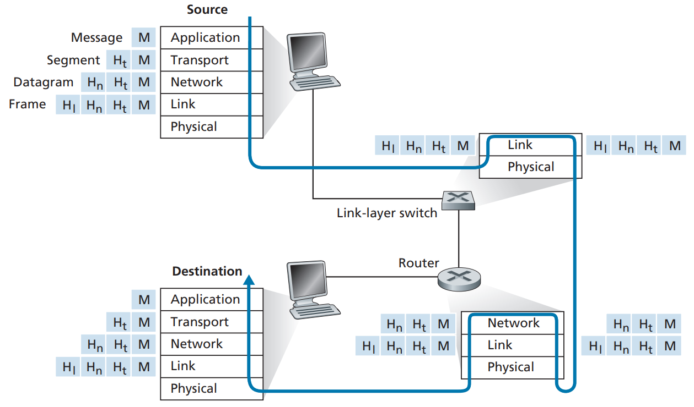

---

## #2

#### OSI 7계층와 TCP/IP 계층의 차이

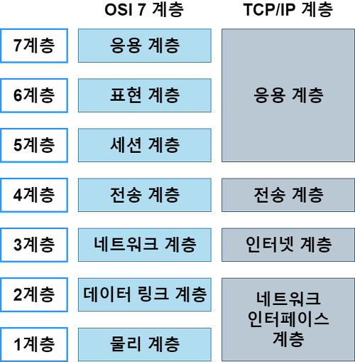

(`네트워크 인터페이스 계층`: TCP/IP 5계층에서 물리계층과 링크계층을 하나로 묶은 것)

OSI 7계층은 TCP/IP 계층의 애플리케이션 계층을 더 세분화한 것이다. TCP/IP 계층과 다른, 응용계층, 표현계층과 세션계층에 대해서 설명하고 나머지는 [[#1] TCP/IP의 각 계층을 설명해주세요.](#1)을 참고한다.

> **응용 계층**(Application Layer)

사용자 또는 애플리케이션이 네트워크에 접근할 수 있도록 해주는 계층이다. 사용자를 위한 인터페이스를 지원하며, 사용자에게 보이는 유일한 계층이다. 메일 전송, 인터넷 접속 등의 작업을 수행할 수 있다.

> **표현 계층**(Presentation Layer)

응용계층으로부터 전달받거나 전송하는 데이터의 인코딩 및 디코딩이 이루어지는 계층이다. 응용 계층에서 데이터를 이해할 수 있도록, 응용프로그램에 맞춰 변환하게 된다. 예를들어, JPEG, TIFF, GIF, MPEG 등의 다양한 포맷을 구분하게 된다.

> **세션 계층**(Session Layer)

응용프로세스가 통신을 관리하기 위한 방법을 정의한다. 네트워크상 양쪽의 연결을 관리/지속시키는 역할과 세션을 만들거나 없애는 역할을 담당하는 계층이다. 통신하는 사용자들을 동기화하고 오류복구를 진행한다. 통신연결은 포트를 기반으로 구성하여 연결되며, OS가 세션계층에 속한다.

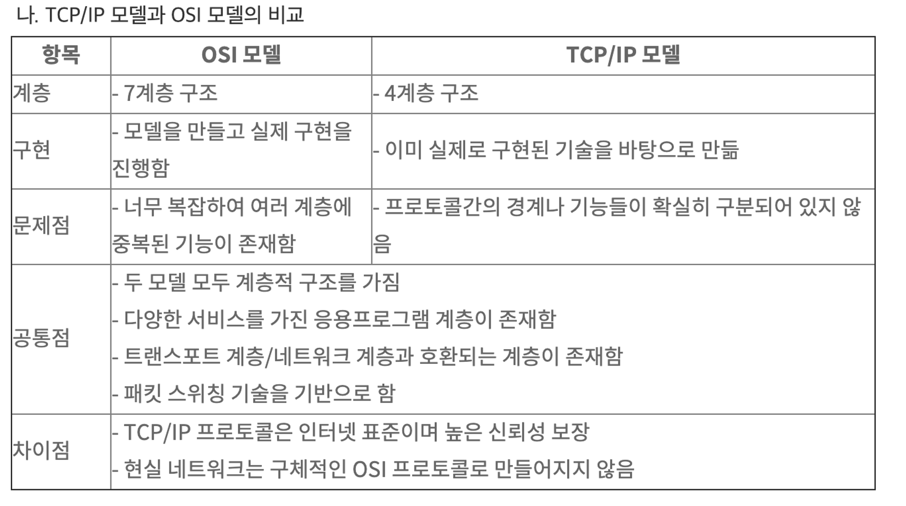

---

## #3

#### Frame, Packet, Segment, Datagram (TCP/IP 5계층 기준)

- **Packet**: 컴퓨터 간에 데이터를 주고받을 때, 네트워크를 통해 전송되는 **데이터 조각**을 패킷이라고 부른다. 송신 측(애플리케이션)은 많은 양의 데이터를 한번에 보내는 것이 아니라, 일정 단위로 잘라서 보낸다. 각 계층에서 필요한 정보는 캡슐화/역캡슐화되어 전달되고, 수신 측은 받은 패킷을 다시 조립해서 사용한다.
- **Segment**: Transport 계층(L4)에서 신뢰할 수 있는 통신을 구현하기 위한 헤더를 데이터(L5 계층 데이터)에 붙이는데, 이렇게 만들어진 패킷을 세그먼트라고 부른다.
- **Datagram**: Network 계층(L3)에서 다른 네트워크와 통신하기 위한 헤더를 세그먼트(L4 계층 데이터)에 붙인것을 데이터그램, 데이터 세그먼트라고 부른다.
- **Frame**: 데이터 링크 계층(L2)에서 물리적인 통신 채널을 열기 위해 패킷에 헤더와 트레일러를 붙인다. 트레일러는 데이터를 전달할 때 데이터 끝 부분에 붙이는 정보로, 주로 에러 검출에 사용된다.


> **왜 패킷을 잘라서 보낼까?**

많은 데이터를 한번에 보내게 되면, 데이터 손실의 가능성이 있으며, 대역폭(신호를 전송할 수 있는 주파수 범위)을 너무 많이 차지하게 되므로, 패킷의 흐름을 원활히 조절하기 위함이다.

> **캡슐화/역캡슐화**

- **캡슐화**(Encapsulation): (데이터 송신 시)하위 계층으로 패킷을 보낼때, 하위계층에서 필요로하는 추가정보(메타데이터)를 헤더/트레일러에 추가하여 보내게된다.
- **역캡슐화**(Decapsulation): 데이터 수신 시, 상위 계층으로 패킷을 전달하고, 전달된 패킷의 헤더를 차례대로 제거하면서 데이터를 얻게 된다.
- [data encapsulation](#27)를 참고하자.

> **소켓(Socket), 포트(Port), 패킷(Packet)**

네트워크에서 서로 메시지를 보내는 두 프로세스를 각각 클라이언트와 서버로 정의한다. 클라이언트는 다른 프로세스와 세션을 시작하려고 접속을 초기화하는 프로세스를 말하며, 세션을 시작하기 위해 접속을 기다리는 프로세스를 서버라 한다. P2P 에서도 클라이언트와 서버 프로세스라 부른다. 각 프로세스는 소켓(socket)을 통해 네트워크로 메시지를 보내고 받는다. 소켓은 호스트의 응용 계층과 전송 계층 간의 인터페이스이다. 또한 애플리케이션과 네트워크 사이의 API라고도 한다. 수신 프로세스를 식별하기 위해서는 1) 목적지 호스트의 IP 주소, 2) 목적지 호스트 내의 수신 프로세스를 명시하는 식별자인 포트 번호가 필요하다.

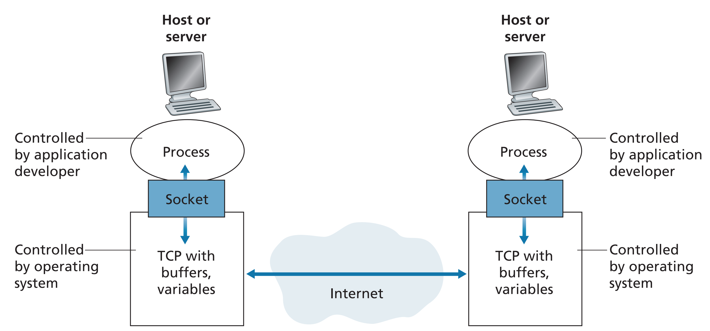

**Port**는 프로세스를 식별하기 위해, 호스트 내부적으로 프로세스가 할당받는 고유한 값이다. 같은 호스트 내에서 서로 다른 프로세스가 같은 포트 넘버를 가질 수 있음, 대신 같은 소켓을 사용하지는 못한다. `accept()`를 통해 만들어지는 소켓에는 새로운 포트 번호가 할당되는 것이 아니라, 서버가 가지는 포트(웹서버 기준, 80)와 동일한 포트 번호를 가진다. 만약 지정된 포트 번호를 다른 소켓이 사용하고 있다면, `bind()` API는 에러를 리턴한다. 포트는 논리적인 접속장소이다.

**Socket**은 프로세스로부터 네트워크로 데이터를 전달하는 출입구(인터페이스) 역할을 한다. `프로세스에서 소켓을 연다`고 표현하며, 수신 측 호스트의 트랜스포트 계층은 실제로 데이터(세그먼트)를 직접 프로세스로 전달하지 않고, 중간 매개자인 소켓에게 전달한다. 호스트에서는 하나 이상의 소켓이 존재할 수 있으므로 소켓은 고유의 식별자를 가지고 있어야한다. 같은 프로세스가 같은 포트를 가지고도 여러 개의 소켓을 열 수 있기 때문에, 소켓과 포트는 다른 개념이다.

요약하자면, **소켓**은 프로세스가 네트워크를 통해서 데이터를 주고받으려면 반드시 열어야 하는 창구 같은 것이고, **포트**는 프로세스 식별을 위해 하나의 호스트에서 프로세스에 할당하는 고유값이고, **패킷**은 네트워크 상의 데이터 조각을 말하는 것이다.

---

## #4

#### TCP와 UDP

TCP와 UDP는 모두 트랜스포트 계층(4계층)의 프로토콜이다. TCP와 UDP가 **공통적**으로 가지고 있는 기능은 아래와 같다.

1. **트랜스포트 다중화/역다중화 기능**(Transport Multiplexing/Demultiplexing): `호스트 대 호스트 전달`을 `프로세스 대 프로세스 전달`로 확장
2. **무결성 검사(오류검출)**: 헤더에 오류 검출 필드를 포함

이제 TCP와 UDP 각각에 대해 알아보자.

**UDP**는 위의 가장 기본적인 두가지 기능만을 제공한다. UDP는 **비신뢰적인 서비스**로서, 프로세스에 의해서 전송된 데이터가 손상되지 않은채로 목적지에 도착하는 것을 보장하지 않는다. 또한 **비연결형 서비스**이며, 오류검출은 선택사항이다.

UDP는 비연결형 서비스이므로 연결설정이 불필요하고 연결상태가 없다. 따라서 연결을 설정하기위한 어떠한 지연이 없고, 유지해야하는 정보가 없기 때문에 더 많은 클라이언트를 수용할 수 있다. 또한 UDP의 패킷 오버헤드(8 byte per segment)가 TCP(20 byte per segment)에 비해 더 작다는 장점이 있다. 그러나 혼잡제어를 사용하지 않아, 네트워크가 폭주상태에 빠지는 것을 막을 수 없다는 단점과 신뢰적이지 않으므로, 몇몇의 정보를 잃어버릴 수 있다는 단점이 존재한다.

**TCP**는 가장 기본적인 두가지 기능도 제공하면서, 신뢰적인 데이터 전달(Reliable Data Transfer) 기능, 연결지향형 서비스, 혼잡제어(Congestion control) 등의 기능을 제공한다. TCP는 전이중 통신이기 때문에 양방향으로 통신 가능하다.

**신뢰적인 데이터 전달**은 흐름제어, 순서번호, 확인응답, 타이머 등의 기술을 사용하여 프로세스에게 데이터가 순서대로 정확히 전달되도록 하는 역할을 한다. 종단 시스템 간에 IP의 비신뢰적인 서비스를 프로세스 사이의 신뢰적인 데이터 전송 서비스로 만들수 있으며, TCP에서의 오류검출은 필수사항이다. **혼잡제어**는 보내는 쪽(송신측)의 트래픽을 조절하여 스위치/링크의 혼잡을 방지하는 역할을 한다. 이는 특정 애플리케이션을 위해 제공하는 특정 서비스가 아니라, 전체를 위한 서비스로서, 혼잡한 네트워크 링크에서 각 TCP 연결이 링크의 대역폭을 공평하게 공유하여 통과하도록 해준다. 즉 TCP는 네트워크가 혼잡하면 프로세스 속도를 낮추어 대역폭을 공평하게 공유하도록 혼잡 제어를 한다.

따라서, UDP는 속도증가와 지연 감소를 위해서 많이 사용되고, TCP는 신뢰성이 중요한 경우에 사용된다. 예를들어, UDP는 동영상 전송과 같이, 몇 프레임 정도 손실되어도 괜찮은 데이터 전송에 사용되고, TCP는 몇몇의 정보도 손실되어서는 안되는 애플리케이션에 이용된다.

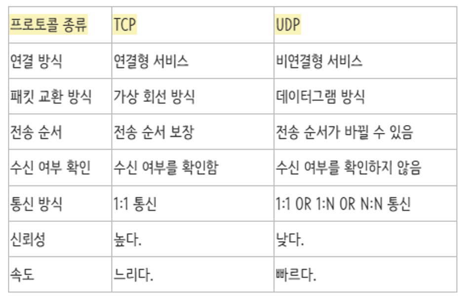

---

## #5

#### TCP와 UDP의 헤더 비교

**UDP segment**의 간략한 구조는 아래와 같다.

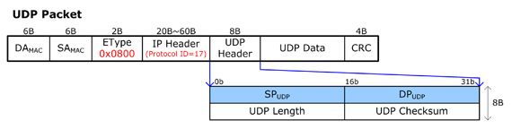

애플리케이션 데이터는 UDP 데이터그램의 데이터 필드에 위치한다. UDP 헤더는 2바이트(16비트)씩 구성된 4개의 필드를 가진다. UDP 헤더는 `출발지 포트번호(SP)`, `목적지 포트번호(DP)`, `체크섬`, `길이`로 이루어져있다.

- **포트번호**는 (목적지) 호스트가 (역다중화 기능을 수행하는) 정확한 프로세스에게 애플리케이션 데이터를 넘기게 하기 위해 사용된다.
  - SP(Source Port), DP(Destination Port)
- **체크섬**(checksum)은 세그먼트에 오류가 발생했는지를 검사하기 위해 사용되며, 체크섬은 UDP 세그먼트 이외에 IP 헤더의 일부 필드도 계산한다.(가상헤더) UDP 헤더와 데이터를 모두 포함하여 체크하게 된다.
- **길이**는 헤더를 포함하는 UDP 세그먼트의 길이(바이트 단위)를 나타낸다. UDP헤더와 데이터를 합친 길이를 나타낸다.

---

**TCP segment**의 간략한 구조는 아래와 같다.

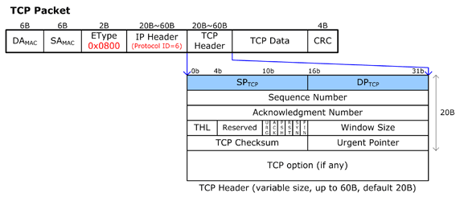

TCP 소켓은 4개의 다른 요소들의 집합에 의해 식별된다.(`출발지 IP`, `출발지 포트번호`, `목적지 IP`, `목적지 포트번호`) 따라서 IP를 제외한 `출발지/도착지 포트번호`(각 16 bit)와 `sequence number`(32 bit), `ack number`(32 bit)를 합쳐, 기본적으로 20 byte의 헤더를 가지게 되며, 옵션을 포함하면 최대 60 byte의 헤더를 가질 수 있다. 다른 출발지 주소를 가지는 세그먼트는, 다른 소켓을 통해서 프로세스에 전달된다. UDP와 다르게, **TCP 세그먼트는 출발지 주소가 다르면, 다른 소켓으로 전달된다.**

- **포트번호**는 IP 정보와 결합하여 출발지, 도착지를 구분하기 위해 사용된다.
- **Sequence Number**는 SYN 패킷을 보낼때, 동기화를 위해 사용되는 번호이다. 초기 Sequence Number를 ISN이라 부르며, 여기에는 랜덤한 수가 담긴다.
- **Ack Number**는 ACK 패킷을 보낼 때 동기화를 위해 사용되는 번호이다.

---

## #6

#### TCP의 3-way-handshake와 4-way-handshake 비교

**핸드셰이크**(Handshake)란, 호스트 간 데이터를 전송하기 전에 먼저 정확한 전송을 보장하기 위해 상대방 컴퓨터와 사전에 세션을 수립하는 과정을 의미한다.

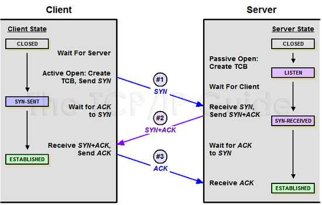

**3-way handshake**는 **TCP의 연결을 초기화** 할 때 사용한다. 양쪽 모두 데이터를 전송할 준비가 되었다는 것을 보장하고, 실제로 데이터 전달이 시작하기전에 한쪽이 다른 쪽이 준비되었다는 것을 알수 있도록 한다. 양쪽 모두 상대편에 대한 초기 순차일련변호를 얻을 수 있도록 한다. 절차는 다음과 같다.

1. 접속 요청 프로세스가 연결 요청 메시지 전송한다.(SYN)
2. 접속 요청을 받은 프로세스가 요청을 수락한다는 확인 메시지를 보낸다. (ACK) 동시에 접속 요청을 받은 프로세스도 접속 요청을 한 프로세스에 연결 요청을 보낸다.(SYN) → (SYN + ACK)
3. 마지막으로 접속 요청 프로세스가 수락 확인을 보내 연결을 맺는다.(ACK)

단순히 응답을 주고받는데 2-way Handshake면 충분해보이지 않는가? 왜 3-way 일까? TCP/IP 통신은 양방향성 connection이다. 위의 그림의 1번 과정에서 클라이언트가 연결 요청을 SYN으로 보내면, 서버는 클라이언트가 요청한 SYN에 대한 대답(ACK)과 함께, 자신도 연결하겠다는 요청의 의미로 SYN을 보내고, 클라이언트로부터 요청에 대한 대답(과정 3)을 받아야한다. 이 과정은 2-way handshaked에서는 성립될 수 없다.

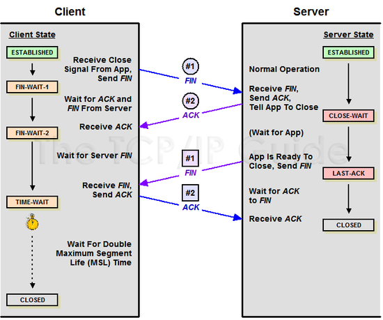

**4-way handshake**는 **세션을 종료**하기 위해 수행되는 절차이다. 구체적인 과정은 다음과 같다.

1. 클라이언트가 연결을 종료하겠다는 FIN 플래그를 전송한다.
2. 서버는 일단 확인메시지를 보내고 자신의 통신이 끝날때까지 기다리는데, 이 상태가 `TIME_WAIT` 상태이다.
3. 서버가 통신이 끝났으면 연결이 종료되었다고 클라이언트에게 FIN 플래그를 전송한다.
4. 클라이언트는 확인했다는 메시지를 보낸다.

> **💡 `CLOSE_WAIT` 와 `TIME_WAIT` 상태란 무엇일까?**  
> `TIME_WAIT` 상태로 대기하는 이유는, 세션 종료후, 혹시나 네트워크에 아직 라이브 패킷이 존재할수도 있기때문이다.

> **💡 용어**
>
> - **SYN**(Synchronization): 연결요청, 세션을 설정하는데 사용되며 초기에 시퀀스 번호를 보낸다.
> - **ACK**(Acknowledgement): 보낸 시퀀스 번호에 TCP 계층에서의 길이 또는 양을 더한 것과 같은 값을 ACK에 포함하여 전송한다.
> - **FIN**(Finish) : 세션을 종료시키는데 사용되며 더 이상 보낸 데이터가 없음을 표시한다.

#### References

- [[네트워크] 3-way / 4-way Handshake 란? - 방구의 개발냄새](https://bangu4.tistory.com/74)
- [TCP의 3 way Handshake과 4 way Handshake - 자비스가 필요해](https://needjarvis.tistory.com/157)
- [3-way handshake 4-way handshake는 왜 필요할까? - 안 평범한 개발자의 하루](https://unordinarydays.tistory.com/172)

---

## #7

#### TCP의 연결 설정 과정(3단계)과 연결 종료 과정(4단계)이 단계가 차이나는 이유가 무엇인가요?

연결 설정 과정과 다르게, 연결 종료 과정에서는 전송중인 데이터를 고려해야 한다. 클라이언트는 아직 서버로부터 못 받은 데이터가 있을 것을 대비하여 일정시간동안 세션을 남긴다(`TIME_WAIT`). 모든 데이터를 다 보내서 더 이상 보낼 데이터가 없다는 의미의 `FIN`을 받으면, 바로 연결을 종료한다.

---

## #8

#### 만약 Server에서 FIN 플래그를 전송하기 전에 전송한 패킷이 Routing 지연이나 패킷 유실로 인한 재전송 등으로 인해 FIN 패킷보다 늦게 도착하는 상황이 발생하면 어떻게 될까요?

클라이언트에서 세션을 종료시킨 후 뒤늦게 도착하는 패킷이 있다면 이 패킷은 Drop되고 **데이터는 유실**될 것이다.

이러한 현상에 대비하여 Client는 Server로부터 `FIN`을 수신하더라도 일정시간동안 세션을 남겨놓고 잉여 패킷을 기다리는 과정을 거치게 되는데 이 과정을 `TIME_WAIT` 라고 한다. 일정시간이 지나면, 세션을 만료하고 연결을 종료시키며, `CLOSE` 상태로 변화한다.

#### References

- [[네트워크] 3-way / 4-way Handshake 란? - 방구의 개발냄새](https://bangu4.tistory.com/74)

---

## #9

#### 초기 Sequence Number인 ISN을 0부터 시작하지 않고 난수를 생성해서 설정하는 이유가 무엇인가요?

TCP 통신에서 연결을 위해 사용하는 포트 번호는 유한하기 때문에 재사용된다. 그래서 두 통신 호스트가 과거에 사용된 포트 번호 쌍을 사용할 가능성이 존재한다. 서버 측에서는 패킷의 `SYN`을 보고 패킷을 구분하는 데, 만약 `ISN`을 0번 부터 순차적으로 사용한다면 과거의 connection으로부터 온 패킷인지 새로운 connection에 대한 시작인지 구별할 수 없다. 이러한 문제가 발생할 가능성을 줄이기 위해 난수로 `ISN`을 시작하고, 이후 sequence number는 순차적으로 사용한다.

---

## #10

#### HTTP와 HTTPS 개념과 차이점

> **HTTP**

HTTP(HyperText Transfer Protocol)란 **서버/클라이언트가 서로  데이터를 주고받기 위한 프로토콜**이다. 즉, HTTP는 인터넷에서 하이퍼텍스트를 교환하기 위한 통신 규약으로, 80번 포트를 사용하고 있다. 따라서 HTTP 서버가 80번 포트에서 요청을 기다리고 있으며, 클라이언트는 80번 포트로 요청을 보내게 된다. 각기 다른 종단 시스템에서 클라이언트와 서버는 서로 HTTP 메시지를 교환하여 통신한다.

HTTP는 TCP를 전송 프로토콜로 사용한다. HTTP 클라이언트는 먼저 서버에 TCP 연결을 시작한다. 이때 HTTP 클라이언트는 HTTP의 기본 포트 번호 80을 통해 서버로 TCP 연결을 시도한다. 일단 연결이 이루어지면, 브라우저와 서버 프로세스는 그들의 소켓 인터페이스를 통해 TCP로 접속한다.

HTTP는 1989년 팀 버너스 리(Tim Berners Lee)에 의해 처음 설계되었으며, WWW(World-Wide-Web) 기반에서 세계적인 정보를 공유하는데 큰 역할을 하였다.

**HTTP의 특징**

- 비연결 지향(Connectionless) : 클라이언트가 request를 서버에 보내고, 서버가 클라이언트에게 response를 보내면 바로 연결을 끊음
- 무상태(stateless) : 연결을 끊는 순간 클라이언트와 서버의 통신은 끝나며 상태 정보를 유지하지 않음

> **HTTPS**

HTTPS는 **HTTP에 데이터 암호화가 추가된 프로토콜**이다. HTTPS는 HTTP와 다르게 443번 포트를 사용하며, 네트워크 상에서 중간에 제3자가 정보를 볼 수 없도록 대칭키 암호화와 공개키 암호화를 모두 사용한다. 처음 연결을 성립하여 안전하게 세션키를 공유하는 과정에서는 공개키를 사용하고, 이후 데이터를 교환하는 과정에서 빠른 연산 속도를 위해 대칭키를 사용한다.

소켓 통신에서 일반 텍스트를 이용하는 대신에, 웹 상에서 SSL이나 TLS 프로토콜을 통해 세션 데이터를 암호화한다.

HTTP는 암호화가 추가되지 않았기 때문에 보안에 취약한 반면, HTTPS는 안전하게 데이터를 주고받을 수 있다. 하지만 HTTPS를 이용하면 암호화/복호화의 과정이 필요하기 때문에 HTTP보다 속도가 느리다. 또한 HTTPS는 인증서를 발급하고 유지하기 위한 추가 비용이 발생하다.

개인 정보와 같은 민감한 데이터를 주고받아야 한다면 HTTPS를 이용해야 하지만, 단순한 정보 조회 등 만을 처리하고 있다면 HTTP를 이용하면 된다.

---

## #11

#### HTTP 요청/응답 헤더의 구조

HTTP 요청과 응답 메시지는 아래와 같다.

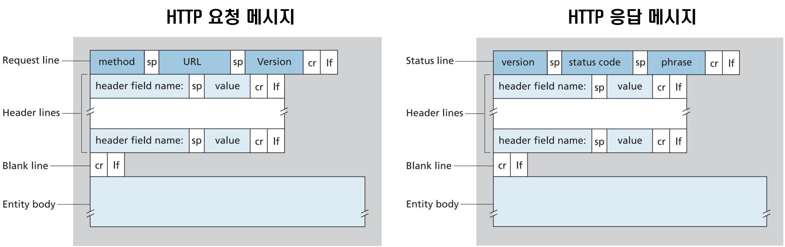

> HTTP 요청 메시지
```
GET /somedir/page.html HTTP/1.1     // 요청 라인
Host: www.someschool.edu            // 헤더 라인
Connection: close
User-agent: Mozilla/5.0
Accept-language: fr
```
Entity Body는 GET 방식에서는 비어 있고, POST 방식에서 사용된다. 만약 method가 POST라면, Entity body에는 사용자가 폼 필드에 입력(검색 엔진에 넣은 검색어)한 것을 포함한다. HTTP는 흔히 GET 방식을 사용하고 Entity body 대신 요청된 URL에 입력 데이터(폼 필드 값)를 넣는다. 예를 들어 폼에 GET 방식을 사용하고 2개의 필드를 가지면, 두 필드의 입력 값이 monkeys와 bananas라면 URL `www.somsite.com/animalsearch?monkeys&bananas` 구조를 가진다.

> HTTP 응답 메시지
```
HTTP/1.1 200 OK                             // 상태 라인
Connection: close                           // 헤더 라인
Date: Tue, 18 Aug 2015 15:44:04 GMT
Server: Apache/2.2.3 (CentOS)
Last-Modified: Tue, 18 Aug 2015 15:11:03 GMT
Content-Length: 6821
Content-Type: text/html

(데이터 데이터 데이터 데이터 ...)               // Entity Body
```
서버로부터 받아온 데이터는 Entity body에 담겨있으며, 최근 수정 시간 정보도 포함하고 있다.

---

## #12

#### HTTP와 HTTPS 동작 과정 비교

HTTP는 서버/클라이언트 모델에 따라 통신한다. 즉 클라이언트가 서버에 요청하면 서버는 응답을 클라이언트에게 보낸다.

1. 클라이언트가 원하는 서버에 접속
2. 클라이언트가 서버에 요청
3. 서버가 요청에 따른 응답 결과를 다시 클라이언트에 응답 
4. 응답이 끝나고 나면 서버와 클라이언트의 연결은 끊김

HTTPS는 HTTP와는 다르게 SSL이나 TLS를 이용하여 암호화하는 과정을 필요로 한다.

1. 서버는 공개키, 개인키를 만들고 인증기관(CA)에 자신의 정보와 공개키 관리 계약을 맺음 
2. 인증기관은 인증기관의 개인키로 사이트에서 제출한 정보(서버 공개키, 공개키 암호화 방법)를 암호화하여 인증서를 만들어 서버에 제공 
3. 사용자가 사이트에 접속하면 서버는 자신의 인증서를 웹 브라우저(클라이언트)에게 제공 
4. 웹 브라우저는 인증기관의 공개키(이미 알고있음)로 인증서를 해독하여 검증 -> 사이트 정보와 서버의 공개키를 얻음 
5. 얻은 서버의 공개키로 대칭키를 암호화하여 다시 서버에 보냄 
6. 서버는 암호화된 대칭키를 자신의 개인키로 복호화 하여 클라이언트와 동일한 대칭키 획득 
7. 이 후부터는 전달 받은 대칭키로 데이터를 주고 받음 
8. 세션이 종료되면 대칭키는 폐기됨


#### References

- [HTTP & DNS & TCP 정의 및 동작원리 - lkh's](https://lkhlkh23.tistory.com/76)
- [[Web 기초] HTTP 통신 과정 - MYSTERICO BLOG](https://mysterico.tistory.com/29)
- [[Web 기초] HTTPS의 동작 원리 (feat. 와이어샤크) - MYSTERICO BLOG](https://mysterico.tistory.com/30)

---

## #13

#### CORS

교차 출처 리소스 공유(Cross-Origin Resource Sharing, CORS)는 추가 HTTP 헤더를 사용하여, 한 출처에서 실행 중인 웹 애플리케이션이 다른 출처의 선택한 자원에 접근할 수 있는 권한을 부여하도록 브라우저에 알려주는 체제이다. 쉽게 말해서 CORS는 웹 페이지가 다른 브라우저에 있는 자원에 접근할 수 있도록 해주는 보안 메커니즘이다. 

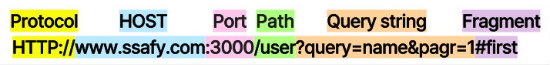

Cross-Origin의 판단 기준은 Schema(프로토콜), Host(도메인), Port이며 이 3가지 중 하나라도 다르면 Cross-Origin이라고 판단한다.

CORS 체제는 브라우저와 서버 간의 안전한 교차 출처 요청 및 데이터 전송을 지원한다. 최신 브라우저는 XMLHttpRequest 또는 Fetch와 같은 API에서 CORS를 사용하여 교차 출처 HTTP 요청의 위험을 완화한다.

> **CORS의 동작 원리**

1. 기본적으로 웹은 다른 출처의 리소스를 요청할 때는 HTTP 프로토콜을 사용하여 요청을 하는데, 이때 브라우저는 요청 헤더 (request header)에 `Origin` 필드에 요청을 보내는 출처를 담아 전송한다.
2. 서버는 요청에 대한 응답을 하는데, 응답 헤더(response header)에 `Access-Control-Allow-Origin`이라는 값에 '이 리소스를 접근하는 것이 허용된 출처'를 내려준다.
3. 이후 응답을 받은 브라우저는 자신이 보냈던 요청의 Origin과 서버가 보내준 응답의 `Access-Control-Allow-Origin`을 비교해 본 후 이 응답이 유효한 응답인지 아닌지를 결정한다.


> **SOP(Same-Origin Policy)란?**

브라우저는 기본적으로 "같은 출처에서만 리소스를 공유할 수 있다"라는 규칙을 가진 SOP 정책을 따른다. 즉, 다른 출처의 리소스를 사용하는 것을 제안하는 보안 방식이다.

> **CORS의 해결방법은?**

Proxy 서버를 사용한다.
응답을 주고 받을때 프록시 서버에서 `Access-Control-Allow-Origin: *` 헤더를 담아 응답한다. 프록시 서버는 헤더를 추가하거나 요청을 허용/거부하는 역할을 중간에서 해줄 수 있다.

---

## #14

#### HTTP GET과 POST 메서드 비교

> **GET**

GET은 클라이언트가 서버에게 어떠한 리소스로부터 정보를 요청하기 위해 사용되는 메서드이다. GET을 통한 요청은 URL 주소 끝에 파라미터로 포함되어 전송되며, 이 부분을 쿼리 스트링(query string)이라고 부른다.

방식은 URL 끝에 `?`를 붙이고 그다음 `변수명1=값1&변수명2=값2...` 형식으로 이어 붙이면 된다. 예를 들면 `www.example.com/show?name1=value1&name2=value2`이다. 서버에서는 `name1`과 `name2`라는 파라미터 명으로 각각 `value1`과 `value2`의 파라미터 값을 전달받을 수 있다.

> **POST**

POST는 클라이언트가 서버로 리소스를 생성하거나 업데이트하기 위해 데이터를 보낼 때 사용되는 메서드이다. POST는 전송할 데이터를 HTTP 메시지 body 부분에 담아서 서버로 보낸다.(body의 타입은 Content-Type 헤더에 따라 결정된다.)

GET에서 URL의 파라미터로 보냈던 `name1=value1&name2=value2`가 body에 담겨 보내진다 생각하면 된다. POST로 데이터를 전송할 때 길이 제한이 따로 없어 용량이 큰 데이터를 보낼 때 사용하거나 GET처럼 데이터가 외부적으로 드러나는 건 아니라서 보안이 필요한 부분에 많이 사용된다. POST를 통한 데이터 전송은 보통 HTML form을 통해 서버로 전송된다.

> **GET과 POST의 차이점**

- 사용목적: GET은 서버의 리소스에서 데이터를 요청할 때, POST는 서버의 리소스를 새로 생성하거나 업데이트할 때 사용한다.
- 요청에 body 유무: GET은 URL 파라미터에 요청하는 데이터를 담아 보내기 때문에 HTTP 메시지에 body가 없다. POST는 body에 데이터를 담아 보내기 때문에 당연히 HTTP 메시지에 body가 존재한다.
- 멱등성(idempotent): GET 요청은 멱등이며, POST는 멱등이 아니다.

> **💡멱등이란?**  
> 멱등의 사전적 정의는 연산을 여러 번 적용하더라도 결과가 달라지지 않는 성질을 의미한다. GET은 리소스를 조회한다는 점에서 여러 번 요청하더라도 응답이 똑같을 것이다. 반대로 POST는 리소스를 새로 생성하거나 업데이트할 때 사용되기 때문에 멱등이 아니라고 볼 수 있다.(POST 요청이 발생하면 서버가 변경될 수 있다.)

---

## #15

#### 쿠키(Cookie)와 세션(Session)

> **쿠키(Cookie)**

HTTP 서버는 상태를 유지하지 않는 비상태(stateless) 프로토콜이기 때문에 클라이언트에 대한 정보를 유지하지 않는다. 그래서 브라우저에 접속하는 사용자를 확인할 없다. 쿠키를 사용하면 사이트가 사용자를 추적하게 해준다.

예) 자동 로그인, 아이디 저장 등

쿠키는 클라이언트(브라우저) 로컬에 저장되는 키와 값이 들어있는 작은 데이터 파일이다. 이름, 값, 유효시간, 경로 등을 포함하며 클라이언트의 상태 정보를 브라우저에 저장하여 참조하며, 유효 시간 동안은 브라우저가 종료되어도 인증이 유지된다는 특징이 있다. 

웹 서버에 새로운 TCP 연결 요청이 들어오면 그 서버는 유일한 식별번호를 만들어 데이터베이스에 저장하고 웹 브라우저에 Set-cookie: 1678 처럼 응답한다. 클라이언트의 웹 브라우저는 해당 쿠키 파일을 저장하고, 앞으로 웹 서버에 HTTP를 요청할 때마다 식별번호를 포함하는 쿠키 헤더 파일을 넣는다. 이를 통해 서버는 사용자를 확인할 수 있다.

쿠키는 다음과 같이 동작한다.


1. 클라이언트가 페이지를 요청
2. 서버에서 쿠키를 생성하고 HTTP 헤더에 쿠키를 포함시켜 응답 (Set-Cookie: key=value)
4. 브라우저가 종료되어도 쿠키 만료 기간이 있다면 클라이언트에서 보관
5. 같은 요청을 할 경우 HTTP 헤더에 쿠키를 함께 보냄
6. 서버에서 쿠키를 읽어 이전 상태 정보를 변경할 필요가 있을 때 쿠키를 업데이트하여 변경된 쿠키를 HTTP 헤더에 포함시켜 응답

> **세션(Session)**

세션은 일정 시간 동안 같은 브라우저로부터 들어오는 요청을 하나의 상태로 보고 그 상태를 유지하는 기술이다. 즉 서버에 접속한 이후부터 브라우저를 종료할 때까지 유지된다. 

예) 로그인 유지(웹 페이지 내에서 화면을 이동하더라도 로그인은 풀리지 않음)

세션은 쿠키를 기반하고 있지만, 사용자 정보 파일을 브라우저에 저장하는 쿠키와 달리 세션은 **서버 측에서 관리**한다. 서버에서는 클라이언트를 구분하기 위해 세션 ID를 부여하며 웹 브라우저가 서버에 접속해서 브라우저를 종료할 때까지 인증 상태를 유지한다.

접속 시간에 제한을 두어 일정 시간 응답이 없다면 정보가 유지되지 않게 설정이 가능하다.
사용자에 대한 정보를 서버에 두기 때문에 쿠키보다 보안에 좋지만, 사용자가 많아질수록 서버 메모리를 많이 차지하게 된다. 즉 동접자 수가 많은 웹 사이트인 경우 서버에 과부하를 주게 되므로 성능 저하의 요인이 된다.

클라이언트가 Request를 보내면, 해당 서버의 엔진이 클라이언트에게 유일한 ID를 부여하는 데 이것이 세션 ID다.

세션의 동작 방식은 다음과 같다.

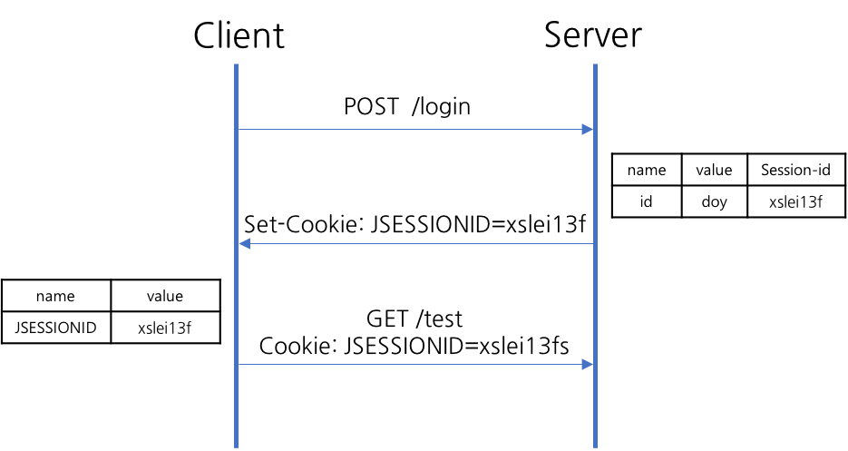

1. 클라이언트가 서버에 접속 시 세션 ID를 발급
2. 클라이언트는 세션 ID에 대해 쿠키를 사용해서 저장함
3. 클라이언트는 서버에 요청할 때, 이 쿠키의 세션 ID를 서버에 전달해서 사용
4. 서버는 세션 ID를 전달받아서 별다른 작업 없이 세션 ID로 세션에 있는 클라언트 정보를 가져옴
5. 클라이언트 정보를 가지고 서버 요청을 처리하여 클라이언트에게 응답

> **쿠키와 세션의 차이점**

- **사용자의 정보가 저장되는 위치**: 쿠키는 서버의 자원을 전혀 사용하지 않으며, 세션은 서버의 자원을 사용한다.
- **보안**: 쿠키는 클라이언트 로컬에 저장되기 때문에 변질되거나 request에서 스니핑 당할 우려가 있어서 보안에 취약하다. 반면 세션은 쿠키를 이용해서 세션 ID만 저장하고 그것으로 구분해서 서버에서 처리하기 때문에 비교적 보안성이 좋다.
- **라이프 사이클**: 쿠키는 만료시간이 있지만 파일로 저장되기 때문에 브라우저를 종료해도 계속해서 정보가 남아 있을 수 있다. 또한 만료 기간을 넉넉하게 잡아두면 쿠키를 삭제할 때까지 유지될 수도 있다. 반면에 세션도 만료시간을 정할 수 있지만 브라우저가 종료되면 만료시간에 상관없이 삭제된다.
- **속도**: 쿠키에 정보가 있기 때문에 서버에 요청 시 속도가 빠르다. 반면 세션은 정보가 서버에 있기 때문에 처리가 요구되어 비교적 느린 속도를 낸다.

세션은 서버의 자원을 사용하기 때문에 무분별하게 만들다 보면 서버의 메모리가 감당할 수 없어질 수가 있고 속도가 느려질 수 있기 때문에 쿠키를 함께 사용한다.

---

## #16

#### DNS란?

모든 네트워크 통신에는 고유의 주소, 즉 IP 주소가 필요하다. 이때 통신을 주고받는 주체가 되는 네트워크에 연결되어 있는 모든 장치들을 host라고 한다. IP는 사람이 이해하고 기억하기 어렵기 때문에 이를 위해서 각 ip에 부여한 이름이 도메인(Domain)이다. 예를 들어 210.89.164.90의 도메인은 naver.com이다.


DNS(Domain Name Server 또는 Domain Name Service 모두를 의미)는 숫자로 이루어진 IP 주소와 일정한 형식을 가진 도메인을 서로 매핑 시키고 정보를 가지고 있다. 예를 들어 네이버에 접속하기 위해 주소창에 도메인(naver.com)을 입력하면, 컴퓨터는 해당 도메인이 연결된 DNS로 가서 서버 IP를 요청한다.

요청받은 네임 서버는 해당 도메인과 연결되어 있는 서버 IP(210.89.164.90)를 찾은 후, 컴퓨터에게 알려준다.

이처럼 도메인에 연결된 서버의 주소를 찾아주는 역할이 **DNS**이다. DNS는 응용 계층 프로토콜이다. UDP 방식을 사용하며, 포트 번호 53을 이용한다. DNS 서버들은 계층 구조로 구현된 분산 데이터베이스이다. 일반적으로 Root DNS 서버 -> TLD(top-level domain) DNS 서버 -> 책임 DNS 서버로 구성된다.

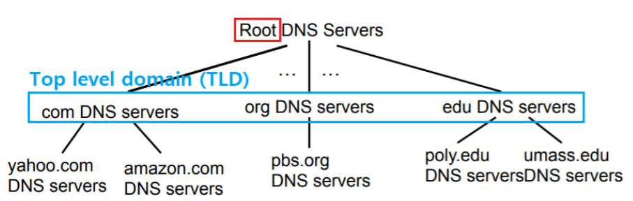

- root 서버 : 전 세계에 13대 구축
- TLD 서버 : com, org, net, edu, gov, kr 등
- Authoritative DNS 서버 : 개인 및 회사가 등록하여 사용가능(naver, amazon, yahoo 등)
- Local DNS 서버 : 각 네트워크 기관들은 캐시처럼 내부에서 요청되는 DNS 쿼리들에 대한 host와 ip 주소 매핑 결과를 저장함

> **브라우저가 도메인에 해당하는 IP를 찾는 순서**

1. local cache 안에 검색한 해당 도메인의 IP가 있는지 확인한다. 이미 해당 도메인을 방문한 적이 있다면 컴퓨터가 해당 도메인의 IP를 기억하고 있으므로 그것을 사용한다.
2. 만약 캐시에 없다면 컴퓨터 내부에 파일 형태로 존재하는 hosts 파일을 검색해서 찾는다. 해당 hosts 파일에 특정 도메인과 IP를 매핑 시켜놓으면 해당 도메인은 지정한 IP로 이동한다.
3. 만약 위의 경우에서 도메인에 대한 IP를 찾지 못하면 최종적으로 DNS를 검색한다.

---

## #17

#### REST와 RESTful의 개념과 차이점

`REST`란 **Re**presentational **S**tate **T**ransfer의 약자로, 간단하게 말해서 웹에 존재하는 모든 자원(이미지, 동영상, DB 등)에 고유한 URI를 부여해 활용하는 것이다. HTTP URI로 자원(Resource)을 명시하고 HTTP 메서드를 통해 해당 자원(URI)에 대한 CRUD(Create, Read, Update, Delete) 연산을 적용한다.

> **REST 구성요소**
- 자원(Resource) : HTTP URI(Uniform Resource Identifier)
- 자원에 대한 행위(verb) : HTTP Method
- 자원에 대한 행위의 내용(Representation) : HTTP message Pay Load

> **HTTP 메서드 종류**

요청의 종류에 따라 다른 HTTP 메서드를 사용하는데 주로 사용하는 대표적인 메서드는 다음과 같다.

| 메서드 | 역할                                                    |
| :----: | :------------------------------------------------------ |
|  GET   | 데이터를 조회한다.                                      |
|  POST  | 데이터를 등록한다. 인증 작업을 거칠 때 사용하기도 한다. |
| DELETE | 데이터를 삭제한다.                                      |
|  PUT   | 데이터를 새 정보로 통째로 업데이트할 때 사용한다.       |
| PATCH  | 데이터의 특정 필드를 수정할 때 사용한다.                |

> **URI란?**

URI는 Uniform Resource Identifier의 약자로, 자원을 식별자로 취급하여 나타내는 주소를 말한다. URI의 종류로 URL과 URN이 있다. URI는 일반적으로 다음과 같은 형식을 갖고 있다.


> **REST의 장단점**
- 장점
  - HTTP 프로토콜의 인프라를 그대로 사용하므로 REST API 사용을 위한 별도의 인프라를 구축할 필요 X 
  - HTTP 표준 프로토콜을 따르는 모든 플랫폼에서 사용 가능 
  - REST API 메시지가 의도하는 바를 명확하게 나타내므로 의도하는 바를 쉽게 파악할 수 있음
- 단점
  - 표준이 존재하지 않아 정의가 필요함 
  - HTTP Method 형태가 제한적임 
  - 구형 브라우저에서 호환이 되지 않아 지원하지 않는 동작 多

> **REST API**

REST에서 자원(URI)은 데이터베이스의 정보를 말한다. 하지만 클라이언트가 직접 데이터베이스에 접속해 변경하는 것은 매우 위험한 방식이다. 그래서 이를 막기 위해 REST API를 사용한다. 클라이언트가 서버에 데이터를 조회·생성·삭제·업데이트를 하겠다고 HTTP 메서드로 요청하면 서버는 로직에 따라 데이터베이스에 접근하여 요청을 처리한다.

즉 REST API는 http의 장점을 최대한 활용할 수 있는 아키텍처로 웹에서 사용되는 데이터나 자원을 HTTP URI로 표현하고, HTTP 프로토콜을 통해 요청과 응답을 정의한다.

그리고 `RESTful`은 REST 아키텍처로 구현된 웹 서비스를 나타내기 위한 용어로, "REST API를 제공하는 웹 서비스는 RESTful하다"처럼 사용된다.
보통 REST API의 설계 규칙을 올바르게 지키도록 설계된 시스템을 RESTful하다고 한다.


#### References

- [[Network] REST란? REST API란? RESTful이란? - HeeJeong Kwon](https://gmlwjd9405.github.io/2018/09/21/rest-and-restful.html)
- [REST API 제대로 알고 사용하기 - NHN Cloud Meetup!](https://meetup.toast.com/posts/92)
- [URL과 URI의 의미와 차이점 (Difference between URL & URI) - Lael's World](https://blog.lael.be/post/61)
- [통합 자원 식별자 - 위키피디아](https://ko.wikipedia.org/wiki/%ED%86%B5%ED%95%A9_%EC%9E%90%EC%9B%90_%EC%8B%9D%EB%B3%84%EC%9E%90)
- [21장. 백엔드 프로그래밍: Node.js의 Koa 프레임워크 - 리액트를 다루는 기술](http://www.yes24.com/Product/Goods/79260300)

---

## #18

#### 소켓(Socket)이란?

`소켓(Socket)`이란 Application 계층 프로세스와 end-to-end 통신을 제공하는 Transport 계층 프로토콜 사이의 인터페이스을 말한다. 즉, Application에서 Transport 계층 프로토콜을 쓰기 위한 API를 말한다. 소켓은 크게 UDP와 TCP 두 종류로 분류할 수 있다. 자세한 내용은 [#4. TCP와 UDP의 차이를 설명해주세요.](#4)을 참고하자.

파이썬으로 TCP에서의 소켓과 UDP에서의 소켓 생성 코드를 구현하면 다음과 같다. 소켓을 생성한다고 바로 통신을 할 수 없으며 실제 통신을 하기 위해는 바인딩, 연결 등 추가 작업이 필요하다.

> **TCP**

- TCP Client

```python
from socket import *

server_name = "example.com"
server_port = 1234

client_socket = socket(AF_INET, SOCKET_STREAM)  # 소켓 생성
client_socket.connect((server_name, server_port)) # 서버에 연결 요청
```

- TCP Server

```python
from socket import *

server_port = 1234

server_socket = socket(AF_INET, SOCKET_STREAM)  # 소켓 생성
server_socket.bind(('', server_port)) # 소켓에 주소 바인딩
server_socket.listen(1) # 클라이언트 연결 대기

(client_socket, client_address) = server_socket.accept()  # 클라이언트 연결 수락
```

> **UDP**

- UDP Client

```python
from socket import *

server_name = "example.com"
server_port = 1234

client_socket = socket(AF_INET, SOCK_DGRAM) # 소켓 생성
```

- UDP Server

```python
from socket import *

server_port = 1234
server_socket = socket(AF_NET, SOCK_DGRAM)  # 소켓 생성
server_socket.bind(('', server_port)) # 소켓에 주소 바인딩
```

#### References

- [Chapter 2. Application Layer - Computer Networking: A Top-Down Approach](http://www.yes24.com/Product/Goods/24320296?OzSrank=2)

---

## #19

#### Socket.io와 WebSocket의 차이를 설명해주세요.

> **WebSocket**


`WebSocket`은 서버와 브라우저 간 연결을 유지한 상태로 데이터를 교환할 수 있도록 하는 프로토콜을 말한다.

전형적인 브라우저 렌더링 방식은 HTTP 요청에 대한 응답을 받아 브라우저 화면을 깨끗히 지우고 받은 내용을 새로 표시하는 방식인데, 내용을 지우고 다시 그리면 브라우저의 깜박임이 생기게 된다. 이러한 깜박임 없이 필요한 부분만 다시 그리는 상호작용 방식의 수요가 생겼다.

이러한 상호작용을 구현하기 위해 Pooling, Long Pooling, Streaming 등 다양한 방식을 사용했지만 요청을 보내고 응답을 보내는 **단방향 메시지 교환 규칙을 준수**하였기 때문에 상호작용하는 웹페이지를 구현하는 것은 매우 어려웠다.

이보다 쉽게 구현하기 위해 **브라우저와 서버 간 양방향 메시지 송수신 규칙**이 필요했고 이것이 WebSocket이다.

> **Socket.io**

`socket.io`는 서버와 브라우저의 양방향 통신을 가능하게 하는 모듈을 말한다. WebSocket의 경우 정말 좋은 기술이지만 오래된 브라우저의 경우 지원을 하지 않는 경우가 있다. 이런 경우 socket.io는 서버와 브라우저의 종류와 버전을 파악하여 가장 적합한 기술을 선택해 양방향 통신이 가능하도록 한다.

#### References

- [WebSocket과 Socket.io - NAVER D2](https://d2.naver.com/helloworld/1336)
- [웹소켓 - 위키백과](https://ko.wikipedia.org/wiki/%EC%9B%B9%EC%86%8C%EC%BC%93)
- [웹소켓 - 모던 JavaScript 튜토리얼](https://ko.javascript.info/websocket)
- [websocket, socket.io를 이용한 양방향 통신 - zych1751](http://www.secmem.org/blog/2019/08/17/websocket-socketio/)
- [10.5 Node.js(Express)와 Socket.io - PoiemaWeb](https://poiemaweb.com/nodejs-socketio)

---

## #20

#### IPv4와 IPv6

IPv4와 IPv6는 **인터넷 프로토콜(IP)의 버전**을 말하며, IPv4는 IP의 4번째 버전, IPv6는 IP의 6번째 버전을 말한다. 이 때 인터넷 프로토콜은 호스트 간 패킷 교환 네트워크에서 패킷(Packet) 혹은 데이터그램(Datagram)으로 불리는 정보를 주고받는데 사용하는 프로토콜을 말한다.


`IPv4`는 헤더에 options이 존재하고, fragmentation/reassembly 기능을 제공해 MTU(Maximum Transport Unit)을 넘는 큰 데이터그램을 쪼개 전송을 하고 도착지에서 재조합을 한다. 또한 checksum 비트도 존재하여 매 라우터마다 checksum 비트를 갱신한다.

반면 `IPv6`는 빠른 속도를 위해 fragmentation/reassembly 기능을 제공하지 않으며, 데이터그램의 우선순위를 설정할 수 있는 priority 비트가 존재한다.

#### References

- [Chapter 4. Network Layer - Computer Networking: A Top-Down Approach](http://www.yes24.com/Product/Goods/24320296?OzSrank=2)

---

## #21

#### MAC 주소란?

`MAC 주소(Media Access Control Address)`는 Data Link Layer에서 통신을 위해 **네트워크 인터페이스에 할당한 식별자**를 말한다. 즉, 모든 네트워크 장비는 자신의 MAC 주소가 있으며 주소는 장비 제조업체가 할당한다. MAC 주소는 물리적 주소(Physical Address)라고 불리기도 한다.

MAC 주소는 주민등록번호, IP는 우편번호라고 생각하면 된다. 어떤 사람을 찾아갈 때, 우편번호를 보고 집을 찾아가면 한 가족이 살고, 그 가족 중에 주민번호가 일치하는 타겟을 찾을 수 있다.

> **💡 MAC 주소와 IP 주소의 차이**  
> MAC 주소와 IP 주소 모두 통신기기의 식별자라는 것은 동일하다. 다만 MAC 주소는 제조업체가 통신기기에 부여하는 식별자이며 같은 식별자를 같는 통신기기는 없다. IP 주소는 Network Layer에서 통신을 하기 위한 주소로 보통 통신사에서 부여하며 바뀔 수 있다.

#### References

- [MAC 주소 - 위키백과](https://ko.wikipedia.org/wiki/MAC_%EC%A3%BC%EC%86%8C)
- [IP Address와 MAC Address 개념 - Crocus](https://www.crocus.co.kr/1515)
- [MAC 주소와 IP 주소의 차이점](https://ko.strephonsays.com/difference-between-mac-address-and-ip-address)
- [아이피 주소와 MAC 주소 (IP Address & MAC Address) - ProHub](https://blog.naver.com/PostView.nhn?isHttpsRedirect=true&blogId=kiminhovator&logNo=220321080118)

---

## #22

#### 라우터와 스위치, 허브의 차이를 설명해주세요.

(여기서의 네트워크는 LAN(Local Area Network)를 말합니다.)


`라우터(Router)`는 Network Layer 3계층 장비로 **네트워크 사이를 연결하는 장치**이다. 최종 도착지의 네트워크에 도착할 수 있도록 적절한 경로를 설정하여 패킷을 전송한다.
**포워딩 테이블**을 사용하여 라우터는 도착하는 패킷 헤더의 필드값을 조사하여 패킷을 전달할 수 있다. 포워딩 테이블 엔트리에 저장되어 있는 헤더의 값은 해당 패킷이 전달되어야 할 라우터의 외부 링크 인터페이스를 나타낸다. 이러한 포워딩 테이블은 **라우팅 프로토콜**에 따라 값을 계산하여 저장하게 된다.

라우터는 소프트웨어 기반의 라우팅(SDN)과 하드웨어 기반의 라우팅을 하는 것으로 나눠진다.
[라우터](https://github.com/0ys/CS_Study/blob/0ys/Network/0ys/4.%20The%20Network%20Layer-Data%20Plane.md)를 참고하자

`스위치(Switch)`는 Data Link Layer 2계층 장비로 **네트워크 내에서 패킷을 전송하는 장치**를 말한다. 스위치로 요청이 들어오면 IP 주소에 대응되는 MAC 주소를 찾아 해당 MAC 주소로 패킷을 전송한다. 만약 IP 주소에 대응되는 MAC 주소가 없다면 허브처럼 브로드캐스트 방식으로 패킷을 전송하고 IP 주소와 MAC 주소를 대응시킨 테이블을 갱신시킨다.
스위치는 IP 주소를 이해하지 않는다. 그래서 IP 주소를 기반으로 라우팅은 불가능하며 단순히 패킷의 MAC 주소를 읽어 스위칭하는 역할을 한다.

패킷 스위치는 링크 계층 프레임의 필드값에 근거하여 포워딩을 결정하고, 라우터는 네트워크 계층 필드값에 근거하여 포워딩을 결정한다는 점이 다르다.

`허브(Hub)`는 Physical Layer 1계층 장비로 **여러 기기를 연결하여 네트워크를 만들어주는 장치**이다. 패킷을 받으면 연결된 모든 기기에 패킷을 전송한다.

> **💡 브로드캐스트(Broadcast)란?**  
> 브로드캐스트란 LAN에 있는 모든 네트워크 장비들에게 보내는 통신이다.

#### References

- [허브, 라우터, 공유기, 스위치의 개념과 차이점 - Easy is Perfect](http://melonicedlatte.com/network/2019/12/21/154500.html)
- [네트워크 스위치와 허브, 라우터는 어떻게 다른 걸까 - IT WORLD](https://www.itworld.co.kr/news/167585)
- [라우터 그리고 스위치 - HelloWorld](https://server-engineer.tistory.com/582)

---

## #23

#### SMTP가 무엇인가요?

`SMTP(Simple Mail Transfer Protocol)`은 **인터넷에서 이메일을 보내기 위해 사용하는 TCP/IP 프로토콜**을 말한다. 사용하는 TCP Port 번호는 25번이다.

SMTP는 다음의 명령어를 사용하여 메일을 주고 받는다.

- MAIL 명령: 주소 반환 확립
- RCPT 명령: 메시지 수신자 확립
- DATA 명령: 메시지 텍스트의 첫 신호를 제공

#### References

- [간이 우편 전송 프로토콜 - 위키백과](https://ko.wikipedia.org/wiki/%EA%B0%84%EC%9D%B4_%EC%9A%B0%ED%8E%B8_%EC%A0%84%EC%86%A1_%ED%94%84%EB%A1%9C%ED%86%A0%EC%BD%9C)

---

## #24

#### 웹 페이지 요청에 대한 처리 과정
학생 밥이 학교의 이더넷 스위치에 연결한 노트북으로 `www.google.com`에 접속을 했다. 요청을 보내고 받기까지의 과정을 자세히 살펴보자.
아래 예제에서 학교 라우터는 ISP comcast.net에 연결되어 있고, comcast.net은 이 학교에 DNS 서비스를 제공하며, DNS 서버는 학교 네트워크가 아닌 Comcast 네트워크에 있다.
DHCP 서버는 라우터에서 실행되고 있다고 가정하자.

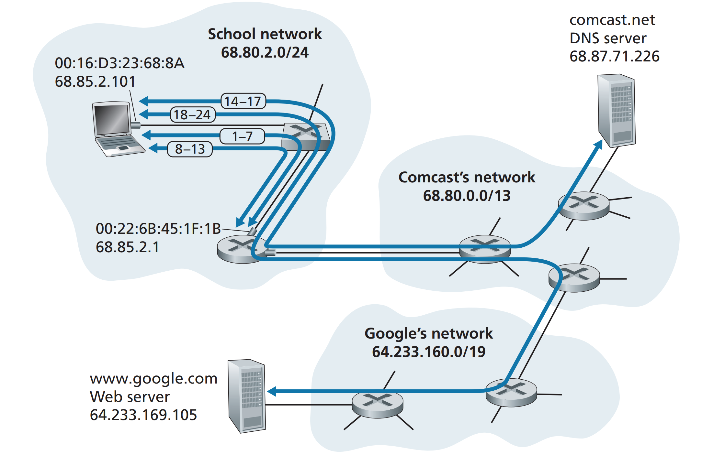

> **1단계**

웹 사이트에 접속하기 위해서는 **노트북의 IP주소, 1-hop 라우터의 IP 주소, DNS 서버 주소**가 필요하다. 이를 알아 내기 위해 DHCP 요청메시지가 담긴 IP 데이터그램을 1-hop 라우터에게 전송한다. DHCP 서버가 내장된 라우터가 노트북의 IP주소, 자신의 IP주소, DNS 서버의 IP주소를 담은 DHCP ACK를 다시 노트북에게 전송한다. (그림의 1-7 과정)

- DNS란 **D**omain **N**ame **S**ystem의 약자로 `www.google.com`과 같은 도메인 주소를 IP 주소로 바꿔주는 시스템을 말한다.
- DHCP(Dynamic Host Configuration Protocol) 서버는 보통은 라우터에 DHCP 서버가 내장되어 있으며 DHCP 서버에 연결된 클라이언트에게 자동적으로 IP주소를 할당한다. 자세한 내용은 [#28](#28)을 참고!

> **2단계**

DNS 서버에 DNS query를 보내기 전에 **1-hop 라우터의 MAC 주소**가 필요하므로 ARP query를 브로드캐스트 방식으로 전송하여 router의 MAC주소를 알아낸다. (그림의 8-13 과정)

- ARP란 **A**ddress **R**esolution **P**rotocol의 약자로, MAC 주소와 IP 주소를 1:1 매핑하기 위해 사용된다.

> **3단계**

`www.google.com`에 요청을 보내기 위해서는 `www.google.com`의 IP주소가 필요하므로, DNS query가 담긴 IP 데이터그램을 DNS 서버에 전송하고 `www.google.com`의 IP 주소를 클라이언트인 노트북에게 전송한다. (그림의 14-17 과정)

> **4단계**

TCP 소켓을 생성하고 3-way handshake로 연결을 생성한다. HTTP 요청을 보내고 응답을 받아 브라우저에 렌더링을 하면 Google 웹페이지를 브라우저에서 확인할 수 있다. (그림의 18-24 과정)

#### References

- [Chapter 6.7. Life of a web request - Computer Networking: A Top-Down Approach](http://www.yes24.com/Product/Goods/24320296?OzSrank=2)
- [ARP 쉽게 이해하기 - 네트워크 엔지니어 환영의 AWS 기술블로그](https://aws-hyoh.tistory.com/entry/ARP-%EC%89%BD%EA%B2%8C-%EC%9D%B4%ED%95%B4%ED%95%98%EA%B8%B0)

---

## #25

#### 네트워크 topology

컴퓨터끼리 정보를 교환하고 교류하는 형태를 의미하는 네트워크에서 토폴로지는 **컴퓨터들의 특정한 망구성 방식**을 의미한다.

하나의 네트워크 구성 방식을 보더라도, 노드와 링크와 같은 물리적 배치로 구분하는 **물리적 토폴로지**와 노드 간의 데이터 흐름으로 구분하는 **논리적 토폴로지**로 네트워크 구성을 각각 판단할 수 있다.


> **Star**

중앙에 위치한 메인 노드를 통해 다른 노드와 소통할 수 있는 구조이다.

- `장점`: 장애 발견이 쉽고 관리가 용이함
- `단점`: 메인 노드에 장애가 발생하면 전체 네트워크 사용 불가능

> **Bus**

버스라는 공통 배선을 통해 노드들이 연결되어 있어서, 한 노드의 신호가 모든 노드에 전달된다. (타겟 노드만 신호에 반응을 하고 다른 노드는 무시한다.)

- `장점`: 노드 추가 및 삭제가 용이하며, 한 노드에 장애가 발생해도 다른 노드에 영향을 주지 않음
- `단점`: 공통 배선의 크기(대역폭)가 제한되어 있으므로 배선에 과부하가 걸릴 경우 네트워크 성능 저하

> **Ring**

각 노드가 양 옆으로 연결된 원형 구조, 단방향으로 신호가 전달된다.

- `장점`: 단방향 구조로 단순하고, 중간에 있는 노드들이 증폭기의 역할을 해준다. (거리 제약이 적어진다.)
- `단점`: 노드 추가 및 삭제가 어렵다.

> **Mesh**

다수의 노드가 서로 연결된 형태이다. 모두 연결되면 완전 연결형(Fully Connected), 일부만 연결되면 부분 연결형(Mesh)이다.

- `장점`: 노드의 장애에 영향받지 않으며 유연한 대처가 가능하고 안정적이다.
- `단점`: 구축 비용이 크고, 노드 추가에도 비용이 많이 든다.

---

## #26

#### subnet mask에 대해서 설명해주세요.

> **IP 주소와 서브네팅 (subnetting)**

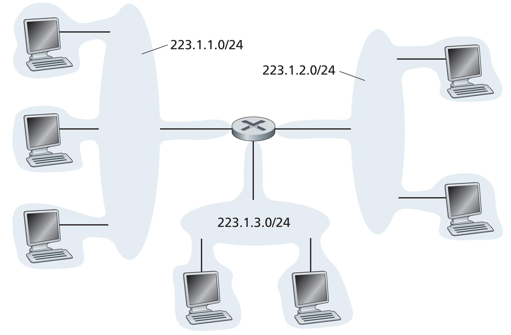

IPv4 의 경우 $2^{32}$의 숫자로 주소를 표현하고, 이를 국가, 회사 등 잘게 나눠 어느 영역을 쓰게할 것인지 결정한다. 한정된 자원이기 때문에 효율적으로 노드에 주소를 할당하는게 중요하다. 이를 위해 IP 를 쪼개는, 네트워크 파트 + 호스트 파트로 구성하는 서브네팅을 활용한다.

서브넷을 결정하려면 먼저 호스트나 라우터에서 각 인터페이스를 분리하고 고립된 네트워크를 만든다. 이 고립된 네트워크의 종단점은 인터페이스의 끝이 된다. 이렇게 고립된 네트워크 각각을 서브넷이라고 부른다.

기본적으로 IP 주소에 따라 5 개의 클래스로 구분된다. 각 클래스에 따라 네트워크 파트와 호스트 파트가 정해진다.

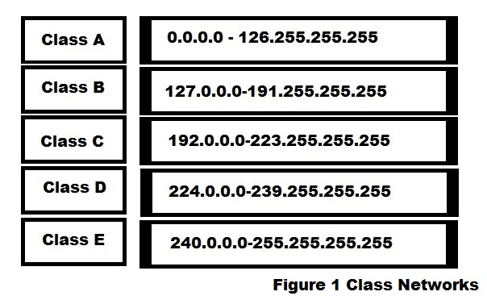

위와 같은 클래스 구조와 더불어 더욱 효율적인 서브네팅을 위해서 사용하는 방법이 서브넷 마스크이다.

> **서브넷 마스크 (subnet mask)**

할당된 IP 주소는 기본적으로 네트워크 파트와 호스트 파트가 정해져있다.

효율적인 주소 관리를 위해 내부적으로 호스트 파트를 새로운 네트워크 파트와 호스트 파트로 나눌 수 있다. 이 때 서브넷 마스크를 활용할 수 있다.

만약 C 클래스인 192.12.16.1 IP, 255.255.255.0 서브넷 마스크(호스트 파트)가 할당되었을 때 기존의 서브넷 마스크인 마지막 8 비트를 1111 0000 으로 바꾼다면, 4 비트만큼의 네트워크 파트 (그룹), 4 비트만큼의 호스트 (멤버) 를 할당할 수 있다. 이렇게 된다면 동일 네트워크 간에는 커뮤니케이션이 자유롭지만, 다른 네트워크 간에는 라우터를 거쳐야 커뮤니케이션을 할 수 있다.

어떤 기업을 생각해보자. 서브넷 마스크로 추가적인 서브네팅을 안한다면 인사팀, 재무팀 등등 여러 팀들이 모두 같은 네트워크 파트를 지니므로 서로에게 접근할 수 있다. 이럴 때 서브넷 마스크를 활용한 서브네팅으로 효율적으로 IP 를 관리할 수 있다.

#### References

- [IP 주소 및 서브넷 마스크 - 보안전문가가 되자](https://m.blog.naver.com/PostView.naver?isHttpsRedirect=true&blogId=hatesunny&logNo=220790654612)
- [[Network] IP주소 클래스(A,B,C class)란? Limky 삽질 블로그](https://limkydev.tistory.com/168?category=954021)
- [서브네팅 목적 및 개념 - 트레비스의 IT 라이프](https://travislife.tistory.com/53)
- [What is a Subnet, How Subnetting Works?](https://gcore.com/learning/what-is-a-subnet-how-subnetting-works/)

---

## #27

#### data encapsulation이 무엇인가요?

data encapsulation 은 데이터를 보내는 송신측에서 데이터를 생성하는 방법으로, 네트워크 계층에서 상위 계층에서부터 하위 계층으로 내려올 때마다 각 계층의 헤더를 붙여 보내는 데이터로 만들어낸다.

반대로 데이터를 받는 수신측에서는 데이터를 받은 후에 계층을 거슬러 올라가면서 헤더를 떼내며 데이터를 파악한다.

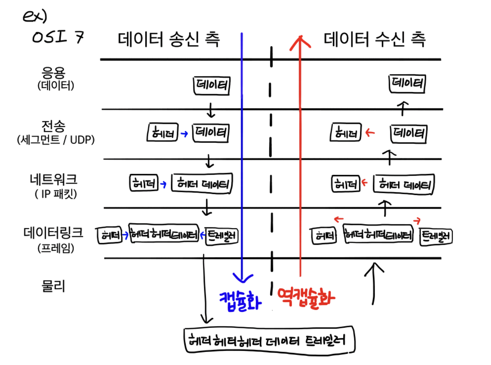

#### References

- [[network] 캡슐화 & 역캡슐화 (encalsulation & decapsulation) - CHAEN](https://ychae-leah.tistory.com/20)
- [[네트워크] TCP/ IP 캡슐화 - jhkang-dev](https://jhkang-tech.tistory.com/20)

---

## #28

#### DHCP를 설명해주세요.

DHCP (Dynamic Host Configuration Protocol) 는 동적으로 IP 주소나 기타 정보들을 관리해주는 프로토콜을 말한다. 관리해야하는 컴퓨터가 많고 이들의 IP 를 모두 직접 할당하고 관리하려면 상당히 복잡하고 시간이 많이들지만, DHCP 를 사용하면 이러한 문제점을 해결할 수 있다.

DHCP 는 UDP 를 사용하여 클라이언트/서버 구조로 통신한다.
그 과정은 아래와 같다.

1. `DHCP discover`: 컴퓨터가 동일 서브넷으로 브로드캐스팅(255.255.255.255)으로 DHCP 서버를 찾는다.
2. `DHCP offer`: DHCP 가 사용가능한 IP 주소의 리스트를 컴퓨터에게 전달한다.
3. `DHCP request`: 컴퓨터가 리스트 중 하나의 IP 주소를 선택하여 서버에 전달한다.
4. `DHCP ack`: DHCP 가 컴퓨터에게 해당 IP 주소를 허락/거절하는 메세지를 전달한다.

> **장점**

- DHCP 서버에서 자동으로 IP 를 관리해주므로 편리하다. IP 에 변동이 있을 때, DHCP 에만 정보를 입력하면 된다.
- 사용중인 컴퓨터에 대해서만 할당하므로 효율적이다.

> **단점**

- DHCP 서버에 의존하기 때문에 서버가 다운되는 경우 모든 컴퓨터에서 인터넷을 할 수 없다.
- 초기 DHCP 세팅 시간 및 트래픽이 크다.
- 단말 컴퓨터를 끌 경우, 완전히 주소가 release 될 때 까지 해당 IP 를 사용할 수 없다.

#### References

- [DHCP 열심히 정리한 글 :) - Don't forget your time](https://m.blog.naver.com/PostView.naver?isHttpsRedirect=true&blogId=hai0416&logNo=221578608161)
- [DHCP란 그 개념부터 알아보자 - 네트워크보안](https://m.blog.naver.com/PostView.naver?isHttpsRedirect=true&blogId=haionvpn&logNo=40181076143)

---

## #29

#### routing protocol (ex. link state, distance vector)

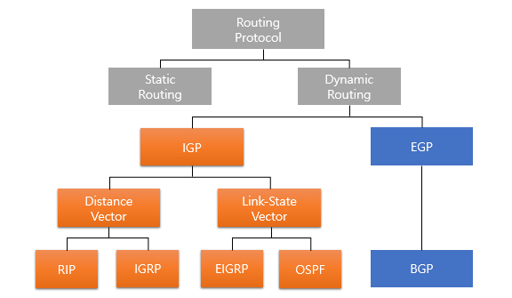

라우팅 알고리즘은 송신자부터 수신자까지 패킷을 전달할 때 라우터의 네트워크를 통과하는 최소 비용 경로를 정하는 것을 목표로 한다.

> **라우팅 알고리즘의 분류**

**1. 라우팅 경로 고정 여부 : 정적 vs 동적**

어떤 경로로 라우팅할지를 미리 정해두냐 동적으로 정하냐에 따라 `정적 라우팅`, `동적 라우팅` 으로 구분한다.
정적 라우팅은 라우팅 테이블에 경로를 수동으로 추가해야 하지만, 동적 라우팅 알고리즘은 네트워크 트래픽 부하나 토폴로지(ex. 물리적 링크) 변화에 따라 라우팅 경로를 변환할 수 있다. 

그래서 동적 라우팅 알고리즘은 주기적으로 토폴로지나 링크 비용의 변경에 직접적으로 응답하기 때문에 네트워크 변화에 빠르게 대응할 수 있지만, 경로의 루프나 경로 진동 같은 문제에 취약하다는 단점이 있다.

**2. 중앙 집중형 vs 분산형**

중앙 집중형 라우팅 알고리즘은 네트워크 전체에 대한 완전한 정보를 가지고 출발지와 목적지 사이의 최소 비용 경로를 계산한다. 즉 입력값으로 모든 노드 사이의 연결 상태와 링크 비용을 필요로 하며, 완전한 정보를 가진다.

링크 상태(link-state, LS)알고리즘이 대표적이다.

분산 라우팅 알고리즘은 최소 비용 경로의 계산이 라우터들에 의해 반복적이고 분산된 방식으로 수행된다.
어떤 노드도 모든 링크 비용을 알지 못하며, 각 노드는 자신과 직접 연결된 링크에 대한 비용 정보만 가진다.
반복된 계산과 이웃 노드와의 정보 교환을 통해 최소 비용 경로를 계산할 수 있다.(스스로 수렴함)

거리 벡터(distance-vector, DV)알고리즘이 대표적이며, 각 노드가 네트워크 내 다른 모든 노드까지 비용(거리)의 추정값을 벡터 형태로 유지한다.

> **내/외부 라우팅**

동적 라우팅에서 AS (Auotonomous System, 하나의 네트워크 관리자에 의해 관리되는 네트워크 집단) 를 기준으로 내부적으로 동작하냐, 외부적으로 동작하냐에 따라 `내부 라우팅` (RIP, IGRP, OSPF, EIGRP) 과 `외부 라우팅` (BGP, EGP) 으로 나눈다.

> **라우팅 테이블 관리**

동적 라우팅에서 어떤 방식으로 라우팅 테이블을 관리하느냐에 따라서도 방법이 다르다.
크게 link state, distance vector 방법이 있다.

`distance vector` 방법은 현재 위치 (단말 또는 라우터) 까지의 방향과 거리를 기록한 라우팅 테이블을 인접한 라우터들에게 전달하고 갱신한다. 즉, 분산적이며, 반복적이고, 비동기적인 특징을 가진다.
메모리가 적게 들고 구성이 쉽지만, 전체 테이블 구성 시간이 길어질 수 있고 같은 경로를 반복해서 도는 루핑 문제가 발생할 수 있다. (EIGRP 는 루핑이 발생하지 않음)
라우팅 루프를 방지하기 위해서 포이즌 리버스를 사용할 수도 있다. 자신이 사용하는 최적의 경로는 거리가 무한대라고 다른 노드들에게 알리는 방법이다. 하지만 3개 이상의 노드를 포함한 루프는 포이즌 리버스로는 감지가 불가하다.
distance vector 를 사용하는 프로토콜로는 RIP, EIGRP, BGP 등이 있으며, distance vector 는 `벨만-포드 알고리즘` 에 기반한다.

`link state` 방법은 각 노드가 연결된 링크의 식별자와 비용 정보를 담은 링크 상태 패킷을 브로드캐스트하여, 전체 네트워크 토폴로지와 모든 링크 비용을 알고 있다. 모든 노드는 네트워크에 대한 동일하고 완벽한 관점을 가지며, 다른 노드와 똑같은 최소 비용 경로 집합을 계산할 수 있다.
정확하고 루핑 문제가 없다는 장점이 있어 대형 네트워크에서 많이 사용되지만 메모리의 소모와 cpu 로드가 많다는 단점이 있다.
link state 를 사용하는 프로토콜로는 OSPF, IS-IS 등이 있으며, link state 는 `다익스트라 알고리즘`에 기반한다.

#### References

- [라우팅 프로토콜(Routing Protocol) - 자비스가 필요해](https://needjarvis.tistory.com/159)
- [라우팅 프로토콜 종류 - 개발일기](https://developmentdiary.tistory.com/494)
- [라우팅 프로토콜의 종류 - 청년 고득녕](https://m.blog.naver.com/PostView.naver?isHttpsRedirect=true&blogId=nackji80&logNo=221431942767)
- [디스턴스 벡터/링크 스테이트 - 이삭이의 토스트 공장](https://toastfactory.tistory.com/286)

---

## #30

#### 이더넷(ethernet)이란?

이더넷은 근거리 유선 통신을 위해 사용되는 네트워킹 방법으로 CSMA/CD(collision detection) 프로토콜을 사용한다. IEEE 802.3 에 표준으로 정의되었다.

다중 접속 프로토콜에서는 모든 노드가 프레임을 전송할 수 있으므로 2개 이상의 노드가 동시에 프레임을 전송하면 충돌(collide)가 발생할 수 있다. 이를 해결하기 위해 1) 채널 분할 프로토콜, 2) 랜덤 접속 프로토콜, 3) 순번 프로토콜의 방법이 있다. 

랜덤 접속 프로토콜에서 가장 유용한 CSMA는 '말하기 전에 듣고(`carrier sensing`)', '다른 사람이 동시에 말하기 시작하면 말을 중단(충돌 검출, `collision detection`)'하는 방식이다. 즉 충돌이 발생하면 이를 찾아내어, 프레임 전송을 중단하고 랜덤 backoff 시간 만큼 기다린 뒤에 다시 전송을 시도한다.

다중 접속 프로토콜에서 충돌 검출을 추가하면, 쓸모없는 손상된 프레임(충돌된 프레임)을 모두 전송하지 않아도 되므로 프로토콜의 성능을 확실히 향상할 수 있다.

(+ [wifi](https://github.com/0ys/CS_Study/blob/0ys/Network/0ys/7.%20Wireless%20and%20Mobile%20Networks.md)의 경우 충돌 검출이 아닌 충돌 회피를 사용하는 CSMA/CA 프로토콜을 사용한다.)

> **이더넷의 장점**

- 적은 용량의 데이터를 보낼 때 성능이 좋다.
- 비용이 적고 관리가 쉽다.
- 구조가 단순하다.

> **이더넷의 단점**

- 캐리어 충돌이 발생할 수 있다.
- 충돌이 발생하면 지연이 생긴다.

---

## #31

#### client와 server의 차이점을 설명해주세요.

네트워크 상에서 요청을 보내는 대상을 `client`, 요청에 응답하는 대상을 `server` 라고 한다. client 와 server 는 고정되지 않고 요청에 따라 바뀐다. 전에는 요청을 보내는 client 였어도 다음 번에는 다른 노드로부터 요청을 받으면 server 가 된다.

#### References

- [서버 클라이언트 뜻 - 오나바딩요](https://blog.naver.com/myca11/221369799273)

---

## #32

#### delay, timing(jitter), throughput 차이를 설명해주세요.

위 세가지 개념은 모두 네트워크의 성능과 관련되어 있다.

> **delay**

하나의 데이터 패킷이 출발 지점에서 도착 지점에 도착한 시간을 의미한다.

딜레이는

- `Processing Delay (처리 지연)`: 라우터가 들어온 패킷의 헤더를 확인하고 처리하는데 걸리는 시간 -> 수 마이크로초
  - 패킷의 비트 레벨 오류를 조사하는 데 필요한 시간 같은 요소도 포함
- `Queueing Delay (큐 지연)`: 라우터가 다른 패킷을 처리하느라 패킷이 라우터의 큐에서 대기하는 시간 -> 수 마이크로초 ~ 수 밀리초
- `Transmission Delay (전송 지연)`: 라우터의 성능 (전송 속도) 에 따라 패킷이 논리회로를 통과할 때까지 걸리는 시간 -> 수 마이크로초 ~ 수 밀리초
- `Propagation Delay (전파 지연)`: 라우터간 거리(전파 속도)에 의해 발생하는 지연 시간  -> 수 밀리초
- 

의 합으로 계산된다.

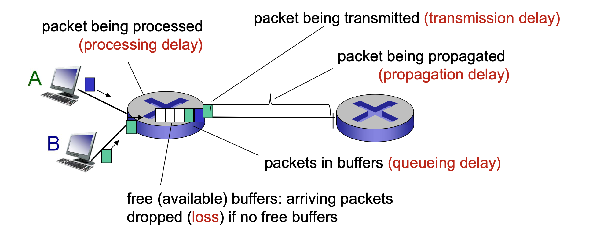

전송 지연과 전파 지연은 다르다. 전송 지연은 라우터가 패킷을 내보내는 데 필요한 시간으로 패킷의 길이와 링크 전송률을 따르며, 두 라우터 사이의 거리와는 관계 없다. 반면, 전파 지연은 비트가 한 라우터에서 다음 라우터로 전파되는 데 걸리는 시간이다. 즉 두 라우터 사이의 거리에 따라 결정된다.

**큐잉 지연과 패킷 손실**
다른 지연과 다르게 큐잉 지연은 패킷마다 지연 정도가 다르다. 예를 들어 10개의 패킷이 동시에 비어 있는 큐에 도착하면, 전송된 첫 패킷은 큐잉 지연을 겪지 않지만 마지막으로 전송되는 패킷은 상당히 많은 큐잉 지연을 겪는다. 그래서 큐잉 지연을 설명할 때 통계적 기법(평균, 분간 등)을 사용한다.

큐잉 지연은 큐에 도착하는 트래픽의 양, 링크의 전송률 등에 의해 결정된다. 특히 트래픽이 주기적으로 들어올 때보다 burst하게 도착할 경우 심각해진다.

어떤 패킷이 이미 가득 차 있는 큐에 도착하면 라우터는 임의로 패킷을 drop하기 때문에 패킷 손실이 발생한다.(패킷 재전송 필요) 즉 트래픽의 밀도가 증가하면 패킷 손실도 증가한다. 그래서 네트워크의 성능을 평가할 때 지연 정도 뿐만 아니라 패킷 손실 확률도 평가 기준이 될 수 있다.

> **timing(jitter)**

delay 의 변동을 (변화량 수준) 의미한다. 같은 스위치가 아닌 경우 패킷마다 대기 시간이 달라지므로 지터가 생긴다.

> **throughput**

지정된 시간동안 실제로 전송된 정보량을 의미한다.

데이터가 지나갈 수 있는 통로의 크기인 bandwidth 와 헷갈릴 수 있는데, bandwidth 가 크더라도 실제로 전송된 정보량이 적으면 throughput 이 적은 것이다.

#### References

- [Network의 4가지 종류 - 공대생의 개발 노트](https://corona-world.tistory.com/47)
- [4. 네트워크의 delay, loss, throughput - 나도 잘 모름](https://snnchallenge.tistory.com/98)
- [[네트워크]latency, bandwidth와 throughput 개념 정리 - 코딩 세상](https://darkstart.tistory.com/141)
- [Latency Delay Jitter 의 명쾌한 비교](https://sensechef.com/1156)
