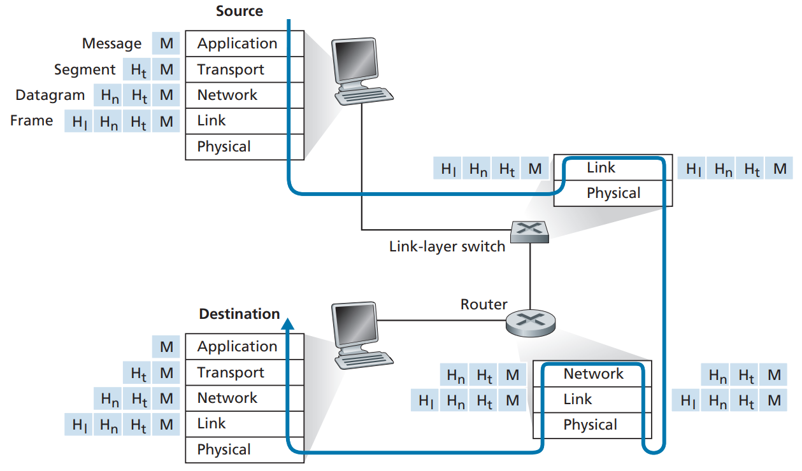

# 요약
- 인터넷이란 많은 종단 시스템을 연결하는 거대한 네트워크이다. 
- 그리고 각 분산 애플리케이션들이 서로 데이터를 주고받을 수 있도록 연결하는 플랫폼 역할을 한다. 
- 네트워크 통신을 위한 다양한 프로토콜이 무엇이고 왜 필요하며 어떻게 운영되는지 이해해보자!

# 1. Computer Networks and the Internet
이 책은 TCP/IP 계층에 따라 하향식 접근으로 목차를 구분한다.

- 응용 계층 -> 2장
- 전송 계층 -> 3장
- 네트워크 계층 -> 4,5장
- 데이터 링크 계층 -> 6장

순서대로 학습하는 것을 추천한다. 7,8장은 선택적으로 학습한다.

---
## 1.1 인터넷이란?
인터넷이란 무엇인가?
- 인터넷을 구성하는 기본적인 하드웨어와 소프트웨어 구성 요소를 살펴봄
- 분산 어플리케이션에 서비스를 제공하는 네트워킹 인프라스트럭처 관점으로 살펴봄
### 구성요소로 본 인터넷
- 종단 시스템 ~ 네트워크(ISP) ~ 종단 시스템

인터넷은 수십억 개의 컴퓨팅 장치를 연결하는 거대한 네트워크이다. 인터넷에 연결된 모든 장치는 호스트 혹은 종단 시스템이라고 부른다. 각 종단 시스템은 통신 링크와 패킷 스위치로 연결된다.(1.2 절 참고)

네트워크 상에서 데이터는 패킷이라는 단위로 전송된다. 송신 종단 시스템은 보내고자 하는 데이터를 세그먼트로 나누고, 각 세그먼트에 헤더를 붙여 패킷이라 불리는 정보 패키지를 만든다.
이러한 패킷은 네크워크를 통해 목적지 종단 시스템으로 보내지고 원래의 데이터로 다시 조립된다. 
패킷은 컴퓨터 네트워크를 통한 경로를 따라 이동한다. 이 때 교차로 역할을 하는 것이 패킷 스위치이다. 패킷 스위치에는 라우터와 링크 계층 스위치가 있다. 이들은 패킷을 입력받아 최종 목적지 방향으로 전달한다.
링크 계층 스위치는 보통 접속 네트워크에서 사용되고, 라우터는 네트워크 코어에서 사용된다.

종단 시스템은 ISP(Internet Service Provider)를 통해 인터넷에 접속한다. 각 ISP는 패킷 스위치와 통신 링크로 이루어진 네트워크이다.
ISP는 다양한 네트워크 접속(가정용, 이동 무선 접속, 고속 LAN 접속 등)을 제공한다.
하위 계층 ISP는 국가 그리고 국제 상위 계층 ISP를 통해 서로 연결되고 상위 계층 ISP들은 서로 직접 연결된다.
상위 계층 ISP는 광 링크로 연결된 고속 라우터로 구성된다. 상위 계층이든 하위 계층이든 각 ISP 네트워크는 따로 관리되고 IP 프로토콜을 수행하며 naming과 주소 배정 방식을 따른다.(1.3 절 참고)

인터넷의 구성요소(종단 시스템, 패킷 스위치)는 인터넷에서 정보 송수신을 제어하는 여러 프로토콜을 수행한다.
대표적으로 TCP(Transmission Control Protocol)/IP(Internet Protocol)가 있다.
IP는 라우터와 종단 시스템 사이에서 송수신되는 패킷 포맷을 기술한다.
그렇다면 프로토콜은 누가 정할까? 인터넷 표준은 IETF에서 개발하며 IETF 표준 문서를 RFC(requests for comment)라고 한다. 이들은 TCP, IP, HTTP(웹), SMTP(전자메일) 같은 프로토콜을 정의한다.
그리고 다른 기구들도 네트워크 링크에 관해 기술한다. 예를 들어 IEEE 802 LAN 표준위원회는 이더넷과 무선 와이파이 표준을 기술한다.

### 서비스 측면에서 본 인터넷
인터넷을 애플리케이션에 서비스를 제공하는 인프라스트럭처 관점에서 기술할 수 있다. 애플리케이션은 전자 메일, 웹 서핑 뿐만 아니라 음악 스트리밍, SNS 등을 말한다.
이러한 애플리케이션은 서로 데이터를 교환하는 많은 종단 시스템을 포함하고 있기 때문에 분산 애플리케이션이라고 부른다.
중요한 것은 인터넷 애플리케이션은 종단 시스템에서 수행된다(네트워크 코어에 있는 패킷 교환기에서 수행되지 않는다)는 점이다. 
패킷 교환기는 종단 시스템 간의 데이터 교환만 할 뿐 데이터의 시작과 끝인 애플리케이션에는 관심을 갖지 않는다.

애플리케이션은 종단 시스템에서 수행되는 프로그램이다. 우리는 분산 인터넷 애플리케이션을 개발하고 있기 때문에 다른 종단 시스템에서 수행되는 프로그램은 서로에게 데이터를 송신할 필요가 있다.
여기서 ==인터넷은 애플리케이션을 위한 플랫폼 역할==을 할 수 있다.

한 종단 시스템에서 수행되는 애플리케이션이 다른 종단 시스템에서 수행되고 있는 프로그램으로 데이터를 보내도록 인터넷에 어떻게 지시할 것인가?
각 종단 시스템들은 어떻게 데이터를 전달하도록 요구하는지를 명시하는 소켓 인터페이스(socket interface)를 제공한다.(2장 참고)

### 프로토콜이란?
어떤 일을 수행하려면 둘 이상의 통신 개체가 함께 인식하는 프로토콜이 필요하다. 두 사람이 대화할 때를 떠올려보자.
명확하게 송수신된 메시지와 이러한 메시지가 송수신될 때나 다른 상황이 발생했을 때 취하는 행동 등을 미리 약속으로 정하는 것이다.
즉 프로토콜은 둘 이상의 통신 개체 간에 교환되는 메시지 포맷과 순서뿐만 아니라, 메시지 송수신과 다른 이벤트에 따른 행동들을 정의한다.

물리적으로 연결된 두 컴퓨터의 네트워크 접속 카드에서 하드웨어로 구현된 프코토콜은 컴퓨터 사이에 연결된 '선로상'의 비트 흐름을 제어한다. 
예를 들어 종단 시스템에 있는 혼잡 제어 프로토콜은 송수신자 간에 전송되는 패킷 전송률을 조절한다.
라우터에서 프로토콜은 출발지에서 목적지까지 패킷 경로를 설정한다.

인터넷과 일반 컴퓨터 네트워크에는 다양한 프로토콜이 여러 가지 통신 목적으로 사용된다. 
컴퓨팅 네트워킹 분야의 전문가가 된다는 것은 네트워킹 프로토콜이 무엇이고 왜 필요하며 어떻게 운영되는지 잘 이해한다는 것과 같다.

---
## 1.2 Network Edge
이제 컴퓨터 네트워크의 구성 요소를 더 자세히 살펴보자.
### 1. 종단 시스템
인터넷에 연결된 장치들을 종단 시스템(=호스트)이라고 부른다. 호스트는 때때로 클라이언트와 서버로 구분된다.
비공식적으로 클라이언트는 PC, 스마트폰 등을 의미하고, 서버는 웹 페이지를 저장하고 분배하는 등 더 강력한 기능을 갖춘 컴퓨터다.
오늘날 많은 서버는 커다란 데이터 센터 내에 있다.

### 2. 접속 네트워크 Access Network
접속 네트워크는 서로 다른 종단 시스템을 연결하는 경로상에 있는 첫 번째 라우터(edge router라고도 함)에 연결된 네트워크이다.
edge router에 연결된 여러 종류의 접속 네트워크와 이들이 사용되는 환경(가정, 기업, 광역 이동 무선)을 살펴보자.
- 가정 접속 : DSL, 케이블, FTTH, 5G 고정 무선
  - DSL : 하나의 로컬 전화 회선을 주파수 분할 다중화를 통해 3개의 분리된 링크처럼 사용함
  - 케이블 인터넷 접속 : 케이블 TV 인프라를 이용, HFC 접속 네트워크, 공유 방송 매체이기 때문에 충돌 핸들링 필요
  - FTTH : 로컬 ISP로부터 가정까지 직접 광섬유 경로 제공(= Gbps 속도 가능), 광신호 분배기술(AON, PON)
  - 5G 고정 무선(5G-FW) : 빔포밍 기술을 사용하여 기지국에서 데이터를 무선으로 전송
- 기업 접속 : 이더넷과 와이파이
  - 이더넷 : LAN(local area network) 기술 중 하나, 꼬임쌍선으로 이더넷 스위치에 연결됨
  - 와이파이 : IEEE 802.11 기술에 기반한 무선 랜 접속
- 광역 무선 접속 : 3G와 LTE, 4G와 5G

### 3. 물리 매체
위의 네트워크 접속 기술에서 사용하는 물리 매체는 아래와 같다.
- HFC는 광섬유 케이블과 동축 케이블을 모두 이용 
- DSL과 이더넷은 구리선을 사용 
- 이동 접속 네트워크는 라디오 스펙트럼을 이용

그 밖의 물리 매체를 살펴보자. 물리 매체는 유도 매체와 비유도 매체로 나눌 수 있다. 
유도 매체는 광섬유 케이블, 꼬임쌍선 혹은 동축케이블 같은 견고한 매체를 따라 파형을 유도한다.
비유도 매체는 무선 랜 혹은 디지털 위성 채널의 경우처럼 대기와 야외 공간으로 파형을 전파한다.

한 종단 시스템에서 다른 종단 시스템으로 비트를 보낼 때, 일련의 송신기-수신기 쌍을 거친다. 각 송신기-수신기 쌍에 대해 이 비트는 물리 매체상에 전자파나 광 펄스를 전파하여 전송한다.
물리 매체는 여러 형태이며 경로상의 각 송신기-수신기 쌍에 대해 같은 유형일 필요는 없다.

---
## 1.3 Network Core
네트워크 엣지를 살펴봤으니 이제 네트워크 코어, 즉 인터넷의 종단 시스템을 연결하는 컴퓨터 네트워크에서의 스위칭(교환)과 라우팅(경로 설정)에 대해 알아보자.
링크와 스위치의 네트워크를 통해 데이터를 이동시키는 방식에는 패킷 교환과 회선 교환이 있다. 인터넷은 패킷 교환 네트워크이다.
### 1. 패킷 교환 Packet Switching
종단 시스템끼리는 메시지를 교환한다. 메시지는 패킷이라는 작은 데이터 덩어리로 분할되어 전송된다. 각 패킷은 통신 링크와 패킷 스위치(라우터, 링크 계층 스위치)를 거치게 된다. 
패킷은 링크의 최대 전송률과 같은 속도로 각각의 통신 링크에서 전송된다. 즉, R비트/초의 속도인 링크에서 L비트의 패킷을 송신할 때 걸리는 시간은 L/R초 이다.

패킷은 '저장 후 전달' 방식으로 전달된다. 다시 말해 스위치가 출력 링크로 패킷의 첫 비트를 전송하기 전에 전체 패킷을 받아야 한다.
그럼 출발지에서 패킷을 송신하기 시작해서 전체 패킷을 목적지에서 수신할 때까지 경과 시간을 계산해보자.(전파 지연은 무시함, 단일 링크 하나만 있는 경우임)
- 0초 : 출발지에서 전송되기 시작
- L/R초 : 출발지는 전체 패킷을 전송함, 라우터가 목적지를 향해 그 패킷을 출력 링크로 전송하기 시작
- 2L/R초 : 라우터는 전체 패킷을 전송함, 수신 시스템도 전체 패킷을 수신함

따라서 전체 지연은 2L/R이다. 만약 스위치에 비트가 도착하자마자 전달한다면 비트가 라우터에서 지연되지 않기 때문에 전체 지연은 L/R이 된다. 
그러나 1.4절의 문제에 의해 라우터는 전달하기에 앞서 전체 패킷을 수신, 저장, 처리할 필요가 있다.

이제 목적지 노드가 3개의 모든 패킷을 수신할 때까지 경과된 전체 시간을 계산해보자.
- L/R초 : 라우터는 첫 번째 패킷을 전송하기 시작, 출발지도 두 번째 패킷을 전송하기 시작
- 2L/R초 : 목적지는 첫 번째 패킷을 수신함, 라우터도 두 번째 패킷을 수신함
- 3L/R초 : 목적지는 두 번째 패킷을 수신함, 라우터는 세 번째 패킷을 수신함
- 4L/R초 : 목적지는 3개의 모든 패킷을 수신함

즉, N개의 링크로 구성(출발지와 목적지 사이에 N-1개의 라우터가 있음)되고 각각은 전송률이 R인 경로를 통해 하나의 패킷을 전송할 때 종단 간 지연은 `NL/R`과 같다.
그렇다면 연속된 N개의 링크를 통해 송신된 P개 패킷의 지연은 어떻게 될까?

각 패킷은 저장-후-전달 지연 뿐만 아니라 출력 버퍼에서 '큐잉 지연(queuing delay)'를 겪게 된다. 
각 링크에 대해 패킷 스위치는 출력 버퍼(출력 큐)를 가지는데, 그 링크에서 송신하려고 하는 패킷을 저장하고 있다. 
링크가 다른 패킷을 전송 중이라면 새로 도착하는 패킷은 출력 버퍼에서 대기해야 하기 때문에 큐잉 지연이 발생한다. 이들 지연은 가변적이고 네트워크의 혼잡 정도에 따른다.
또한 버퍼 공간의 크기가 유한하기 때문에 전송을 위해 대기 중인 다른 패킷들로 꽉 차 있을 수 있다. 이럴 경우 새로 도착하는 패킷 혹은 이미 큐에 대기 중인 패킷을 폐기하기 때문에 '패킷 손실'이 발생한다. 

라우터는 어떻게 패킷을 적절한 목적지의 링크로 전달할 수 있을까? 패킷은 실제 여러 유형의 컴퓨터 네트워크에서 다른 방식으로 실행되지만, 여기서는 간략하게 살펴보자.
인터넷에서 모든 종단 시스템은 IP 주소를 가진다. 어떤 패킷이 출발지에서 전송될 때 패킷의 헤더는 목적지의 IP 주소를 포함한다.
그리고 각 라우터는 목적지 주소를 라우터의 출력 링크로 매핑하는 '포워딩 테이블'을 갖고 있다.
즉 패킷이 라우터에 도착하면 라우터는 올바른 출력 링크를 찾기 위해 주소를 조사하고 이 목적지 주소를 이용하여 포워딩 테이블을 검색한다. 그런 후 라우터는 그 패킷을 출력 링크로 보낸다.
특히 IP 주소는 계층적 구조를 가지기 때문에 패킷이 네트워크의 한 라우터에 도착하면 라우터는 패킷의 목적지 주소의 '일부를 조사'하고 그 패킷을 이웃 라우터로 전달한다.

그러면 포워딩 테이블은 어떻게 설정되는가? 인터넷은 자동으로 포워딩 테이블을 설정하는 데 이용되는 여러 특별한 라우팅 프로토콜을 가지고 있다. 5장에서 자세하게 공부하자.
라우팅 프로토콜은 각 라우터로부터 각 목적지까지의 최단 경로를 결정하고 라우터에 포워딩 테이블을 설정하는 데 이 최단 경로 결과를 이용할 수 있다.

### 2. 회선 교환 Circuit Switching
회선 교환에서는 종단 시스템 간의 통신 경로상에서 필요한 자원(버퍼, 링크 전송률)이 통신 세션 동안 확보 또는 예약된다. 
패킷 교환 네트워크에서는 이러한 자원을 예약하지 않는다.
세션 메시지는 온디맨드 방식으로 자원을 요청하고 사용한다. 그 결과, 통신 링크에 대한 접속을 위해 기다릴 수도 있다.

회선 교환 네트워크의 예로 전통적인 전화망이 있다. 송신자가 정보를 보내기 전에 네트워크는 송신자와 수신자 간의 경로에 있는 스위치들을 연결 상태로 유지한다.
전기 통신 용어로 이 연결을 회선이라고 한다.
네트워크가 회선을 설정할 때, 그 연결이 이루어지는 동안 네트워크 링크에 일정한 전송률을 예약한다.
즉 주어진 전송률이 송신자-수신자 연결을 위해 예약되므로 송신자는 수신자에게 보장된 일정 전송률로 데이터를 보낼 수 있다.

링크 내 한 회선은 주파수 분할 다중화(FDM) 혹은 시분할 다중화(TDM)으로 구현된다.
- FDM : 각 회선은 지속적으로 대역폭의 일부를 얻음 
	- 한 링크의 주파수 스펙트럼을 공유, 각 연결에 대해 주파수 대역폭을 고정
- TDM : 각 회선은 짧은 시간 동안 주기적으로 전체 대역폭을 얻음
	- 시간을 일정 주기의 프레임으로 구분하고 각 프레임은 고정된 수의 시간 슬롯으로 나뉨
	- 하나의 연결을 설정될 때, 모든 프레임에서 하나의 시간 슬롯을 할당받음
	- TDM 회선의 전송률 = 한 슬롯 안의 비트 수 * 프레임 전송률 (예. 8bit * 초당 8000프레임 = 64kbps)

패킷 교환 옹호자들은 회선 교환의 경우 할당된 회선이 비활용 기간에는 낭비된다고 주장한다. 또한 회선 교환에서 종단 간 회선을 설정하고 대역폭을 보존하는 것이 복잡하고
경로에 있는 스위치들 사이의 운영을 조절하는 복잡한 신호 소프트웨어가 필요하다고 지적한다.
또 한가지, 회선 교환에서는 데이터의 전송 시간은 네트워크의 모든 링크의 개수와 무관하다. 종단 간 회선이 100개 있더라도 하나만 사용한다.

#### 패킷 교환 대 회선 교환
패킷 교환은 가변적이고 예측할 수 없는 종단 간의 지연(주로 큐잉 지연)때문에 실시간 서비스에 적합하지 않다는 주장도 있다.
하지만 패킷 교환은 회선 교환보다 전송 용량의 공유에서 더 효율적이다. 게다가 사용자의 비활용 기간을 적절하게 사용하여 원래 용량보다 훨씬 많은 사용자를 허용할 수 있다.
그리고 다중화를 요구하지 않기 때문에 한 명의 사용자만 활동할 경우 매우 빠르게 데이터를 전송할 수 있다.
마지막으로 회선 교환보다 간단하고 효율적이므로 구현 비용을 줄일 수 있다.

링크 전송률을 공유하는 두 방식의 가장 큰 차이점은 회선 교환이 요구에 관계없이 미리 전송 링크의 사용을 할당하는 반면에 패킷 교환은 요구할 때만 링크의 사용을 할당한다는 것이다.
그래서 회선 교환 방식처럼 사용하지 않는 링크 시간에는 링크 사용을 할당할 필요가 없다. 패킷 교환 방식에서 링크 전송 능력은 링크에 전송할 패킷을 가진 사용자만이 패킷 기반으로 공유한다.

### 3. 네트워크의 네트워크
인터넷은 네트워크의 네트워크이다.
종단 시스템은 접속 ISP를 통해 인터넷에 연결된다. 접속 ISP는 DSL, 케이블, FTTH, 와이파이, 셀룰러를 포함하는 다양한 접속 기술을 이용하여 유선 혹은 무선 연결을 제공한다.
수십억 개의 종단 시스템을 연결하는 인터넷에서는 이 접속 ISP들이 또 서로 연결된다. 그래서 네트워크의 네트워크가 탄생하게 되었다.

어떻게 모든 종단 시스템이 서로에게 패킷을 보낼 수 있도록 접속 ISP를 연결할 수 있을까?
1. 각 접속 ISP를 직접 서로 연결함(그물망 설계) -> 개별 접속 ISP에게 너무 많은 비용 발생
	- 각 접속 ISP가 전 세계적으로 다른 접속 ISP와 수십만 개의 개별적인 통신 링크를 유지해야 함
2. 네트워크 구조 1 : 모든 접속 ISP를 하나의 (상상 속)글로벌 ISP와 연결함
	- 접속 ISP = 고객, 글로벌 ISP = 제공자
3. 네트워크 구조 2 : 수십만 개의 접속 ISP와 다중의 글로벌 ISP로 구성됨
	- 여러 명의 제공자 중 선택이 가능, 글로벌 ISP는 서로 연결되어야 함
4. 네트워크 구조 3 : 다중계층 구조, 접속 ISP-지역 ISP-1계층 ISP가 복잡하게 연결됨
	- 어느 주어진 지역에 있는 접속 ISP들이 연결하는 지역 ISP가 있고, 이 지역 ISP는 1계층 ISP(글로벌ISP)와 연결됨
5. 네트워크 구조 4 : 구조 3에다가 PoP, 멀티홈, 피어링, IXP를 포함하면 오늘날의 인터넷과 유사함
6. 네트워크 구조 5 : 구조 4 위에 콘텐츠 제공자 네트워크를 추가함
	- 구글 데이터 센터는 모두 구글의 사설 TCP/IP 네트워크를 통해 전 세계를 연결하지만 공중 인터넷과는 분리되어 있음
	- 구글의 사설 네트워크는 구글 서버로 오가는 트래픽만 전달함
	- 자신의 네트워크를 구축함으로써 인터넷의 상위 계층을 우회(bypass)하고, 요금을 줄이고, 더 많은 통제권을 가짐

요약하면 오늘날의 인터넷, 즉 네트워크의 네트워크는 복잡하며 12개 정도의 1계층 ISP들과 수십만 개의 하위 계층 ISP들로 구성되어 있다.
하위 계층 ISP들은 상위 계층 SIP들과 연결하고 상위 계층 ISP들은 서로 연결한다.
사용자와 콘텐츠 제공자는 하위 계층 ISP들의 고객이고 하위 계층 ISP들은 상위 계층 ISP들의 고객이다.
최근에 주요 콘텐츠 제공자도 자신의 네트워크를 구축했고 가능한 곳에서 하위 계층 ISP들과 직접 연결한다.

---
## 1.4 Packet-Switched Networks
패킷 교환 네트워크에서 발생할 수 있는 데이터 전송 지연과 손실 원인을 살펴보자.
컴퓨터 네트워크는 두 종단 시스템 간에 처리율(전달될 수 있는 초당 데이터의 양)을 제한하여 종단 시스템 간에 지연을 야기하며 실제로 패킷을 잃어버리기도 한다.
또한 현실의 물리 법칙은 처리율의 제한 뿐만 아니라 지연과 손실을 야기한다.

### 1. 개요
패킷은 출발지에서 목적지로 가는 동안 경로상의 각 노드에서 다양한 지연을 겪게 된다.
중요한 지연으로는 노드 처리 지연, 큐잉 지연, 전송 지연, 전파 지연을 들 수 있으며 이러한 지연들이 쌓여서 전체 노드 지연을 일으킨다.
많은 애플리케이션의 성능은 네트워크의 지연에 상당한 영향을 받기 때문에 이 지연들의 특성과 중요성을 잘 이해해야 한다.
- 처리 지연 : 패킷 헤더를 조사하고 그 패킷을 어디로 보낼지 결정하는 시간 -> 수 마이크로초
	- 패킷의 비트 레벨 오류를 조사하는 데 필요한 시간 같은 요소도 포함
- 큐잉 지연 : 큐에서 링크로 전송되기를 기다림 -> 수 마이크로초 ~ 수 밀리초
- 전송 지연 : 패킷의 모든 비트를 링크로 밀어내는 데 필요한 시간 -> 수 마이크로초 ~ 수 밀리초
	- 패킷의 길이가 L비트이고 링크의 전송률이 R bps일 때, L/R이다. 
- 전파 지연 : 링크의 처음부터 도착 라우터까지의 전파에 필요한 시간 -> 수 밀리초
	- 두 라우터간의 거리 / 전파 속도(링크의 물리 매체에 따라 다름)
	
전송 지연과 전파 지연은 다르다. 전송 지연은 라우터가 패킷을 내보내는 데 필요한 시간으로 패킷의 길이와 링크 전송률의 함수이다. 두 라우터 사이의 거리와는 관계없다.
반면, 전파 지연은 비트가 한 라우터에서 다음 라우터로 전파되는 데 걸리는 시간이다. 두 라우터 사이의 거리에 대한 함수이며 패킷 길이나 링크 전송률과는 관계없다.

### 2. 큐잉 지연과 패킷 손실
다른 지연과 다르게 큐잉 지연은 패킷마다 지연 정도가 다르다. 예를 들어 10개의 패킷이 동시에 비어 있는 큐에 도착하면, 전송된 첫 패킷은 큐잉 지연을 겪지 않지만 마지막으로
전송되는 패킷은 상당히 많은 큐잉 지연을 겪는다. 
그래서 큐잉 지연을 설명할 때 통계적 기법(평균, 분간 등)을 사용한다. 

큐잉 지연은 큐에 도착하는 트래픽의 양, 링크의 전송률 등에 의해 결정된다. 특히 트래픽이 주기적으로 들어올 때보다
burst하게 도착할 경우 심각해진다.

어떤 패킷이 이미 가득 차 있는 큐에 도착하면 라우터는 임의로 패킷을 drop하기 때문에 패킷 손실이 발생한다.(패킷 재전송 필요)
즉 트래픽의 밀도가 증가하면 패킷 손실도 증가한다. 
그래서 네트워크의 성능을 평가할 때 지연 정도 뿐만 아니라 패킷 손실 확률도 평가 기준이 될 수 있다.

### 3. 종단 간 지연

### 4. 컴퓨터 네트워크에서의 처리율
병목을 따져봐야 함
N개의 링크에 대한 각각의 전송률이 R1, R2, ..., RN일 때, 네트워크의 최종 전송률은 min(R1, R2, ..., RN)이다.

---
## 1.5 Protocol Layers
프로토콜 계층 구조와 서비스 모델을 소개한다.
계층을 나눔으로써 서로 독립적으로 구현되고 변경될 수 있다.
각 계층은 프로토콜이 존재한다.

- Application : message (HTTP, SMTP, FTP, DNS)
- Transport : segment (TCP, UDP)
- Network : datagrams (IP)
- Link : frames (이더넷, WiFi)
- Physical : bits (꼬임쌍선, 동축케이블)

### Encapsulation
전송 계층에서는 응용 계층의 정보를 받아 헤더 Ht를 붙여 전송 계층의 segment를 만든다. 
이를 통해 응용 계층의 데이터를 encasuplation 할 수 있다. 다시 말해 상위 계층의 데이터를 포장하여 하위 계층으로 전달한다.
각 패킷은 헤더 부분과 payload 부분을 가진다. payload는 간단히 말하면 이전 계층에서 전달받은 패킷이다.

---
## 1.6 네트워크 보안
컴퓨터 네트워크는 다양한 유형의 공격에 취약하다. 어떻게 더 안전하게 만들 수 있을가?

---
## 1.7 네트워크의 역사

## 연습문제
