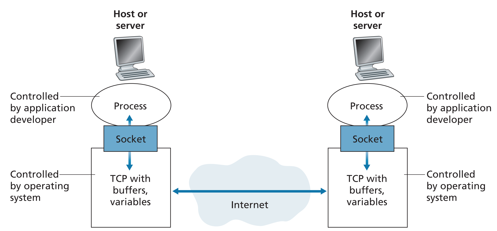
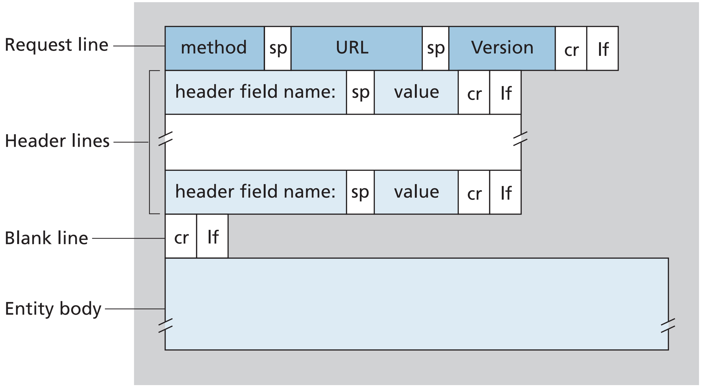

# 2. Application Layer

## 네트워크 애플리케이션
네트워크 애플리케이션은 우리가 사용하는 모든 인터넷 서비스를 의미한다.
네트워크 애플리케이션 개발의 중심은 다른 위치의 종단 시스템에서 동작하고 네트워크를 통해 서로 통신하는 프로그램을 작성하는 것이다.
예를 들어 클라이언트의 웹 브라우저 프로그램과 웹 서버 호스트가 통신할 수 있다. 따라서 우리는 새로운 애플리케이션을 개발할 때 여러 종단 시스템
에서 실행되는 소프트웨어를 작성해야 한다. 중요한 것은 우리가 라우터나 링크 계층 스위치처럼 네트워크 코어 장비에서 실행되는 소프트웨어까지 작성할 필요는
없다는 것이다. 네트워크 코어 장비는 네트워크 계층 및 그 하위 계층에서 기능한다. 오직 종단 시스템에만 애플리케이션 소프트웨어가 존재한다.

### 네트워크 애플리케이션 구조
1. 클라이언트-서버 구조 
   - 클라이언트 호스트는 가끔 또는 항상 켜져 있다.
   - 서버는 고정 IP 주소를 갖는다. 클라이언트는 서로 직접적으로 통신하지 않는다.
   - 데이터 센터가 강력한 가상의 서버를 생성하는 역할로 사용된다.
2. P2P 구조
   - peer라는 간헐적으로 연결된 호스트 쌍이 서로 직접 통신한다. 
   - 피어는 서비스 제공자가 소유하지 않고, 사용자가 제어하는 데스크톱과 랩톱이다. ex) BitTorrent 
   - 자기 확장성을 가진다. 피어가 곧 제공자이자 사용자이다.

### 프로세스 간 통신
다른 호스트(운영체제)에서 실행되는 프로세스와 어떻게 통신할까? 2개의 종단 시스템에서 프로세스는 컴퓨터 네트워크를 통한 메시지 교환으로 서로 통신한다.

네트워크에서 서로 메시지를 보내는 두 프로세스를 각각 클라이언트와 서버로 정의한다. 클라이언트는 다른 프로세스와 세션을 시작하려고 접속을 초기화하는 프로세스를 
말하며, 세션을 시작하기 위해 접속을 기다리는 프로세스를 서버라 한다. P2P 에서도 클라이언트와 서버 프로세스라 부른다.

프로세스는 소켓(socket)을 통해 네트워크로 메시지를 보내고 받는다. 소켓은 호스트의 응용 계층과 전송 계층 간의 인터페이스이다.
또한 애플리케이션과 네트워크 사이의 API라고도 한다.

수신 프로세스를 식별하기 위해서는 1) 목적지 호스트의 IP 주소, 2) 목적지 호스트 내의 수신 프로세스를 명시하는 식별자인 포트 번호가 필요하다.



### 응용 계층에서 사용할 수 있는 전송 계층 서비스
네트워크가 제공하는 하나 이상의 전송 프로토콜 중 어떤 것을 선택할 것인가? 또한 전송 계층 프로토콜이 애플리케이션에게 제공할 수 있는 서비스는 무엇인가?
1. 신뢰적 데이터 전송 : 데이터 손실 없이 목적지에 도착함을 보장함 (오디오/비디오 등은 손실 허용 애플리케이션)
2. 처리율 : 명시된 속도에서 보장된 가용 처리율을 제공함 (bandwidth-sensitive VS. elastic)
3. 시간 : 송신자가 소켓으로 내보내는 모든 비트가 수신자의 소켓에 100 ms 내에 도착할 것을 보장함 (실시간 상호작용 애플리케이션에서 사용)
4. 보안 : 기밀성, 데이터 무결성, 종단 인증 등

### 인터넷 전송 프로토콜
1. TCP (Transmission Control Protocol)
   - 연결지향형 서비스 : 핸드셰이킹 -> 전이중(full-duplex) 연결
   - 신뢰적인 데이터 전송 서비스 : 바이트 스트림이 손실되거나 중복되지 않음 (패킷 오버헤드)
   - 혼잡 제어 : 네트워크가 혼잡하면 프로세스 속도를 낮춤(대역폭을 공평하게 공유하도록!)
2. UDP(User Datagram Protocol)
   - 최소 서비스 모델을 가진 간단한 전송 프로토콜
   - 비연결형, 비신뢰적인 데이터 전송 서비스
   - 혼잡 제어를 하지 않아 데이터를 원하는 속도로 보낼 수 있음
- TLS(Transport Layer Security)
  - TLS로 강화된 TCP는 중요한 보안 서비스를 제공함
  - 애플리케이션 계층에서 구현!! 애플리케이션의 클라이언트와 서버 측 모두에 TLS 코드를 포함해야함
  - 송신 프로세스가 평문 데이터를 TLS 소켓에게 전달하면, 이를 암호화하여 TCP 소켓으로 전달함

앞에서 살펴본 네 가지 전송 계층 서비스 중 처리율과 시간 보장은 현재 인터넷에서 제대로 보장해 줄 수 없다. 
즉, 때로 시간 민감 애플리케이션에게 만족스런 서비스를 제공할 수 있으나 시간 혹은 대역폭 보장을 제공할 수는 없다.

## 애플리케이션 계층 프로토콜
네트워크 프로세스는 소켓으로 메시지를 보냄으로써 통신한다. 그렇다면 이 메시지는 어떻게 구성될까? 
응용 계층 프로토콜은 다른 종단 시스템에서 실행되는 애플리케이션의 프로세스가 서로 메시지를 보내는 방법을 정의한다.
- 교환 메시지 타입(요청 메시지와 응답 메시지)
- 여러 메시지 타입의 문법(메시지 내부의 필드와 필드 간의 구별 방법)
- 필드에 있는 정보의 의미
- 언제, 어떻게 프로세스가 메시지를 전송하고 응답하는지 결정하는 규칙

이러한 정보는 RFC에 명시되어 있다. 웹의 응용 계층 프로토콜인 HTTP를 제외하고 다른 많은 응용 계층 프로토콜은 독점이며 공중 도메인에서 구할 수 없다.
네트워크 애플리케이션은 응용 계층 프로토콜을 포함한다. 예를 들어 웹 애플리케이션은 HTML, 웹 브라우저, 웹 서버, 응용 계층 프로토콜을 포함하는 여러 요소들로 구성된다.
웹 응용 계층 프로토콜인 HTTP는 브라우저와 웹 서버 사이에서 교환되는 메시지의 포맷과 순서를 정의한다. 따라서 HTTP는 단지 웹 애플리케이션의 한 요소이다.

앞으로 5개의 주요 애플리케이션 분야로 웹, 전자메일, 디렉터리 서비스(DNS), 비디오 스트리밍(CDN), P2P 애플리케이션을 살펴보자.

# HTTP
WWW을 통해 인터넷은 대중에게 알려지기 시작했다.
웹은 온디맨드 방식으로 동작하기 때문에 사용자는 그들이 원할 때 원하는 것을 수신할 수 있다. 또한 모든 사람이 매우 낮은 비용으로 발행자가 될 수 있다.

웹의 응용 계층 프로토콜인 HTTP(HyperText Transfer Protocol)은 클라이언트 프로그램과 서버 프로그램으로 구현된다.
각기 다른 종단 시스템에서 클라이언트 프로그램과 서버 프로그램은 서로 HTTP 메시지를 교환하여 통신한다.
HTTP는 메시지의 구조 및 클라이언트와 서버가 메시지를 어떻게 교환하는지에 대해 정의하고 있다.

### 웹 전문 용어 정리
웹 페이지는 기본 HTML 파일과 여러 참조 객체(이미지, JS 등등)로 구성된다. 기본 HTML 파일은 페이지 내부의 다른 객체를 그 객체의 URL로 참조한다.
각 URL은 객체를 갖고 있는 서버의 호스트 이름과 객체의 경로 이름을 갖고 있다.
- `http://www.someSchool.edu/someDepartment/picture.gif`
- 호스트 이름 : `http://www.someSchool.edu`
- 경로 이름 : `/someDepartment/picture`

웹 브라우저는 HTTP의 클라이언트 측을 구현한다.(웹 클라이언트라 부름) 브라우저는 요구한 웹 페이지를 보여주고 여러 가지 특성을 제공한다.

웹 서버는 HTTP의 서버 측을 구현하며 URL로 각각을 지정할 수 있는 웹 객체를 갖고 있다. 인기 있는 웹 서버로는 Apache, 마이크로소프트의 Internet Information Sever 등이 있다.

## 개요
사용자가 웹 페이지를 요청할 때, 브라우저는 페이지 내부의 객체에 대한 HTTP 요청 메시지를 서버에 보낸다.
서버는 요청을 수신하고 객체를 포함하는 HTTP 응답 메시지로 응답한다.

HTTP는 TCP를 전송 프로토콜로 사용한다. HTTP 클라이언트는 먼저 서버에 TCP 연결을 시작한다. 이때 HTTP 클라이언트는 HTTP의 기본 포트 번호 80을 통해 서버로 TCP 연결을 시도한다.
일단 연결이 이루어지면, 브라우저와 서버 프로세스는 그들의 소켓 인터페이스를 통해 TCP로 접속한다!!

서버가 클라이언트에게 요청 파일을 보낼 때, 서버는 클라이언트에 관한 어떠한 상태 정보도 저장하지 않는다. 만약 특정 클라이언트가 몇 초 후에 같은 객체를 두 번 요청한다면,
잠시 전에 이미 그 객체를 보냈다고 서버가 알려주면 좋겠지만 서버는 이전에 한 일을 기억하지 않으므로 그 객체를 또 보낸다.
이렇게 HTTP 서버는 클라이언트에 대한 정보를 유지하지 않으므로, HTTP를 비상태(stateless) 프로토콜이라고 한다.

웹은 클라이언트-서버 구조를 사용한다. 웹 서버는 항상 켜져 있고, 고정 IP 주소를 가지며, 다른 잠재적인 수백만 브라우저로부터의 요청을 서비스한다.

## 비지속 연결과 지속 연결
- 비지속 연결 : 각 클라이언트의 요구와 서버의 응답 쌍이 분리된 TCP 연결을 통해 보내짐
  - 각 TCP 연결은 하나의 요청 메시지와 하나의 응답 메시지만 전송함, 여러 개의 객체를 통신할 땐 그 객체의 수 만큼 TCP 연결이 필요함
  - 그래서 여러 개의 TCP로 다중 연결하여 동시에 데이터를 보낼 수 있음
  - three-way handshake 방식으로 2RTT의 시간(TCP연결+객체를 요청하고 받는 시간)이 필요함
- 지속 연결 : 모든 요구와 해당하는 응답들이 같은 TCP 연결상으로 보내짐
  - HTTP는 기본적으로 파이프라이닝을 통한 지속 연결을 사용함
  - 객체에 대한 요구는 진행 중인 요구에 대한 응답을 기다리지 않고 연속해서 보내질 수 있음(=파이프라이닝)

## HTTP 메시지 포맷
### 1. HTTP 요청 메시지
```text
GET /somedir/page.html HTTP/1.1     // 요청 라인
Host: www.someschool.edu            // 헤더 라인
Connection: close
User-agent: Mozilla/5.0
Accept-language: fr
```


Entity Body는 GET 방식에서는 비어 있고, POST 방식에서 사용된다. 만약 method가 POST라면, Entity body에는 사용자가 폼 필드에 입력(검색 엔진에 넣은 검색어)한 것을 포함한다.
HTTP는 흔히 GET 방식을 사용하고 Entity body 대신 요청된 URL에 입력 데이터(폼 필드 값)를 넣는다. 예를 들어 폼에 GET 방식을 사용하고 2개의 필드를 가지면, 두 필드의 입력 값이 monkeys와 bananas라면
URL은 `www.somsite.com/animalsearch?monkeys&bananas` 구조를 가진다.

### 2. HTTP 응답 메시지
```text
HTTP/1.1 200 OK                             // 상태 라인
Connection: close                           // 헤더 라인
Date: Tue, 18 Aug 2015 15:44:04 GMT
Server: Apache/2.2.3 (CentOS)
Last-Modified: Tue, 18 Aug 2015 15:11:03 GMT
Content-Length: 6821
Content-Type: text/html

(데이터 데이터 데이터 데이터 ...)               // Entity Body
```


## 쿠키
HTTP 서버는 상태를 유지하지 않기 때문에 접속하는 사용자를 확인할 수 없다. 그래서 쿠키를 사용하여 사이트가 사용자를 추적하게 해준다.
웹 서버에 새로운 TCP 연결 요청이 들어오면 그 서버는 유일한 식별번호를 만들어 데이터베이스에 저장하고 웹 브라우저에 Set-cookie: 1678 처럼 응답한다.
클라이언트의 웹 브라우저는 해당 쿠키 파일을 저장하고, 앞으로 웹 서버에 HTTP를 요청할 때마다 식별번호를 포함하는 쿠키 헤더 파일을 넣는다. 이를 통해 서버는 사용자를 확인할 수 있다.

## 웹 캐싱(=프록시 서버)
origin 웹 서버를 대신하여 HTTP 요구를 충족시키는 네트워크 개체이다. 자체의 저장 디스크를 갖고 있어 최근 호출된 객체의 사본을 저장 및 보존한다.
클라이언트와 기점 서버 중간에 위치하여, 있는 객체는 바로 클라이언트에게 보내고, 없는 객체는 새로 서버에게 요청하고 기억해둔다.
장점으로는 클라이언트의 요구에 대한 응답 시간을 줄이고, 추가 비용 없이 전체적인 웹 트래픽을 줄일 수 있다.

그렇다면 캐시 내부에 있는 객체 복사본이 최신인지 어떻게 확신할 수 있을까? HTTP는 조건부 GET 방식을 통해 이를 보장한다.
HTTP 요청 메시지가 GET 방식을 사용하고, `If-Modified-Since:` 헤더 라인을 포함하면 조건부 GET 메시지다.
즉 캐시는 객체를 저장할 때 마지막으로 수정된 날짜(Last-Modified: 헤더 라인)을 함께 저장하고, 나중에 다시 객체를 사용할 때 조건부 GET으로 수정 여부를 확인한다.

비디오를 스트리밍하는 CDN(콘텐츠 분배 네트워크)에서 웹 캐시가 중요한 역할을 하고 있다. CDN 회사는 분산된 캐시를 설치하여 많은 트래픽을 지역화하고 있다.


# SMTP


# DNS
인터넷 호스트의 식별자 중 하나는 호스트 이름이다. `www.google.com`처럼 호스트 이름은 기억하기 쉬워 사용자가 좋아한다.
그러나 호스트 이름은 인터넷에서의 그 호스트 위치에 대한 정보를 거의 제공하지 않는다. 게다가 호스트 이름은 가변 길이의 알파벳 문자로 구성되어 라우터가 처리하는 데 어려움이 있다.
그래서 호스트는 주로 고정 길이의 계층 구조를 가진 IP 주소로 식별된다.

DNS(Domain Name System)은 이러한 선호 차이를 절충하기 위해, 호스트 이름을 IP 주소로 변환해주는 디렉터리 서비스다.
구체적으로 DNS는 1) DNS 서버들의 계층 구조로 구현된 분산 데이터베이스이고, 2) 호스트가 분산 데이터베이스로 질의하도록 허락하는 애플리케이션 계층 프로토콜이다.
DNS 서버는 주로 BIND(버클리 인터넷 네임 도메인) 소프트웨어를 수행하는 유닉스 컴퓨터다. DNS 프로토콜은 UDP 상에서 수행되고 포트 번호 53을 이용한다.
애플리케이션이 변환될 호스트 이름을 명시하여 DNS 측의 클라이언트를 호출한다. 그리고 사용자 호스트의 DNS 클라이언트는 DNS 서버로 질의를 보내 IP 주소를 가진 응답을 받는다.

단일 DNS 서버에 있는 중앙 집중 데이터베이스는 확장성이 전혀 없고, 여러 가지 문제점이 있기 때문에 일반적으로 DNS는 분산되도록 설계된다.
DNS는 많은 서버를 계층 형태로 구성한다. Root DNS 서버 -> TLD(top-level domain) DNS 서버 -> 책임 DNS 서버로 구성된다.
예를 들어 `www.amazon.com`의 IP 주소를 얻기 위해서는 루트 서버 -> com을 갖는 TLD 서버 -> amazon.com을 가진 책임 서버에 차례대로 접속하게 된다.

DNS의 또 다른 중요한 형태는 로컬 DNS 서버이다. 지역 ISP들은 로컬 DNS 서버(디폴트 네임 서버)를 갖는다. 호스트의 로컬 DNS 서버는 대체로 호스트에 가까이 있다.
호스트가 DNS 질의를 보내면, 이 질의는 먼저 프록시로 동작하는 로컬 DNS 서버에게 전달되고, 그 로컬 DNS 서버는 이 질의를 DNS 서버 계층으로 전달한다.

# P2P 파일 분배

# 소켓 API
