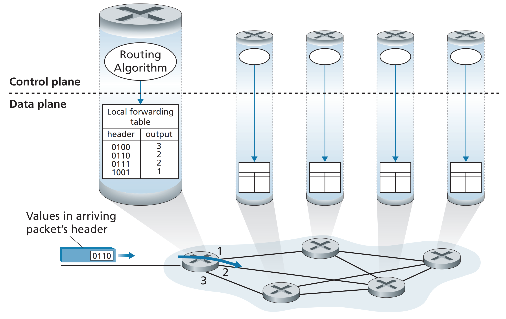
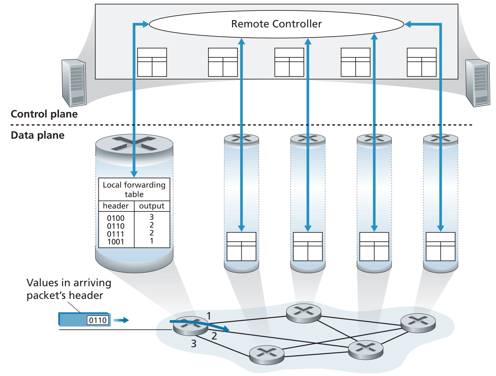
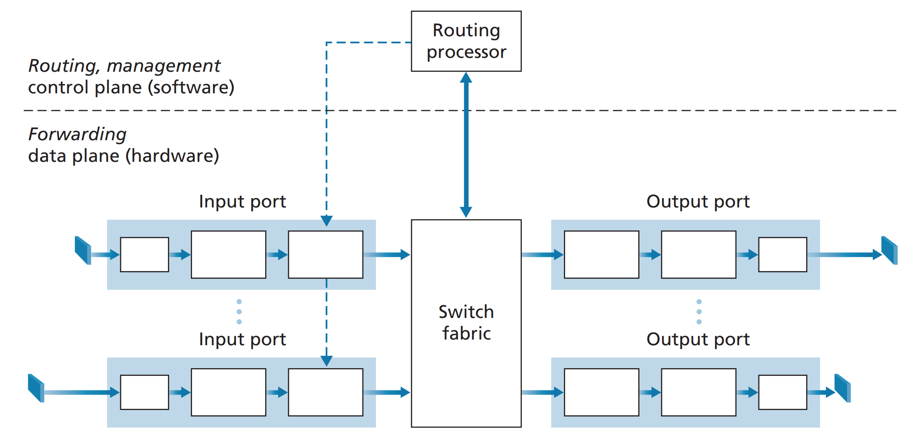
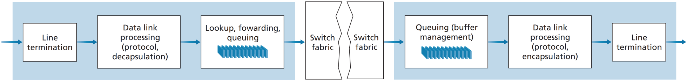

# 네트워크 계층 : 데이터 평면
네트워크 계층은 서로 상호작용하는 데이터 평면(data plane)과 제어 평면(contorl plane)으로 나눌 수 있다. 

- 데이터 평면은 한 라우터의 입력 링크에 도착한 데이터그램이 어떻게 목적 라우터의 출력 링크로 나갈 수 있는지 정의한다.
여기서는 목적지 기반 IP 포워딩과 일반화된 포워딩 방식을 사용한다.
- 제어 평면은 송신 호스트에서 수신 호스트까지의 라우터 간 패킷 이동 경로를 결정한다. OSPF와 BGP 같은 라우팅 프로토콜이 있다.

포워딩(forwarding)은 매우 짧은 시간(보통 몇 나노초) 단위를 갖기에, 대표적으로 하드웨어에서 실행된다. 
반면에, 라우팅(routing)은 네트워크 전반에 걸쳐 출발지에서 목적지까지 데이터그램의 종단 간 경로를 결정한다.
라우팅은 더 긴 시간(보통 초) 단위를 갖기에 소프트웨어에서 보통 실행된다.

포워딩 테이블을 사용하여 라우터는 도착하는 패킷 헤더의 필드값을 조사하여 패킷을 전달할 수 있다.
포워딩 테이블 엔트리에 저장되어 있는 헤더의 값은 해당 패킷이 전달되어야 할 라우터의 외부 링크 인터페이스를 나타낸다.
이러한 포워딩 테이블은 5장의 라우팅 프로토콜에 따라 값을 계산하여 저장하게 된다.

전톨적인 라우팅 프로토콜은 위의 사진과 같이 각 라우터가 자신만의 포워딩 테이블과 라우팅 알고리즘을 가지게 된다.

## SDN(software defined networking)
SDN은 각 라우터로부터 물리적으로 분리된 '원격 컨트롤러 컴퓨터'가 각각의 라우터에서 사용될 포워딩 테이블을 분배하는 방식이다.
위의 전통적인 방식과 비교했을 때, 데이터 평면의 구성은 바뀌지 않았지만, 제어 평면이 물리적으로 분리된 원격 컨트롤러에 의해 정의되는 것이 다르다.

원격 컨트롤러는 높은 신뢰성과 중복성을 갖춘 원격 데이터 센터에 설치될 수 있으며, ISP 또는 제 3자에 의해 관리될 수 있다.
SDN은 네트워크가 소프트웨어적으로 정의되었을 때, 포워딩 테이블을 계산하는 컨트롤러는 라우터와 상호작용을 하며 소프트웨어에서 실행된다.

## 링크 계층 스위치 vs 라우터
링크 계층 스위치라고 불리는 일부 패킷 스위치는 링크 계층 프레임의 필드값에 근거하여 포워딩을 결정하기 때문에 링크 계층(2계층) 장치라고 한다.
반면에 라우터 같은 패킷 스위치는 네트워크 계층 필드값에 근거하여 포워딩을 결정한다. 때문에 네트워크 계층(3계층) 장치라고 한다.

# 라우터 내부에는 무엇이 있을까?
일반적인 라우터의 구조는 아래와 같다.

- 입력 포트 : 물리 계층 ~ 링크 계층을 상호 운용하고 '검색 기능'을 수행함
  - 가장 오른쪽 박스에서 포워딩 테이블을 참조하여 도착한 패킷이 스위치 구조를 통해 적절한 라우터 출력 포트로 가도록 결정함
- 스위치 구조 : 입력 포트와 출력 포트를 연결함
- 출력 포트 : 수신한 패킷을 저장하고 필요한 링크~물리 계층 기능을 수행하여 출력 링크로 패킷을 전송함
- 라우팅 프로세서 : 제어 평면 기능을 수행함(포워딩 테이블 계산)

라우터의 입력 포트, 출력 포트, 스위치 구조는 거의 항상 하드웨어로 구현된다.
그럼 각각을 자세히 살펴보자.

## 입력포트
1. 라인 종단과 링크 계층 처리는 라우터의 개별 입력 링크와 관련된 물리 계층 및 데이터 링크 계층을 구현한다.
2. 마지막 박스의 검색, 포워딩, 큐잉이 라우터 동작의 핵심이다. 
   - 라우터는 포워딩 테이블을 사용하여 도착 패킷의 출력 포트를 검색한다. 
   - 포워딩 테이블은 라우팅 프로세서에서 입력 라인 카드로 복사된다. (=호출을 줄이고 병목을 피함)

### 어떻게 포워딩 테이블에서 출력 포트를 찾을까? == match plus action
입력 패킷의 IP 주소에 따라 스위칭할 출력 포트의 링크 인터페이스가 주어진다. 
예를 들어 IP 1-3는 0번, 4-6은 1번, 7-9는 2번 링크 인터페이스를 사용하면, 총 3개의 엔트리를 갖는 포워딩 테이블을 구성할 수 있다.
이런 형식의 포워딩 테이블에서 라우터는 패킷의 목적지 주소의 prefix를 테이블의 엔트리와 매치한다.
예를 들어, IP 주소의 앞 21개 비트를 프리픽스로 사용할 수 있다. 만약 다수의 매치가 있을 경우, 최장 프리픽스 매치 규칙을 따른다.

## 스위칭
- 메모리를 통한 교환 : CPU가 입력값을 메모리에 올리고 처리해서 출력 포트의 버퍼에 복사함
- 버스를 통한 교환 : 공유 버스를 통해 직접 출력 포트로 패킷을 전송함
- 상호 연결 네트워크를 통한 교환 : crossbar switch와 같이 2N 버스로 구성된 네트워크를 통해 패킷을 전송함

## 출력포트
1. 출력 포트의 메모리에 저장된 패킷을 가져온다. (스케줄링 및 큐 제거 발생)
2. 필요한 링크 계층 및 물리 계층 전송 기능을 수행하고 패킷을 출력 링크를 통해 전송한다.

### 어디에서 큐잉이 일어날까?
패킷 큐는 입력 포트와 출력 포트 모두에서 형성될 수 있다. 그리고 더이상 도착하는 패킷을 저장할 수 있는 메모리가 없을 때 패킷 손실이 발생한다.
1. 입력 큐잉 : HOL(head-of-the-line) 블로킹
   - 두 패킷이 같은 출력 큐로 향한다면 이 중 한 패킷은 차단되고 입력 큐에서 기다려야 함
   - 이 때, 라인의 앞쪽에서 다른 패킷이 막고 있으므로 입력 큐에서 대기 중인 패킷은 사용할 출력 포트가 사용 중이지 않아도 스위치 구조를 통해 전송되기를 기다려야 함(HOL 블로킹)
2. 출력 큐잉
   - 스위치 구조가 포트 라인 속도보다 빠른 경우 패킷 큐잉이 출력 포트에서 발생함
   - 메모리가 충분하지 않으면 도착한 패킷을 삭제하거나(drop-tail), 이미 대기 중인 하나 이상의 패킷을 제거함(패킷 스케줄러)
   - 버퍼가 가득 차기 전에 송신자에게 혼잡 신호를 제공 = 명시적 혼잡 알림(ECN)

#### 얼마나 많은 버퍼가 요구되는가?
버퍼링이 크면 클수록 패킷 손실을 감소시킬 수 있지만, 오히려 버퍼가 클수록 큐잉 지연이 길어진다!

### 패킷 스케줄링
큐에 있는 패킷이 출력 링크를 통해 전송되는 순서를 결정한다.
- FIFO : 먼저 온 놈이 먼저 간다. 패킷 손실은 따로 결정한다.
- 우선순위 큐잉 : 각 패킷은 우선순위 클래스에 따라 처리된다. 같은 클래스의 패킷은 차례대로 처리된다.
  - 비선점 우선순위 큐잉에서는 낮은 우선순위더라도 패킷의 전송이 시작되면 중단하지 않고 처리한다. 
- 라운드 로빈과 WFQ : 클래스가 나뉘지만, 라운드 로빈 스케줄러가 클래스 간에 서비스를 번갈아서 제공한다.
  - 작업 보존 큐잉(work-conserving queuing) 규칙을 따를 경우, 클래스가 비어있으면 바로 다음 클래스를 처리한다.
  - 가장 일반화된 방식은 WFQ(weighted fair queuing) 규칙이다. 각 클래스마다 다른 양의 서비스 시간을 부여한다.

# IP : 인터넷 프로토콜
...

## IPv4

## IPv6
