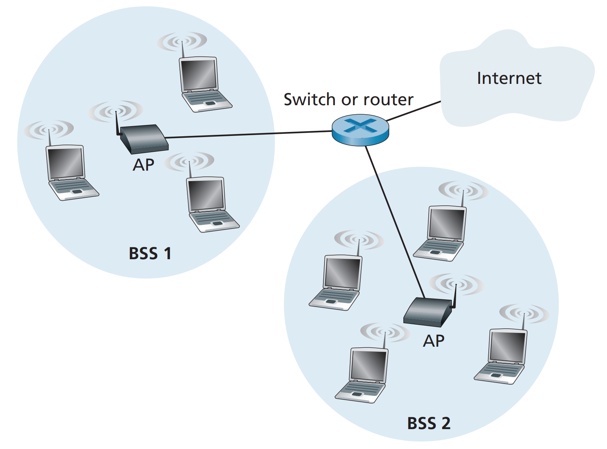
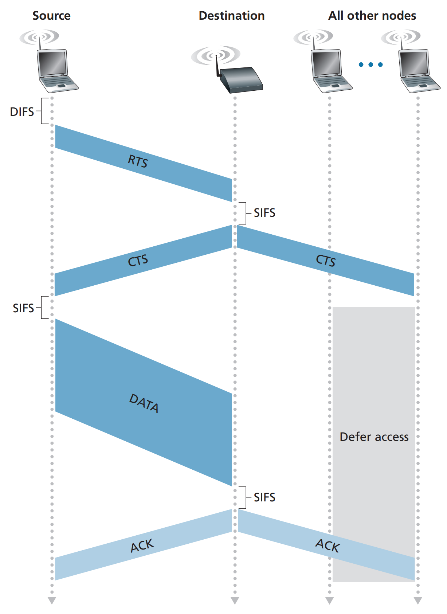
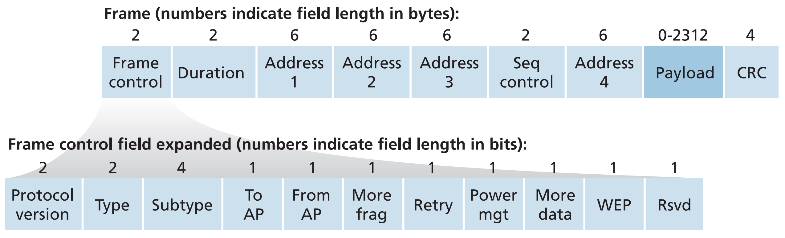
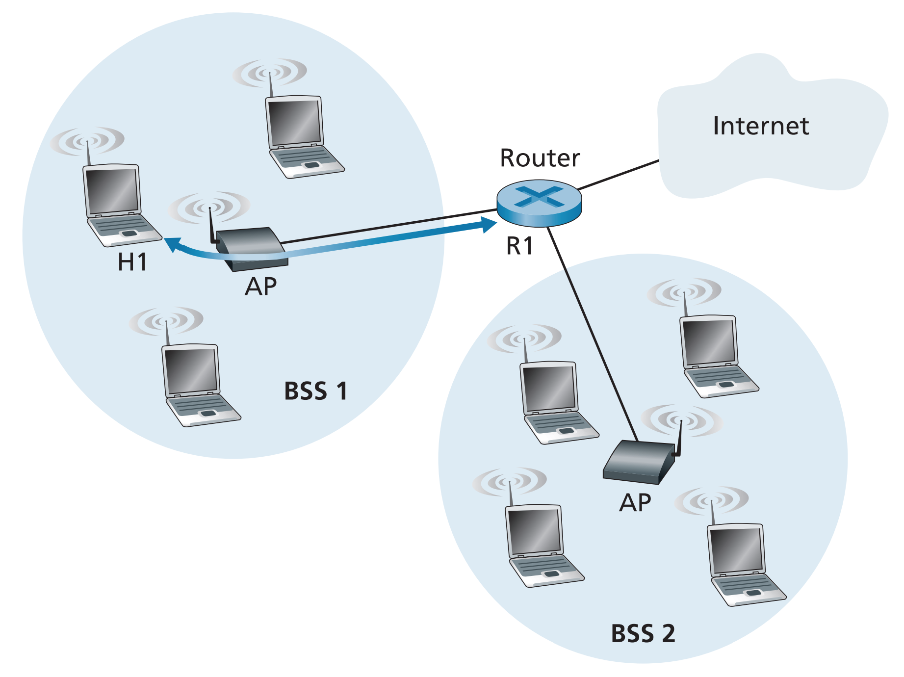

# 7.3 와이파이: 802.11 무선 랜
가장 성공적인 무선 랜 기술인 와이파이(WiFi)는 IEEE 802.11 무선 랜이다.
- 802.11 프레임 구조
- 802.11 매체 접속 프로토콜
- 802.11 랜과 유선 이더넷 랜의 연동

IEEE 802.11 표준안에는 여러 버전이 있는데 가정, 직장, 비즈니스 등 일반적으로 거리가 70m 미만인 영역에서 동작하는 WLAN과
와이파이 4,5,6이 있으며, 802.11 af, ah는 좀 더 먼 거리에서 동작하며 IoT, 센서 네트워크 등을 활용하기 위한 용도이다.

서로 다른 802.11 표준안은 공통적인 특징을 공유한다.
- 동일한 링크 계층 프레임 구조를 사용
- 이전 표준과의 역방향 호환성(낮은 버전의 단말도 높은 버전과 상호작용 가능)
- CSMA/CA 매체 접속 프로토콜 사용

표준안 간의 차이점은 서로 다른 주파수 영역에서 동작한다는 것이다.
- 2.4 GHz : 비허가 주파수 대역, 가전제품과 주파수 경쟁
- 5 GHz : 전송 거리가 더 짧고 다중 경로 전파의 영향을 더 많이 받음

와이파이 4,5,6은 MIMO(multiple input multiple output) 안테나를 사용하여,
송신과 수신 측에 각각 2개 이상의 안테나가 있어 각기 다른 신호를 송수신한다.
그래서 동시에 여러 개의 스테이션에 전송할 수 있으며, 목적지에 따라 동적으로 수신자의 방향을 향해 전송할 수 있다.

## 802.11 WLAN 구조
가장 근본 구성 단위는 BSS(basic service set)이다.
BSS는 하나 이상의 무선 단말기와 하나의 기지국(AP; access point)로 구성된다.

802.11 무선 기지국은 6바이트의 MAC 주소를 가지며,
각각의 AP도 자신의 무선 인터페이스에 대한 MAC 주소를 갖는다.
이렇게 AP를 가진 무선 랜을 인프라스트럭처 무선 랜이라고 하며,
AP와 AP를 인터넷 라우터와 연결해주는 유선 이더넷 구조를 통칭한다.

802.11에서 개별 무선 단말기는 네트워크 계층 데이터를 송신 또는 수신하기 전에 하나의 AP와 결합되어야 한다.
네트워크 관리자가 AP를 설치할 때 AP에게 하나 또는 두 단어로 된 SSID(service set identifier = 와이파이 이름)를 할당한다.
그리고 또한 관리자는 AP에게 채널 숫자를 할당해야 한다. 구별된 채널을 통해 같은 장소에 여러 개의 AP를 설치할 수 있다.
즉 관리자는 3개의 802.11 AP를 같은 장소에 설치한 후, 각각 채널 1, 6, 11을 할당하고 그 3개의 AP를 하나의 스위치로 연결함
으로써 최대 전송률의 3배에 해당하는 합산 전송률을 갖는 무선 랜을 생성할 수 있다.
(2.4GHz주파수에서 채널은 최대 11개의 겹치는 채널이 있으며, 서로 다른 2개의 채널은 4개 채널 이상의 간격으로 분리되어야 겹치지 않는다.)

### 와이파이 정글
하나의 단말이 여러 개의 AP로부터 충분히 강한 신호를 받을 수 있는 지역을 뜻한다.
무선 스테이션이 인터넷에 접속하기 위해서는 정확하게 하나의 서브넷에 들어가야 하므로 단 하나의 AP와 결합되어야 한다.
결합이란 무선 스테이션이 AP와 가상 회선을 만드는 것을 뜻한다. 그래야 데이터 프레임을 전송할 수 있다.
어떻게 특정 AP와만 결합될 수 있는가?

802.11 표준은 AP가 주기적으로 비컨 프레임(beacon frame)을 전송하도록 한다.
비컨 프레임에는 AP의 SSID와 MAC 주소가 포함된다.
와이파이 정글에 들어온 무선 스테이션은 11개의 채널을 살펴보며 비컨 프레임으로부터 사용 가능한 AP 정보를 구한다.
무선 스테이션은 비컨 시그널의 세기가 가장 강한 AP를 선택한다.(또는 개별 알고리즘에 의해 결정됨)
이렇게 비컨 프레임의 수신을 통해 채널을 찾는 과정을 수동적 스캐닝이라 한다.

능동적 스캐닝은 무선 스테이션이 영역 안에 있는 AP들에게 탐사용 프로브(probe) 프레임을 방송한다.
그리고 프로브 응답 메시지를 보낸 AP 중 하나를 선택한다.

핸드세이킹 통신을 통해 AP와의 결합 단계가 끝나면 무선 스테이션은 AP의 서브넷 IP 주소를 얻을 수 있다.

## 802.11 MAC 프로토콜
무선 스테이션이 AP와 결합되면 AP와 데이터 프레임을 송수신할 수 있다.
그러나 AP 자신을 포함한 여러 스테이션이 동시에 동일한 채널로 데이터 프레임을 전송할 수 있으므로
전송을 조정하기 위해 다중 접속 프로토콜이 필요하다.

802.11 무선 랜에서 사용되는 랜덤 접속 프로토콜은 CSMA/CA(CSMA with collision avoidance)이다.
CSMA는 carrier sense multiple access이다. 
즉 스테이션이 전송하기 전에 채널 상태를 감지하고(sense), 만일 채널이 사용 중이면 전송하지 않는다.

이더넷의 CSMA/CD(collision detection)와 다르게 802.11에서는 충돌 회피(DA) 기술을 사용하고,
링크 계층 ARQ(ACK/재전송) 방식을 사용함으로써 비트 오류율을 줄인다.

802.11은 충돌 검출을 사용하지 않으므로, 일단 스테이션이 프레임을 전송하기 시작하면 그 프레임을 모두 전송한다.

### 링크 계층 ACK 방식
목적지 스테이션은 CRC 검사를 통과한 프레임을 수신하면 짧은 시간을 기다린 후에 ACK 프레임을 송신 스테이션에게 보낸다.
만약 송신 스테이션이 주어진 시간 동안에 ACK를 수신하지 못하면, 송신 스테이션은 오류가 발생했다고 가정하고 프레임을 재전송한다.
일정 횟수만큼의 재전송 후에도 ACK를 수신하지 못하면, 폐기한다.

충돌을 회피하는 802.11의 경우, 두 스테이션이 서로 같은 채널을 사용 중임을 감지하면 서로 경쟁하여 순서를 정한다.
그런데 서로를 감지할 수 없는 두 스테이션이 하나의 AP를 사용하고자하는 '숨은 터미널'일 경우는 어떻게 할까?
RTS(Request to Send)와 CTS(Clear to Send)라는 짧은 제어 프레임을 사용하여 채널 접속을 예약한다.

- DIFS : Distributed Inter-Frame Space
- SIFS : Short Inter-Frame Spacing

송신자는 RTS 프레임을 AP에게 보냄으로써 Data 프레임과 ACK 프레임을 전송하는 데 필요한 전체 시간을 알려준다.
AP는 이에 대한 응답으로 CTS 프레임을 모든 스테이션에 전송해서 예약됨을 알린다.
짧은 RTS/CTS 프레임을 전송함으로써 DATA와 ACK는 충돌없이 전송될 수 있다.

## IEEE 802.11 프레임

- Payload : 하나의 IP 데이터그램 또는 ARP 패킷
- CRC : 비트 오류 검출
- 주소 필드 : 4개의 Address를 가짐(3개는 네트워크 연동, 1개는 애드혹 네트워크 모드)
  - Address 2 : 프레임을 전송하는 스테이션의 MAC 주소
  - Address 1 : 프레임을 수신하는 스테이션의 MAC 주소
  - Address 3 : 서브넷(AP 그룹)을 인터넷과 연결하는 라우터 인터페이스의 MAC 주소
  - 라우터는 AP의 존재를 모르고 무선 스테이션의 MAC 주소를 가지고 전송함(송신:라우터, 수신:무선단말)
  - AP는 이더넷 프레임의 주소 1,2를 받아 자신을 포함하는 3주소 체계로 변환함(수신:무선단말, 송신:AP, 주소3:라우터)
  - 무선 단말은 서브넷으로 전송한 라우터 인터페이스의 MAC 주소를 주소3으로부터 알 수 있음
  - 무선 랜은 BSS 구성이기 때문에 이러한 3주소 체계가 필요함!

## 동일한 IP 서브넷 내에서의 이동성
무선 랜의 물리적 영역을 증가시키기 위해 동일한 IP 서브넷에 여러 개의 BSS를 설치하기도 한다.
따라서 무선 스테이션이 기존 TCP 세션을 유지한 채로 어떻게 한 BSS에서 다른 BSS로 매끄럽게 이동할 수 있는가 하는 BSS간의 이동성 문제가 발생한다.

위 그림의 두 BSS에 있는 AP를 포함한 모든 기지국은 동일한 IP 서브넷에 속한다.
따라서 H1이 BSS1에서 BSS2로 이동할 때 H1의 IP 주소는 동일하게 유지되며, TCP 연결도 유지될 수 있다.

만약 두 BSS를 연결하는 장치가 라우터인 경우 H1은 현재 진행 중인 IP 주소를 새로 진입한 서브넷에 맞게 변경해야 한다.
이때 네트워크 계층의 이동성 프로토콜을 사용한다.
기존의 H1이 새로운 AP2와 결합하게 되면, AP2로 하여금 출발지 주소가 H1인 이더넷 프레임을 스위치로 브로드캐스트한다.
스위치는 자가학습을 통해 자동으로 포워딩 테이블을 구성하므로, 이 프레임을 수신한 스위치는 포워딩 테이블을 갱신할 수 있다.