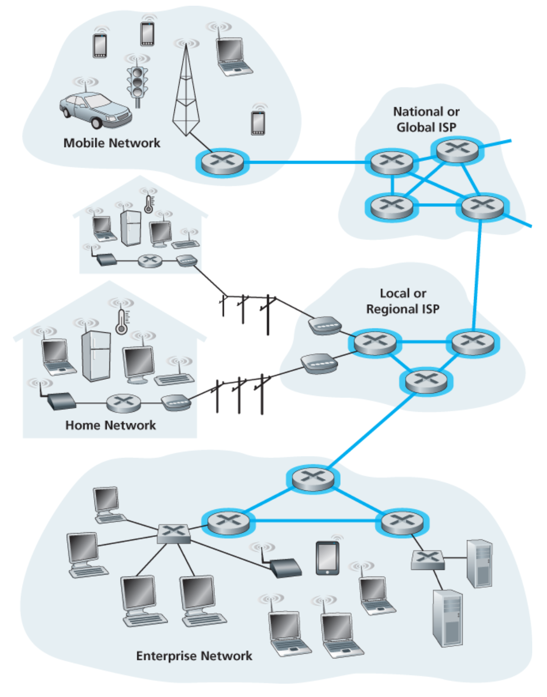
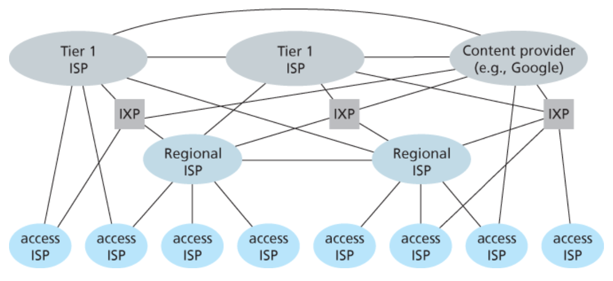
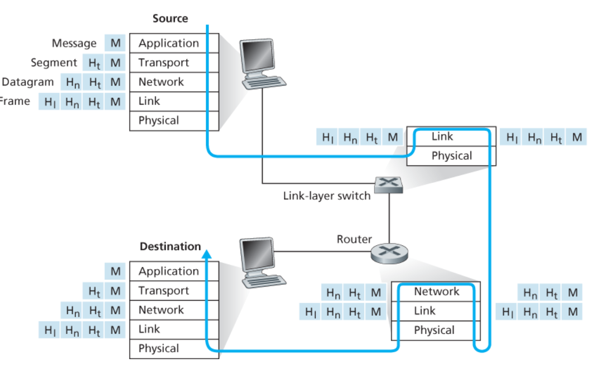

# 제1장 컴퓨터 네트워크와 인터넷

## 1.1 인터넷이란?

- 인터넷을 구성하는 기본 하드웨어 및 소프트웨어 구성 요소인 인터넷의 기본 사항
- 인터넷을 분산된 응용 프로그램에 서비스를 제공하는 네트워크 인프라

### 1.1.1 인터넷의 기본 및 SW 구성요소

- **`호스트(host) / 종단 시스템(end system)`**
  - 애플리케이션 프로그램(ex 웹 브라우저/ 웹 서버 프로그램 등)을 호스팅(실행)하는 주체
  - 인터넷에 연결된 컴퓨터 및 기타 장치
  - **종류**
    - 데스크탑 컴퓨터(ex 데스크탑 PC, 맥)
    - 서버(ex 웹 서버 및 이메일 서버)
    - 모바일 장치(ex 노트북, 스마트폰 및 태블릿)
    - 인터넷에 연결된 비전통적인 “사물"
  - 종단 시스템은 통신 링크와 패킷 스위치의 네트워크에 연결
- **`패킷`**

  - 원본 종단 시스템에서 대상 종단 시스템으로 전송되는 **데이터의 단위**
  - 통신 링크를 통해 전송되며, 각 링크의 전송 속도에 따라 다름
  - 패킷 스위치(ex 라우터)가 패킷을 수신하고 다음 링크로 전달

- 인터넷은 수많은 패킷 스위치와 링크로 구성된 네트워크의 네트워크
- 인터넷의 네트워크는 다양한 방식으로 상호 연결 → 계층 구조를 형성
  - 최상위 계층: 백본 네트워크 (고속 링크와 강력한 라우터로 구성)
  - 중간 계층: 지역 ISP(인터넷 서비스 제공자) 네트워크
  - 최하위 계층: 사용자의 액세스 네트워크
- **`인터넷 서비스 제공자(ISP) (a.k.a SKT,KT,LG)`**
  - 종단 시스템에 다양한 유형의 네트워크 접속을 제공
    - 주거용 광대역 접속(케이블 모뎀 또는 DSL)
    - 고속 로컬 영역 네트워크 접속
    - 모바일 무선 접속
  - 콘텐츠 제공자에게 인터넷 접속을 제공
  - ( 종단 시스템에 접속을 제공하는) 하위 계층 ISP → 국가 및 국제 상위 계층 ISP → 고속 라우터와 고속 광섬유 링크로 상호 연결
  - 상위 계층이든 하위 계층이든 각 ISP 네트워크는 독립적으로 관리

### 1.1.2 서비스 제공 인프라 관점에서의 인터넷

- 인터넷을 분산 애플리케이션에 서비스를 제공하는 인프라로 보는 관점
- 인터넷 애플리케이션은 종단 시스템에서 실행
- **`분산 애플리케이션`**
  - 서로 데이터를 주고받는 여러 종단 시스템을 포함
  - 이메일, 웹 서핑, 영화 스트리밍, sns, 화상 회의, 위치 기반 추천 시스템 등
- **`소켓 인터페이스`**
  - 한 종단 시스템에서 실행되는 프로그램이 다른 종단 시스템에서 실행되는 특정 목적지 프로그램으로 데이터를 전달하기 위해 송신 프로그램이 따라야 할 규칙 집합
    → 인터넷이 데이터를 목적지 프로그램으로 전달할 수 있음

### 1.1.3 프로토콜이란?

> 두 개 이상의 통신 엔티티 간에 교환되는 메시지의 형식과 순서, 메시지 전송 및 수신 시의 통신 규칙을 정의하는 표준

- TCP(전송 제어 프로토콜)
- IP(인터넷 프로토콜)
- HTTP(하이퍼텍스트 전송 프로토콜)
- FTP(파일 전송 프로토콜) 등

### **`네트워크 프로토콜`**

- `ex) 웹 서버에 요청을 보내는 상황`
  - 컴퓨터 → 웹 서버 : 연결 요청 메시지 보내고 응답 대기
  - 웹 서버 : 연결 요청 메시지를 수신, 연결 응답 메시지를 반환
  - 연결 완료
  - 컴퓨터 → 웹 서버 : 요청하는 웹 페이지의 이름을 포함한 GET 메시지 전송
  - 웹 서버 → 컴퓨터 : 요청된 웹 페이지 전송

---

## 1.2 The Network Edge

### 1.2.1 접근 네트워크

> 종단 시스템을 첫 번째 라우터(엣지 라우터)와 물리적으로 연결하는 네트워크

### **`가정용 접근: DSL, 케이블, FTTH, 다이얼업 및 위성`**

- **DSL (Digital Subscriber Line) 디지털 가입자 회선**
  - 통신사의 기존 지역 전화 인프라(전화선)을 사용하여 인터넷에 접근하는 방식
- **케이블**
  - 케이블 TV 회사의 케이블 TV 인프라를 사용하여 인터넷에 접근하는 방식
  - DSL보다 더 높은 다운스트림 속도 제공
- **FTTH (Fiber to the Home)**
  - 광섬유를 사용하여 가정에 직접 인터넷을 제공하는 방식
  - 가장 높은 속도와 대역폭 제공, **`but`** 높은 설치 비용
- **다이얼업**
  - 기존 전화선을 사용하여 인터넷에 접근하는 초기 방식
  - 다이얼업 모뎀은 전화선을 통해 데이터를 전송
  - 현재는 거의 사용 X
- **위성**
  - 위성 인터넷은 위성을 사용하여 인터넷에 접근하는 방식
  - 주로 DSL이나 케이블이 제공되지 않는 지역에서 사용
  - 광범위한 지역에서 접근 가능, **`but`** 긴 지연 시간

### **`기업용 접근: 이더넷 및 Wi-Fi`**

- **이더넷**
  - 기업 네트워크에서 널리 사용되는 기술
  - 높은 대역폭과 신뢰성을 제공
- **Wi-Fi**
  - 무선으로 인터넷에 접근할 수 있는 기술

### **`모바일 네트워크: 3G, 4G, 5G`**

- 무선 기지국을 통한 인터넷에 접근
- 사용자가 이동 중에도 인터넷에 연결 가능
- 각 세대(3G, 4G, 5G)에 따라 속도와 대역폭이 증가

### 1.2.2 물리적 매체

### **`유선 매체`**

데이터를 전송하기 위해 물리적 케이블을 사용

- **트위스트 페어(Twisted Pair)**
  - 두 가닥의 구리선으로 구성
  - 전화선과 이더넷 케이블에 사용
  - 저렴하고 설치가 용이, **`but`** 일반적으로 느린 데이터 전송 속도
- **동축 케이블(Coaxial Cable)**
  - 하나의 구리 도체가 절연체로 감싸지고, 외부에 도체로 둘러싸인 형태
  - 케이블 TV 네트워크와 일부 이더넷 네트워크에서 사용
  - 높은 대역폭과 신뢰성을 제공 → 장거리 데이터 전송에 적합
- **광섬유(Fiber Optic Cable)**
  - 유리 또는 플라스틱 섬유로 구성, 데이터를 빛의 형태로 전송
  - FTTH(Fiber to the Home)와 같은 고속 인터넷 서비스에서 사용
  - 매우 높은 대역폭과 긴 거리 전송을 지원, 전자기 간섭에 민감 X

### **`무선 매체`**

데이터를 전송하기 위해 전자기파를 사용

- **지상 라디오 채널**
  - 물리적 배선을 설치할 필요 X
  - 이동 중인 사용자에게 연결성을 제공, 장거리까지 신호를 전달 가능
  - 신호가 전달될 전파 환경과 거리에 크게 의존
    - 경로 손실 및 그림자 페이딩, 다중 경로 페이딩, 간섭 등
- **위성 라디오 채널**
  - 통신 위성은 두 개 이상의 지구 기반 마이크로파 송수신기(지상국)를 연결
  - 위성은 한 주파수 대역에서 송신을 수신하고, 중계기(아래에서 설명)를 사용하여 신호를 재생성한 후 다른 주파수로 신호를 송신합니다.
  - **`통신에 사용되는 위성의 종류`**
    - **정지 궤도 위성**
      - 지구의 동일한 지점 위에 영구적으로 머물러 있음
      - 상당한 신호 전파 지연이 발생, **`but`** DSL이나 케이블 기반 인터넷 접근이 불가능한 지역에서 종종 사용
    - **저궤도(LEO) 위성**
      - 지구와 훨씬 가까운 곳에 배치, 지구의 동일한 지점 위에 영구적으로 머무르지 X
      - 지구 주위를 회전하며, 지상국뿐만 아니라 서로 통신 O
      - 특정 지역에 지속적인 커버리지를 제공하기 위해서는 많은 위성이 필요함

---

## 1.3 The Network Core

### 1.3.1 패킷 스위칭

> 패킷은 각 통신 링크를 해당 링크의 전체 전송 속도에 맞춰 전송

→ 소스 종단 시스템/ 패킷 스위치가 전송 속도가 R bps인 링크를 통해 L 비트의 패킷을 전송

→ 패킷을 전송하는 데 걸리는 시간은 L/R 초

### **`저장 및 전달(Store-and-Forward) 전송 (지연)`**

- **패킷 스위치(라우터)가 패킷의 첫 비트를 아웃바운드 링크로 전송하기 전에 전체 패킷을 수신해야 함**
- 라우터는 일반적으로 여러 개의 연결 링크를 가지며, 들어오는 패킷을 아웃바운드 링크로 전환
  → 한 (입력) 링크에서 다른 하나의 연결된 링크로 패킷을 전달

(예시)

- 소스가 패킷 1의 일부를 전송 → 패킷 1의 앞 부분이 이미 라우터에 도착
  → 라우터는 저장 및 전달을 사용하기 때문에, 이 순간에는 수신한 비트를 전송할 수 X
  → 먼저 패킷의 비트를 버퍼에 저장 → 라우터가 패킷의 모든 비트를 수신
  → 아웃바운드 링크로 패킷 전송
- **`소스가 패킷 전송을 시작한 순간부터 목적지가 전체 패킷을 수신할 때까지 경과하는 시간?`**
  - **`시간 0`** : 소스 전송을 시작
  - **`L/R 초`** : 소스는 전체 패킷을 전송/ 라우터는 전체 패킷을 수신하고 저장
    → 라우터는 목적지를 향해 아웃바운드 링크로 패킷 전송 가능
  - **`2L/R 초`** : 라우터는 전체 패킷을 전송/ 목적지는 전체 패킷을 수신
    → 전체 지연은 **2L/R**이 됩니다.
  - 만약 스위치가 전체 패킷을 수신하기 전에 도착하는 즉시 비트를 전송
    → 라우터에서 비트 지연 X → 총 지연 : **L/R**

### **`대기 지연과 패킷 손실`**

- 각 패킷 스위치는 연결된 링크 多 → 각 링크에 대해 출력 버퍼를 가짐 → 라우터가 해당 링크로 전송할 패킷을 저장
- **출력 버퍼 대기 지연**
  - 링크가 다른 패킷의 전송으로 바쁠 경우 → 도착한 패킷은 출력 버퍼에서 대기
  - 네트워크의 혼잡 수준에 따라 달라짐
- **패킷 손실**
  - 버퍼 공간 유한 → 도착한 패킷이 전송 대기 중인 다른 패킷으로 인해 버퍼에 자리 X
    → 도착한 패킷이나 이미 대기 중인 패킷 중 하나가 삭제되는 현상

### **`포워딩 테이블과 라우팅 프로토콜`**

- **패킷 포워딩**
  - 라우터의 패킷 전달 링크 결정 방식
  - 인터넷의 모든 종단 시스템 : IP 주소 존재
  - 소스는 **패킷의 헤더** : **목적지의 IP 주소**를 포함
- **계층 구조의 주소 체계**
  - 패킷이 네트워크의 라우터에 도착 → 라우터는 패킷의 목적지 주소의 일부를 검사
    → 패킷을 인접 라우터로 전달 → 각 라우터는 목적지 주소를 해당 라우터의 아웃바운드 링크에 매핑하는 포워딩 테이블을 가지고 있습니다.
    → 패킷이 라우터에 도착 → 라우터는 주소 검사 → 이 목적지 주소를 사용하여 포워딩 테이블 검색 → 적절한 아웃바운드 링크 탐색 → 라우터는 이 아웃바운드 링크로 패킷 전송
- **포워딩 테이블**
  - 포워딩 테이블을 자동으로 설정하는 데 사용되는 여러 **라우팅 프로토콜 O**

### 1.3.2 회선 스위칭

데이터를 링크와 스위치의 네트워크를 통해 이동시키는 두 가지 접근 방식

### **`패킷 스위칭 VS 회선 스위칭`**

- **회선 스위칭(circuit switching)**
  - ex 전통적인 전화 네트워크
  - 종단 시스템 간의 통신 세션 동안 경로를 따라 필요한 자원(버퍼, 링크 전송 속도) **예약**
  - 데이터 전송 전 네트워크는 발신자와 수신자 사이에 연결(**회선**) 설정
  - **장점**
    - 회선 설정시, 링크내 발신자-수신자 연결에 대해 일정한 전송 속도 예약
      → 일정한 속도로 데이터 전송 가능
    - 링크에 여러개의 회선 → 동시에 여러개의 연결 지원
  - **단점**
    - 전용 회선은 침묵 기간 동안 유휴 상태로 존재
    - 유휴 네트워크 자원(연결 경로의 주파수 대역 / 시간 슬롯)은 다른 진행 중인 연결에서 사용할 수 X
    - 종단 간 회선 설정, 종단 간 전송 용량을 예약 → 복잡
- **패킷 스위칭(packet switching)**
  - 패킷은 링크 자원을 전혀 예약하지 않고 네트워크로 전송
  - 다른 패킷이 같은 링크를 동시에 전송 → 링크 혼잡
    → 패킷은 전송 링크의 송신 측 버퍼에서 대기 → 지연 발생
  - **장점**
    - 필요에 따라 링크 사용을 할당
    - 회선 스위칭보다 전송 용량을 더 잘 공유
    - 회선 스위칭보다 구현이 더 간단하고 효율적이며 비용이 적게 든다
  - **단점**
    - 가변적이고 예측 불가능한 대기 지연 때문에 실시간 서비스(ex 전화 통화 및 화상 회의)에 부적합

### **`회선 스위칭 네트워크의 다중화`**

**링크 회선의 구현**

- **주파수 분할 다중화(FDM)**
  - 링크의 주파수 스펙트럼이 링크를 가로지르는 연결 사이에 분할
  - 링크는 연결 기간 동안 각 연결에 주파수 대역을 할당 → 대역폭 일부 얻음
- **시간 분할 다중화(TDM)**
  - 시간이 일정한 길이의 프레임으로 분할 → 각 프레임은 고정된 수의 시간 슬롯으로 분할
  - 연결 설정 시, 네트워크는 매 프레임마다 하나의 시간 슬롯을 할당
    → 각 슬롯은 하나의 연결에 전용으로 할당되며, 매 프레임에서 하나의 시간 슬롯이 데이터 전송에 사용됨
  - 각 회선이 슬롯 동안 주기적으로 모든 대역폭을 얻음

### 1.3.3 네트워크의 네트워크

- 종단 시스템(PC, 스마트폰, 웹 서버 등) → 액세스 ISP를 통해 인터넷에 연결
- **액세스 ISP**
  - DSL, 케이블, FTTH, Wi-Fi 및 셀룰러를 포함한 다양한 액세스 기술 → 유선 또는 무선 연결을 제공
- 종단 사용자와 콘텐츠 제공자를 액세스 ISP에 연결하는 것만으로는 인터넷 구성 X
  → 액세스 ISP 자체도 상호 연결 → 네트워크의 네트워크 구성

**`[ 네트워크 구조의 목표 ]`**

<aside>
💡 **모든 종단 시스템이 서로에게 패킷을 보낼 수 있도록 액세스 ISP를 상호 연결하는 것**
</aside>

**`네트워크 구조 1`**

- 모든 액세스 ISP를 단일 글로벌 전송 ISP와 상호 연결
- 가상의 글로벌 전송 ISP는 전 세계를 아우르는 라우터와 통신 링크의 네트워크로, 수십만 개의 액세스 ISP 각각 근처에 적어도 하나의 라우터를 가짐
- 이러한 방대한 네트워크를 구축하는 데는 큰 비용 발생
- 이익을 내기 위해, 글로벌 ISP는 자연스럽게 각 액세스 ISP가 글로벌 ISP와 교환하는 트래픽 양에 따라 연결 비용을 부과

**어떤 회사가 수익성 있는 글로벌 전송 ISP를 구축하고 운영한다면, 다른 회사들도 자신들의 글로벌 전송 ISP를 구축하고 원래의 글로벌 전송 ISP와 경쟁**

**`네트워크 구조 2`**

- 수십만 개의 액세스 ISP와 여러 글로벌 전송 ISP로 구성
- 액세스 ISP는 이제 경쟁하는 글로벌 전송 제공자의 가격 및 서비스를 기준으로 선택할 수 있기 때문에 네트워크 구조 2를 네트워크 구조 1보다 선호
- `but` 글로벌 전송 ISP 자체도 상호 연결 → 한 글로벌 전송 제공자에 연결된 액세스 ISP는 다른 글로벌 전송 제공자에 연결된 액세스 ISP와 통신할 수 O
- 두 계층 구조
  - 상위 계층 : 글로벌 전송 제공자
  - 하위 계층 : 액세스 ISP
- 특정 지역에는 액세스 ISP가 연결되는 지역 ISP → 각 지역 ISP는 티어 1 ISP와 연결 (가상의 글로벌 전송 ISP와 유사하지만, 티어 1 ISP (12개)는 실제로 존재하며 전 세계 모든 도시에 존재하지는 X)
- 특정 지역 내 여러 경쟁하는 지역 ISP → 각 액세스 ISP는 연결되는 지역 ISP에 비용 지불 → 각 지역 ISP는 연결되는 티어 1 ISP에 비용 지불
- 계층 구조의 각 단계에서 고객-공급자 관계
- 티어 1 ISP는 계층 구조의 최상위에 있으므로 누구에게도 비용을 지불X

**이 다중 계층 구조 : 오늘날 인터넷의 대략적인 모델**

**`네트워크 구조 3`**

- 존재 지점(PoP), 멀티호밍, 피어링, 인터넷 교환 지점(IXP)을 추가
  - PoP : 액세스 ISP 수준을 제외한 모든 계층에 존재
    - 고객 ISP가 공급자 ISP에 연결할 수 있는 공급자 네트워크 내의 한 위치에 있는 하나 이상의 라우터 그룹
    - 고객 네트워크가 공급자의 PoP에 연결하려면, 제3자 통신 제공자로부터 고속 링크를 임대하여 PoP의 라우터에 자신의 라우터를 직접 연결
  - 멀티호밍
    - 두 개 이상의 공급자 ISP에 연결하는 것을 의미
    - 티어 1 ISP를 제외한 모든 ISP는 멀티호밍을 선택할 수 O
    - ex) 액세스 ISP : 두 개의 지역 ISP와 멀티호밍 / 두 개의 지역 ISP와 티어 1 ISP와 멀티호밍지역 ISP : 여러 티어 1 ISP와 멀티호밍
    - ISP가 멀티호밍을 하면, 공급자 중 하나에 장애가 발생하더라도 인터넷에 패킷을 보내고 받을 수 O
  - 피어링
  - 고객 ISP는 전 세계 인터넷 상호 연결성을 얻기 위해 공급자 ISP에 비용을 지불 (교환하는 트래픽의 양에 따라)
  - 이러한 비용을 줄이기 위해, 동일 계층 내의 두 ISP는 피어링 가능
  - 두 ISP가 직접 네트워크를 연결하여 모든 트래픽이 상위 중개자를 거치지 않고 직접 연결을 통해 전달되도록 하는 것
  - 두 ISP가 피어링할 때, 정산이 없는 피어링이며, 이는 어느 ISP도 다른 ISP에 비용을 지불하지 않음 (티어 1 ISP도 피어링 O)
  - 인터넷 교환 지점(IXP)
    - 제3자 회사는 여러 ISP가 함께 피어링할 수 있는 인터넷 교환 지점(IXP) 만들 수 O

**이 생태계를 액세스 ISP, 지역 ISP, 티어 1 ISP, PoP, 멀티호밍, 피어링 및 IXP로 구성된**

**`네트워크 구조 4`**

오늘날의 인터넷을 설명하는 **`네트워크 구조 5`**

- **콘텐츠 제공자 네트워크를 추가**하여 네트워크 구조 4를 기반으로 구축
- ex) 구글
- 구글의 개인 네트워크는 하위 계층 ISP와 피어링(정산 없음)하여 인터넷의 상위 계층을 우회 시도 → 직접 연결하거나 IXP에서 연결하여 이루어짐
- 여전히 많은 액세스 ISP는 티어 1 네트워크를 통해서만 도달할 수 있기 때문에 구글 네트워크는 또한 티어 1 ISP와 연결되어 있으며, 그들과 교환하는 트래픽에 대해 비용을 지불
- 콘텐츠 제공자가 자체 네트워크를 구축함으로써, 상위 계층 ISP에 대한 비용을 줄일 뿐만 아니라, 서비스를 종단 사용자에게 전달하는 방식을 보다 잘 통제

---

## 1.4 패킷 교환 네트워크에서의 지연, 손실, 처리량

- 종단 시스템 간의 데이터 전송 시
  - 처리량 (초당 전송할 수 있는 데이터 양)을 제한
  - 종단 시스템 간의 지연을 발생
  - 패킷의 손실 불가피하게 발생

### 1.4.1 패킷 교환 네트워크에서의 지연

- 패킷은 경로상의 각 노드에서 여러 유형의 지연 발생
- **`노드 처리 지연, 대기 지연, 전송 지연, 전파 지연 → 총 노드 지연`**
- 검색, 웹 브라우징, 이메일과 같은 많은 인터넷 애플리케이션의 성능은 네트워크 지연의 영향

### **지연의 유형**

**`처리 지연`**

- **패킷의 헤더를 검사하고 패킷의 방향을 결정하는 데 필요한 시간**
- 상류 노드에서 라우터로 패킷의 비트를 전송하는 동안 발생한 비트 수준의 오류 확인 시간

→ 이 노드 처리가 끝난 후, 라우터는 패킷을 다음 라우터로 가는 링크 앞의 대기열로 보냄

**`대기 지연`**

- **대기열에서 패킷이 링크로 전송되기를 기다리는 지연**
- 특정 패킷의 대기 지연 길이는 링크로 전송되기 위해 대기 중인 패킷의 수에 depends
  - 대기열이 비어 있고 다른 패킷이 현재 전송 중 X → 패킷의 대기 지연은 0
  - 트래픽 多, 다른 패킷이 전송 대기 → 대기 지연은 길어짐

**`전송 지연`**

- 패킷은 앞서 도착한 모든 패킷이 전송된 후에만 전송 가능
- 패킷의 길이를 L 비트, 라우터 A에서 라우터 B로의 링크 전송 속도를 R bps → 전송 지연: L/R
- **패킷의 모든 비트를 링크로 밀어 넣는 데(즉, 전송하는 데) 필요한 시간**

**`전파 지연`**

- **링크의 시작부터 다음 라우터까지 전파하는 데 필요한 시간**
- 전파 속도는 링크의 물리적 매체에 따라 달라지며, 이는 빛의 속도와 근사
- 지연 시간: 두 라우터 간의 거리 d / 전파 속도 s
- 패킷의 마지막 비트가 노드 B에 도달 → 패킷의 모든 비트가 라우터 B에 저장 → 라우터 B에서 전달

### **`전송 지연 VS 전파 지연의 비교`**

- **전송 지연**
  - 라우터가 패킷을 밀어내는 데 필요한 시간
  - 패킷의 길이와 링크의 전송 속도의 함수이지, 두 라우터 간의 거리와는 무관
- 전파 지연
  - 비트가 한 라우터에서 다음 라우터로 전파되는 데 걸리는 시간
  - 두 라우터 간의 거리의 함수이지, 패킷의 길이나 링크의 전송 속도와는 무관
- **총 노드지연 : `dnodal=dproc+dqueue+dtrans+dprop`**

### 1.4.2 대기 지연 및 패킷 손실

- 처리 지연, 전송 지연, 전파 지연과 달리 **대기 지연**은 패킷마다 다를 수 있음
- 대기지연 → 통계값 多 활용
- ex) 10개의 패킷이 동시에 빈 대기열에 도착
  - 처음 전송되는 패킷은 대기 지연 X
  - 마지막으로 전송되는 패킷은 상대적으로 큰 대기 지연 O

### **`패킷 손실`**

- 실제로 링크 앞의 대기열은 유한한 용량 → 패킷이 도착하면 대기열이 가득찰 수 O
- 패킷을 저장할 장소가 X → 라우터는 해당 패킷 삭제 → 패킷 손실

### 1.4.3 종단 간 지연

- 소스에서 목적지까지의 총 지연?
  - 소스 호스트와 목적지 호스트 사이에 N-1개의 라우터가 있다고 가정
  - 노드 지연이 누적 → 종단 간 지연

$dend−end=N(dproc+dtrans+dprop)$

### **`종단 시스템, 애플리케이션 및 기타 지연`**

- 공유 매체(ex: WiFi)로 패킷을 전송하려는 종단 시스템은 다른 종단 시스템과 매체를 공유하기 위한 프로토콜의 일환으로 전송을 의도적으로 지연
- VoIP(인터넷 전화) 애플리케이션에서 나타나는 미디어 패킷화 지연
  - VoIP에서 송신 측은 패킷을 인터넷에 전달하기 전에 먼저 인코딩된 디지털 음성으로 패킷을 채워야 함
  - 이 패킷을 채우는 데 걸리는 시간(패킷화 지연) ⬆️ → VoIP 통화의 사용자 인식 품질에 영향

### 1.4.4 컴퓨터 네트워크에서의 처리량

- 컴퓨터 네트워크에서의 또 다른 중요한 성능 척도 : **`종단 간 처리량`**

---

## 1.5 프로토콜 계층과 서비스 모델

### 1.5.1 계층적 아키텍처

- 각 계층은 해당 계층 내에서 특정 작업을 수행 → 서비스 제공, 그 아래 계층의 서비스를 사용 → 서비스 제공
- 단순화 → **모듈성** 제공 → 계층이 제공하는 서비스의 **변경이 용이함**
- 계층이 위의 계층에 동일한 서비스를 제공, 아래의 계층에서 동일한 서비스를 사용 → 계층의 구현이 변경될 때 시스템의 나머지 부분은 변경 X → 지속적으로 업데이트되는 대규모 및 복잡한 시스템에 유용

### **`프로토콜 계층화`**

- 각 계층은 해당 계층 내에서 특정 작업을 수행 → 서비스 제공, 그 아래 계층의 서비스를 사용 → 서비스 제공
- 프로토콜 계층의 구현
  - 애플리케이션 / 전송 계층 프로토콜 → 종단 시스템의 소프트웨어로 구현
  - 물리 계층 / 데이터 링크 계층 → 주어진 링크와 관련된 네트워크 인터페이스 카드(ex: 이더넷 또는 WiFi 인터페이스 카드)에 구현
  - 네트워크 계층 → 종종 하드웨어와 소프트웨어의 혼합 구현
- **장점**
  - **`계층화`** → 시스템 구성 요소를 논의하는 구조화된 방법 제공
  - **`모듈성`** → 시스템 구성 요소의 업데이트가 용이함
- **단점**
  - 한 계층이 하위 계층의 기능을 중복할 수도 있음
  - 한 계층의 기능이 다른 계층에만 존재하는 정보(예: 타임스탬프 값) 요구 → 계층 분리의 목표 위반
- **프로토콜 스택 :** 여러 계층의 프로토콜을 함께 묶은 것
  - 인터넷 프로토콜 스택은 물리 계층, 링크 계층, 네트워크 계층, 전송 계층, 애플리케이션 계층의 다섯 계층

---

### **`애플리케이션 계층`**

- 애플리케이션 계층의 정보 패킷: **`메시지`**
- 네트워크 애플리케이션 및 그 애플리케이션 계층 프로토콜이 있는 곳
- 인터넷의 애플리케이션 계층
  - HTTP 프로토콜(웹 문서 요청 및 전송을 제공하는 프로토콜)
  - SMTP(이메일 메시지 전송을 제공하는 프로토콜)
  - FTP(두 종단 시스템 간 파일 전송을 제공하는 프로토콜) 등
- 한 종단 시스템의 애플리케이션은 프로토콜을 사용 → 다른 종단 시스템의 애플리케이션과 정보 패킷 교환

---

### **`전송 계층`**

- 전송 계층의 패킷: **`세그먼트`**
- 애플리케이션 계층 메시지를 애플리케이션 끝점 간에 전송
- 인터넷의 전송 프로토콜
  - TCP 및 UDP
- TCP
  - 애플리케이션에 연결 지향 서비스 제공
  - 애플리케이션 계층 메시지를 대상에 확실히 전달하고 흐름 제어(송신자/수신자 속도 조정)를 포함
  - 긴 메시지를 더 짧은 **세그먼트**로 나누고, 네트워크가 혼잡할 때 소스가 전송 속도를 제한하도록 하는 혼잡 제어 메커니즘 제공
- UDP 프로토콜
  - 애플리케이션에 연결 없는 서비스를 제공
  - 신뢰성, 흐름 제어, 혼잡 제어가 없는 간단한 서비스

---

### **`네트워크 계층 (IP 계층)`**

- 네트워크 계층 패킷 : **`데이터그램`**
- 데이터그램을 한 호스트에서 다른 호스트로 이동시킴
- 소스 호스트의 인터넷 전송 계층 프로토콜(TCP 또는 UDP)
  → 전송 계층 세그먼트와 대상 주소를 네트워크 계층에 전달
  → 세그먼트를 대상 호스트의 전송 계층으로 전달하는 서비스 제공
- **IP 프로토콜**
  - 1개 존재
  - 데이터그램의 필드 및 종단 시스템과 라우터가 이 필드에서 수행하는 작업을 정의
- 라우팅 프로토콜
  - 여러개 존재
  - 데이터그램이 소스와 대상 사이의 경로를 결정

---

### **`링크 계층`**

- 링크 계층의 패킷: **`프레임`**
- 데이터그램을 소스와 목적지 사이의 일련의 라우터를 통해 라우팅
- 패킷을 경로상의 다음 노드(호스트 / 라우터)로 이동시키기 위해, 네트워크 계층은 링크 계층의 서비스를 사용합니다.
- 링크 계층 프로토콜의 예 : 이더넷, WiFi, 케이블 액세스 네트워크의 DOCSIS 프로토콜
- 일반적으로 데이터그램은 소스에서 목적지로 이동하기 위해 여러 링크를 거침
  → 데이터그램은 경로상의 다양한 링크에서 서로 다른 링크 계층 프로토콜에 의해 처리됨

---

### **`물리 계층`**

- **역할**
  - 프레임 내의 개별 비트를 한 노드에서 다음 노드로 이동시키는 것
  - 비트는 링크를 통해 전송됨

---

### **`OSI 모델 - 7계층`**

- **개방형 시스템 상호 연결(OSI) 모델**
- 애플리케이션 계층, 표현 계층, 세션 계층, 전송 계층, 네트워크 계층, 데이터 링크 계층, 물리 계층
- **표현 계층**
  - 통신 애플리케이션이 교환되는 데이터의 의미를 해석할 수 있도록 하는 서비스 제공
  - 데이터 압축과 데이터 암호화, 데이터 설명(데이터가 표현/저장되는 내부 형식 지정) 제공
- **세션 계층**
  - 데이터 교환의 구분 및 동기화를 제공, 체크포인트 및 복구 체계를 구축 수단

### 1.5.2 캡슐화(Encapsulation)

[ 데이터가 발신 시스템의 프로토콜 스택에서 내려가는 물리적 경로와, 링크 계층 스위치 및 라우터의 프로토콜 스택을 통과한 후, 수신 시스템의 프로토콜 스택을 올라가는 경로]

- **캡슐화(encapsulation)**
  1. 발신 호스트에서 애플리케이션 계층 메시지(M) → 전송 계층으로 전달
  2. 전송 계층은 메시지를 가져와 수신 측 전송 계층에서 사용할 추가 정보 붙임(전송 계층 헤더 정보, Ht)
  3. 애플리케이션 계층 메시지 + 전송 계층 헤더 정보 → 함께 전송 계층 세그먼트 구성
  4. 전송 계층 세그먼트 → 애플리케이션 계층 메시지 캡슐화
     - 이때의 추가 정보
       - 수신 측 전송 계층이 메시지를 적절한 애플리케이션으로 전달할 수 있도록 하는 정보
       - 메시지의 비트가 경로에서 변경되었는지 여부를 수신자가 확인할 수 있는 오류 탐지 비트
  5. 전송 계층은 세그먼트 → 네트워크 계층에 전달
  6. 소스 및 목적지 종단 시스템 주소와 같은 네트워크 계층 헤더 정보(Hn)를 추가 → 네트워크 계층 데이터그램을 생성
  7. 데이터그램 → 링크 계층으로 전달
  8. 링크 계층은 자체 링크 계층 헤더 정보 추가 → 링크 계층 프레임을 생성
  - 패킷의 구성
    - 헤더 필드와 페이로드 필드 → 페이로드는 일반적으로 상위 계층의 패킷

---

## 1.6 네트워크에 대한 공격

### **`나쁜 사람들은 인터넷을 통해 당신의 호스트에 악성 소프트웨어를 넣을 수 있습니다.`**

- **악성 소프트웨어**(malware)
  - 장치에 침입하고 감염 → 파일 삭제, 개인 정보를 수집하는 스파이웨어 설치, 정보 전송 가능..
  - 감염된 호스트 → **봇넷(**수천 개의 유사하게 감염된 장치로 구성된 네트워크**)**에 등록
    → 분산 서비스 거부 공격(Dos)에 활용될 수도 O
- 자가 복제 가능
- **바이러스**
  - 사용자 상호작용을 통해 사용자 장치를 감염시키는 악성 소프트웨어
- **웜**
  - 명시적인 사용자 상호작용 없이 장치에 진입할 수 있는 악성 소프트웨어
  - 새로 감염된 장치의 웜 → 인터넷 스캔 → 동일한 취약 네트워크 애플리케이션을 실행하는 다른 호스트 탐색 → 해당 호스트에 자신을 복사하여 보냄

### **`나쁜 사람들은 서버와 네트워크 인프라를 공격할 수 있습니다.`**

- **서비스 거부(DoS) 공격**
  - 네트워크, 호스트 또는 다른 인프라를 합법적인 사용자에 의해 사용 불가능하게 만듦
  - 종류
    - **취약성 공격**
      - 타겟 호스트에서 실행 중인 취약한 애플리케이션이나 운영 체제에 몇 개의 잘 조작된 메시지를 보내는 것
      - 패킷을 취약한 애플리케이션이나 운영 체제에 보내면 서비스 중단 or 호스트가 다운될 수 있습니다.
    - **대역폭 홍수**
      - 공격자는 대상 호스트에 수많은 패킷을 보냄 → 대상을 막히게 만들어 합법적인 패킷이 서버에 도달 X
    - **연결 홍수**
      - 공격자는 대상 호스트에서 많은 수의 반개방 또는 완전 개방 TCP 연결 설정
      - 호스트는 이러한 가짜 연결로 인해 합법적인 연결을 수락하지 않을 수도 O
- **분산 서비스 거부(DDoS) 공격**
  - 공격자는 여러 소스를 제어 → 각 소스가 대상에 트래픽 보냄
  - 수천 대의 감염된 호스트를 가진 봇넷 활용
  - 단일 호스트의 DoS 공격보다 감지하고 방어하기가 훨씬 더 어려움

### **`나쁜 사람들은 패킷을 감청할 수 있습니다.`**

- **패킷 스니퍼**
  - 지나가는 모든 패킷의 사본을 기록하는 수동 수신 장치

### **`나쁜 사람들은 신뢰하는 사람인 척할 수 있습니다.`**

- **IP 스푸핑**
  - 인터넷에 잘못된 소스 주소가 있는 패킷을 주입하는 기능
- 해결 → **종단점 인증** 필요함

---

## 1.7 컴퓨터 네트워킹과 인터넷의 역사
