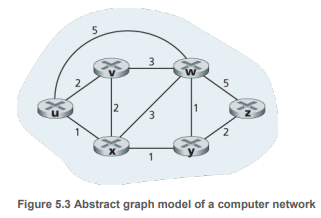
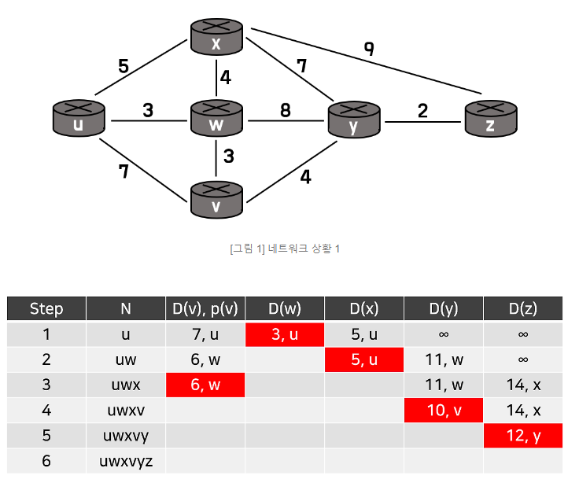
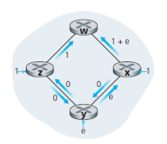
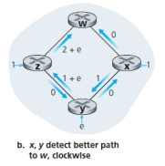
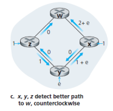
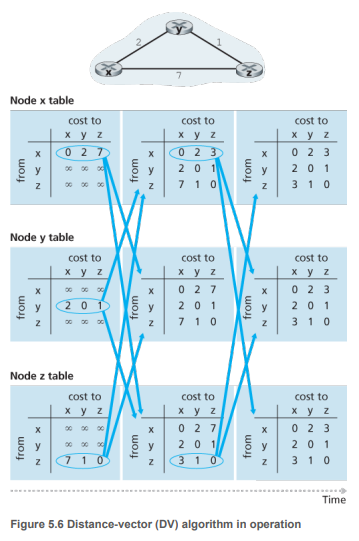
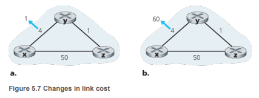
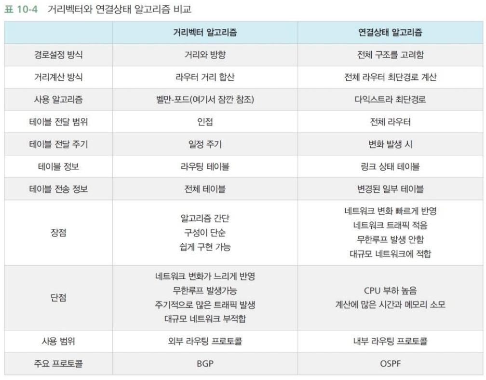

# 5장 네트워크 계층

## 5.1 개요

---

## 5.2 라우팅 알고리즘

- **라우팅 알고리즘의 목표**
    <aside>
    💡 **송신자부터 수신자까지 라우터의 네트워크를 통과하는 최소 비용 경로(루트)를 결정하는 것**
    
    </aside>

- **라우팅 문제 표현 → 그래프 사용**
  
  - 그래프(graph) : G(N,E)로 표현
  - **N** : 노드(node)의 집합
    - 패킷 전달 결정이 이루어지는 지점인 **라우터**
  - **E** : 엣지(edge)의 집합
    - 두 네트워크 간의 연결(피어링)
    - 물리 링크에 해당
  - **비용** : 엣지가 가지는 값
    - 일반적으로 해당 링크의 물리적인 거리, 링크 속도, 링크와 관련된 금전 비용 등
    - 경로 상 모든 에지 비용의 단순 합
    - if 모든 에지가 같은 비용을 갖는다면 → **최소 비용 경로 = 최단 경로**
      (출발지와 목적지 사이에서 최소 개수의 링크를 가지는 경로）

### **라우팅 알고리즘을 분류하는 일반적인 방법**

1. **`알고리즘이 중앙 집중형인지 분산형인지`**

- **중앙 집중형 라우팅 알고리즘 (centralized routing algorithm)**
  - 네트워크 전체에 대한 완전한 정보를 가지고 출발지와 목적지 사이의 최소 비용 경로를 계산
    → 입력값: 모든 노드 사이의 연결 상태와 링크 비용
  - **특징**
    - 이 연결과 링크 비용에 대한 완전한 정보를 가짐
  - **`링크 상태(link-state, LS) 알고리즘`**
- **분산 라우팅 알고리즘 (decentralized routing algorithm)**
  - 최소 비용 경로의 계산이 라우터들에 의해 반복적이고 분산된 방식으로 수행됨
  - 어떤 노드도 모든 링크 비용을 알지 X
    - 각 노드는 자신과 직접 연결된 링크에 대한 비용 정보만 가짐
  - 반복된 계산, 이웃 노드와의 정보 교환 → 최소 비용 경로 계산
  - **`거리 벡터(distance-vector,DV) 알고리즘`**
    - 각 노드가 네트워크 내 다른 모든 노드까지 비용(거리)의 추정값을 벡터 형태로 유지

1. **`정적 알고리즘과 동적 알고리즘`**

- **정적 라우팅 알고리즘(static routing algorithm)**
  - 라우팅 테이블에 경로를 수동으로 추가해야하는 프로세스
- **동적 라우팅 알고리즘(dynamic routing algorithm)**
  - 네트워크 트래픽 부하나 토폴로지(ex 물리적 링크) 변화에 따라 라우팅 경로 변환
  - 주기적으로, 토폴로지나 링크 비용의 변경에 직접적으로 응답하는 방식
  - **장점** : 네트워크 변화에 빠르게 대응 가능
  - **단점** : 경로의 루프나 경로 진동 같은 문제에 취약

1. **`라우팅 알고리즘의 부하 민감도`**

- **부하에 민감한 알고리즘(load-sensitive algorithm)**
  - 링크 비용: 해당 링크의 현재 혼잡 수준을 나타내기 위해 동적으로 변함
  - 현재 혼잡한 링크에 높은 비용을 부과 → 혼잡링크 우회
- **부하에 민감하지 않은 알고리즘**
  - 오늘날 인터넷 라우팅 알고리즘 (RIP, OSPF, BGP 등)
  - 링크 비용이 최근(현재)의 혼잡을 반영하지 않기 때문에 민감 X

### 5.2.1 링크 상태(LS) 라우팅 알고리즘

<aside>
💡 **네트워크 토폴로지와 모든 링크 비용을 알고있음**

</aside>

- 각 노드가 연결된 링크의 식별자와 비용 정보를 담은 링크 상태 패킷을 **브로드캐스트**
  - 모든 노드는 네트워크에 대한 동일하고 완벽한 관점을 가짐
  - 다른 노드와 똑같은 최소 비용 경로 집합을 계산 가능

**`다익스트라 알고리즘`**

- 하나의 노드(출발지)에서 네트워크 내 다른 모든 노드로의 최소 비용 경로를 계산
- 알고리즘 반복 실행 → n번 반복 → n개의 목적지 노드에 대해 최소 비용 경로 계산됨

- **`D(v)`**
  - 알고리즘의 현재 반복 시점에서 출발지 노드 ~ 목적지 v까지의 최소비용 경로의 비용
- **`p(v)`**
  - 출발지에서 v까지의 현재 최소 비용 경로에서 v의 직전 노드
- **`N'`**
  - 노드의 집합
  - 출발지에서 v까지의 최소 비용 경로가 명확히 알려져 있다면, v는 N'에 포함됨.
- **`중앙 집중형 라우팅 알고리즘`**은 초기화 단계와 반복 부분으로 구성
  - 반복 횟수 = 네트워크의 노드 수
  - 반복 수행 종료 → 출발지에서 모든 노드로의 최단 경로 산출
- **다익스트라 알고리즘의 계산 복잡도**
  - n개의 노드 (출발지 제외)가 있다면
  - 최악의 경우 찾아야 하는 노드의 총 수의 복잡성
    $$
    n(n + 1)/2 = O(n^2)
    $$
  - 우선순위 큐 → **$O(nlogn)$**

**`혼잡에 민감한 라우팅의 경로 진동`**

- 링크 비용은 대칭적 X
- 경로 탐지하는 과정 중에 최소 비용 경로 방향 일치 X ( ( 시계방향 → 반시계방향 → 시계방향 )

### 5.2.2 거리 벡터(DV) 라우팅 알고리즘

- **DV 알고리즘의 특징**
  - **분산적(distributed)**
    - 각 노드는 이웃으로부터 정보 수신, 계산 수행, 계산된 결과를 다시 이웃들에게 배포함
  - **반복적(iterative)**
    - 이웃끼리 더 이상 정보를 교환하지 않을 때까지 프로세스가 지속
      (자기 종료 가능 : 계산을 멈추라는 신호가 없어도 알아서 멈춤)
  - **비동기적(asynchronous)**
    - 모든 노드가 서로 정확히 맞물려 동작할 필요 X

### **최소 비용 경로의 비용들 사이의 중요 관계 : `벨만-포드(Bellman-Ford) 식`**

- DV 알고리즘에서 일어나는 이웃 간 통신의 형식을 제안

- 벨만-포드 알고리즘 : **음의 간선**이 있는 다익스트라
- 노드 x가 이웃 v에게서 새로운 거리 벡터 수신
  → x는 v의 거리 벡터를 저장하고 **벨만-포드 식**을 사용하여 자신의 거리 벡터를 갱신
  - **`dx(y)`** : 노드 x부터 y까지 최소 비용 경로의 비용
    $$
    dx(y) = minv(c(x, v) + dv(y))
    $$
    - **`minv`**는 x의 모든 이웃에 대해 적용
    - **`x -> v -> y`**까지의 최소 경로 비용 중 최솟값 !!!
- 만약 이 갱신으로 인해 노드 x의 거리 벡터가 변경된다면
  → 노드 x는 수정된 거리벡터를 자신의 이웃들에게 전송
  → 이웃들도 자신의 거리 벡터 갱신
- 모든 노드가 거리 벡터를 비동기적으로 교환하는 동작 반복
- **벨만-포드 식의 해답 → `각 노드 포워딩 테이블의 엔트리 제공`**
  - x → v → y 가 최단 경로라면
    - **`v`**에 패킷 전달 → 노드 x의 **포워딩 테이블**에 v가 지정됨

**거리 벡터 (DV) 알고리즘**

- DV-유사 알고리즘은 실제로 인터넷의 RIP, BGP, ISO, IDRP, 최초의 ARPAnet 등
  많은 라우팅 알고리즘에서 사용

- 알고리즘의 동작
  1. 모든 노드가 동시에 이웃에게서 거리 벡터를 받고,

     → 새로운 거리 벡터를 계산해서 변화가 있다면 각각의 이웃에게 알림

  2. 이웃으로부터 갱신된 거리벡터 수신
  3. 라우팅 테이블 엔트리를 재연산
  4. 목적지까지 최소 비용 경로의 비용 변경값을 알림
  5. 더 이상의 갱신 메시지가 없을 때까지 1~4번 반복

**`거리 벡터(DV) 알고리즘: 링크 비용 변경과 링크 고장`**

- **`y → x`**의 링크 비용이 **`4 → 1`**로 감소한 상황
  - DV 알고리즘은 정지 상태가 될 때까지 두 번 반복
    - **t0** : y가 링크 비용이 4→1 감지 → 자기 거리 벡터 갱신 → 이웃에게 알림
    - **t1** : z는 y로부터 갱신 정보 수신 → 자기 거리 벡터 갱신 → 이웃에게 알림
    - **t2** : y는 z로부터 갱신 정보 수신 → 자기 거리 벡터 갱신 → 정지 상태
  - **비용 감소 소식은 신속히 퍼짐**
- **`y → x`**로의 링크 비용이 **`4 → 60`**으로 증가한 상황
  - 링크 비용이 변경되기 전 : **`Dy(x)=4, Dy(z)=1, Dz(y)=1，Dz(x)=5`**
    - **t0** : y가 링크 비용이 4→60 감지
      - 자기 거리 벡터 갱신
      $$
      Dy(x) = min(c(y, x) + Dx(x), c(y，z) + Dz(x)) = min(60 + 0, 1 + 5) = 6
      $$
      - **`Dz(x)=5` 의 값이 잘못되었음을** y는 모름 ( y도 그저 전달받은 사실이므로)
    - **t1** : x로 가기 위해 y는 z로 경로 설정
              → z는 y로 경로 설정을 하는 **`라우팅 루프`** 발생
  - **t1** : z에게 새로운 거리 벡터를 알림
  - **t1 이후** : z 거리 벡터 받음
    → `y→x` 최소 비용이 6임을 알게됨
    → z는 y에 도달하기 위해 비용 1 이 필요하다는 사실을 알고 있음
    → x로의 새로운 최소 비용 $Dz(x)= min{50 + 0, 1 + 6} = 7$ 계산
    → x까지의 최소 비용이 증가 = t2 시각에 새로운 거리 벡터를 y에 알림
  - z의 새로운 거리 벡터 수신 → y는 Dy(x) = 8을 결정 → 거리벡터 z에게 전송 → z는 Dz(x) = 9로 결정 → 이 거리 벡터를 y에게 전송
  - → z의 y를 통한 경로 비용 계산값이 50보다 커질 때까지 이 루프를 44번 반복(y와 z 간의 메시지 교환)됨 → **링크 비용 증가는 천천히 알려짐**
  - 만약 4에서 60이 아니라 10000이면? → **`무한 계수 문제(count-to-infinity problem)`**

**거리 벡터 알고리즘: 포이즌 리버스**

- **라우팅 루프를 방지하는 방법**
  - 만약 z가 y를 통해 목적지 x로 가는 경로 설정 → z는 y에게 x까지의 거리가 무한대라고 알림
  - z는 y를 통과해서 x로 가는 동안은 이러한 거짓말을 계속함 → y는 z를 통해 x로 가는 경로 시도 X
- **`but`** **모든 무한 계수 문제 해결X**（단순히 직접 이웃한 2개의 노드가 아닌）3개 이상의 노드를 포함한 루프는 포이즌 리버스로는 감지 불가

### **`링크 상태 알고리즘과 거리 벡터 라우팅 알고리즘의 비교`**

- **경로 계산**
  - LS 알고리즘
    - 전체 정보를 필요로 함
      → 모든 라우터에 LS 알고리즘이 구현되면, 각 노드는 브로드캐스트를 통해 통신하지만, → 오직 자신에 직접 연결된 링크의 비용만 알림
  - DV 알고리즘
    - 각 노드는 오직 직접 연결된 이웃과만 메시지를 교환하지만, 자신으로부터 네트워크 내 모든 노드로의 최소 비용 추정값을 이웃들에게 제공
- **메시지 복잡성**
  - LS 알고리즘
    - 각 노드는 모든 링크 비용을 알아야 함 → O( |N| |E| )개의 메시지 전송
    - 링크 비용이 변할 때마다 새로운 링크 비용이 모든 노드에게 전달되어야 함
  - DV 알고리즘
    - 매번 반복마다 직접 연결된 이웃끼리 메시지를 교환
    - 알고리즘의 결과가 수렴하는 데 걸리는 시간 : 변수 多
    - 링크 비용이 변할 때, 어떤 노드의 최소 비용 경로에 변화를 준 경우에만 수정된 링크 비용 전파
- **수렴 속도**
  - LS 알고리즘
    - O( |N| |E| )개의 메시지를 필요로하는 O($|N|^2$) 알고리즘
  - DV 알고리즘
    - 천천히 수렴
    - 알고리즘이 수렴하는 동안 라우팅 루프가 발생 **`or`** 무한 계수 문제 발생 가능
- **견고성 (what if** 라우터의 고장, 오동작, 파손?)
  - LS 알고리즘
    - 라우터는 연결된 링크에 대해 잘못된 비용 정보를 브로드캐스트할 가능성 O
    - 노드는 링크 상태 브로드캐스트를 통해 받은 패킷을 변질시키거나 폐기할 가능성 O
    - **`but`** 각 링크 상태 노드는 자신의 포워딩 테이블만 계산
      → 경로 계산 = 일정 정도 분산 수행 → 어느 정도의 견고성 O
  - DV 알고리즘
    - 한 노드의 잘못된 계산은 전체로 확산될 가능성O
    - 각 반복마다 한 노드의 거리 벡터 계산이 이웃에게 전달
      ( 다음 반복에서 이웃의 이웃에게 간접적으로 전달하기 때문 )

---

## 5.3 인터넷 내의 AS 내부 라우팅: OSPF

### `Open Shortest Path First (OSPF)`

---

## 5.4 ISP 간 라우팅: BGP

### 5.4.1 BGP의 역할

### 5.4.2 BGP 경로 정보 광고

### 5.4.3 최적 경로 결정

### `핫 포테이토 라우팅 (Hot Potato Routing)`

### `경로 선택 알고리즘 (Route-Selection Algorithm)`

---

## 5.6 ICMP: 인터넷 제어 메시지 프로토콜
